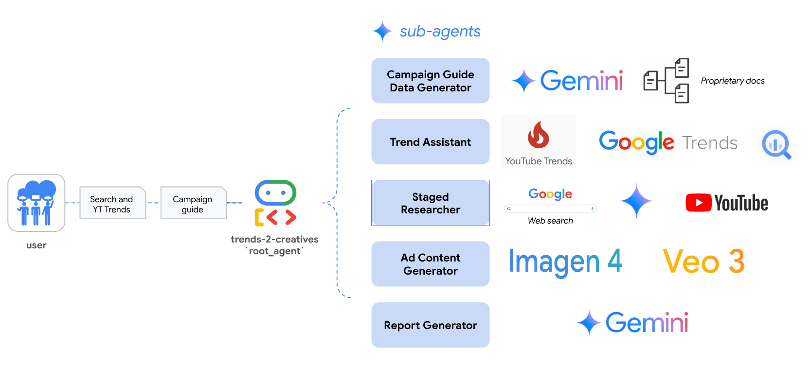
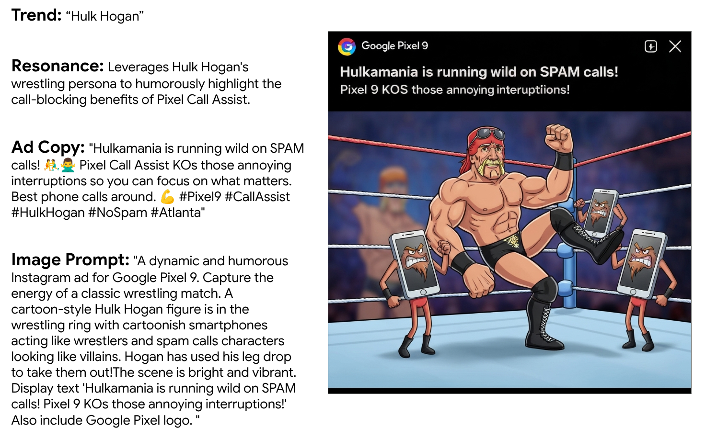
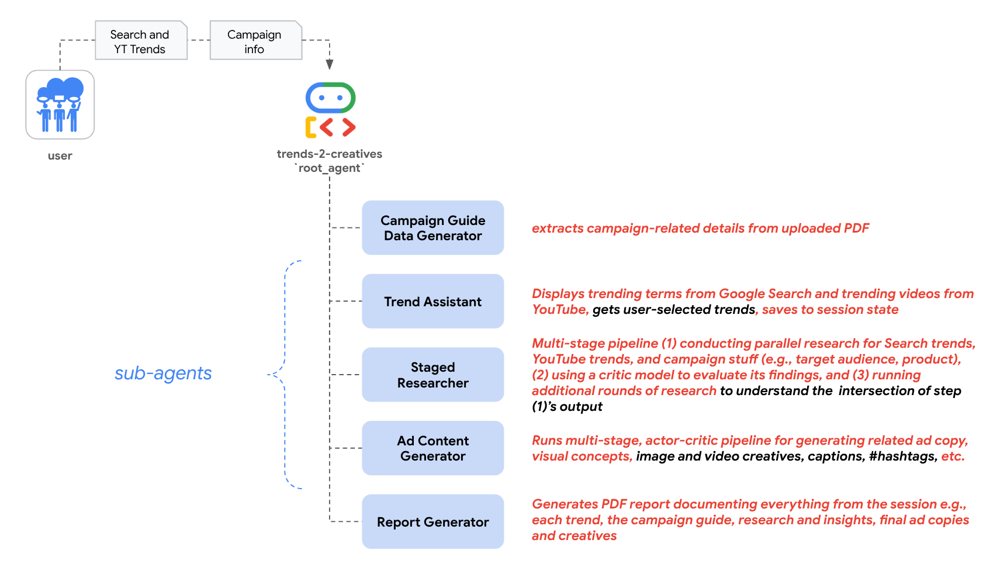
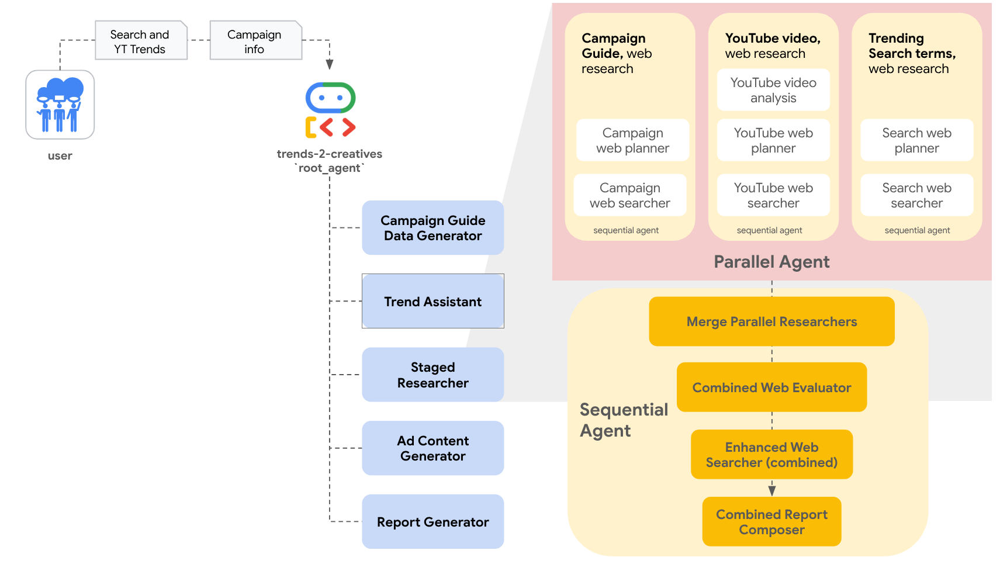
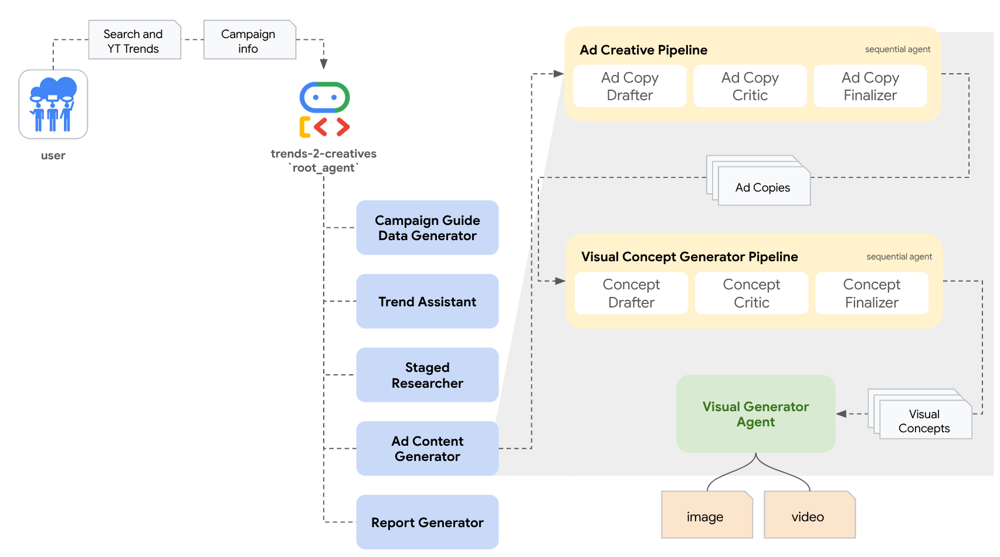

# trends-2-creatives

> a multi-agent system finding the intersection between product, trend, and audience

<details open>
  <summary>sample interaction</summary>

<p align="center">
  
</p>

</details>

## About

*trends-2-creatives* is a marketing tool for developing data-driven and culturally relevant marketing strategies. Built with Google’s [Agent Development Kit (ADK)](https://google.github.io/adk-docs/), this multi-agent system helps users generate ad creatives from trending themes found in Google Search and YouTube.

- Build LLM-based agents with [models supported in Vertex AI's Model Garden](https://cloud.google.com/vertex-ai/generative-ai/docs/model-garden/available-models)
- Explore [trending Search terms](https://cloud.google.com/blog/products/data-analytics/top-25-google-search-terms-now-in-bigquery?e=48754805) and [trending YouTube videos](https://developers.google.com/youtube/v3/docs/videos/list)
- Conduct web research to better understand the campaign, Search trend, and trending YouTube video
- Draft ad creatives (e.g., image and video) based on trends, campaign themes, or specific prompts

<p align="center">
  
</p>


## Example usage

<details>
  <summary>sample interaction</summary>

---

*In the ADK dev UI, follow these prompts to go from trends to creatives in ~5 mins*

**[entry point]** 

First we need a "campaign guide", which typically includes target product, target audience, key selling points, campaign objectives, etc.

three options:
1. Use default values in one of the provided example state configs [shared_libraries/profiles/example_state_pixel.json](trends_and_insights_agent/shared_libraries/profiles/example_state_pixel.json) (make sure path in `.env` file) 
2. Manually edit one of these files or create a similar `json` with something you're more familiar with
3. Upload a `campaign_guide` in PDF format e.g., [marketing_guide_Pixel_9.pdf](trends_and_insights_agent/marketing_guide_Pixel_9.pdf)
    * TODO: fix support for user-uploaded PDF 


```
> [user]: Hello...
```

**[trends]** 

```
> [agent]: [displays Search Trends]

> [user]: <selects interesting Search trend(s)>

> [agent]: [displays YouTube Trends]

> [user]: <selects interesting YouTube trend(s)>
```

**[campaign & trend research]** 

```
> [agent]: <executes pipeline of parallel research tasks>

> [agent]: [Displays combined research report and saves as PDF artifact]
```


**[creative gen]** 

Note: this section is configured for **human-in-the-loop** i.e., agent will iterate with user when generating image and video creatives

```
> [agent]: Now that I have all the research, I'll use the ad_content_generator_agent to help generate ad creatives based on the campaign themes, trend analysis, web research insights, and specific prompts.
```

1. Choose from a set of ad copies. Or create new ones from scratch
2. Edit suggested image prompts for the selected Ad Copy
3. Edit suggested video prompts for the generated image
4. Select attention-grabbing captions for the creatives

**[report gen]** 

```
> [agent]: Okay, we've gathered all the necessary research and generated the ad content. Now, I'll generate a comprehensive report outlining the campaign guide, search trends, YouTube trends, and insights from this session.
```

</details>


**sample output**


<p align="center">
  
</p>


# How to use this repo

1. Clone this repo (to local or Vertex AI Workbench Instance)
2. Create and store YouTube API key
3. Open terminal, run commands under **One-time setup**
4. Run commands under **Start a session**


## Create and store YouTube API key

1. See [these instructions](https://developers.google.com/youtube/v3/getting-started) for getting a `YOUTUBE_DATA_API_KEY`

2. Store this API key in [Secret Manager](https://cloud.google.com/secret-manager/docs/creating-and-accessing-secrets) as `yt-data-api` (see `YT_SECRET_MNGR_NAME` in `.env` file)

   > For step-by-step guidance, see [create a secret and access a secret version](https://cloud.google.com/secret-manager/docs/create-secret-quickstart#create_a_secret_and_access_a_secret_version)


## One-time setup

Ensure ffmpeg is installed on your system or where the agent will be deployed. This is used for simple video editing purposes.

```bash
git clone https://github.com/tottenjordan/zghost.git
```

<details>
  <summary>Create & activate virtual environment</summary>

```bash
sudo apt-get install virtualenv python3-venv python3-pip

python3 -m venv .venv && source .venv/bin/activate
```

</details>


<details>
  <summary>Install packages</summary>

*install `ffmpeg` for video editing...*

```bash
sudo apt update
sudo apt install ffmpeg
ffmpeg -version
```

*install python packages...*

```bash
pip install pipx
pip install -U poetry packaging ipykernel

poetry install
```

</details>


<details>
  <summary>Authenticate and Enable Google Cloud APIs</summary>

```bash
gcloud auth application-default login

gcloud services enable artifactregistry.googleapis.com \
    bigquery.googleapis.com \
    logging.googleapis.com \
    run.googleapis.com \
    storage-component.googleapis.com  \
    eventarc.googleapis.com \
    serviceusage.googleapis.com \
    secretmanager.googleapis.com \
    aiplatform.googleapis.com
```

</details>


<details>
  <summary>Optionally, create notebook kernel</summary>

*create kernel with required packages for notebooks hosted locally or in [Vertex AI Workbench Instances](https://cloud.google.com/vertex-ai/docs/workbench/instances/introduction)* 

**Notebook hosted locally**

```bash
export ENV_NAME=py312_venv
python3 -m ipykernel install --user --name $ENV_NAME --display-name $ENV_NAME
```

**Notebook hosted in Vertex AI Workbench**

*run this in instance terminal window:*

```bash
export ENV_NAME=py312_venv
DL_ANACONDA_ENV_HOME="${DL_ANACONDA_HOME}/envs/$ENV_NAME"
echo $DL_ANACONDA_ENV_HOME

python3 -m ipykernel install --prefix "${DL_ANACONDA_ENV_HOME}" --name $ENV_NAME --display-name $ENV_NAME
```

*In either option, open a notebook file and select your kernel (top right). Should see `$ENV_NAME` as an available kernel* 

</details>


<details>
  <summary>Create and populate `.env` file(s)</summary>

*(1) create `.env` file for `root_agent`:*

```bash
touch .env
nano .env
```

*(2) edit variables as needed:*

```bash
GOOGLE_GENAI_USE_VERTEXAI=1
GOOGLE_CLOUD_PROJECT=YOUR_GCP_PROJECT_ID
GOOGLE_CLOUD_PROJECT_NUMBER=YOUR_GCP_PROJECT_NUMBER # e.g., 1234756
GOOGLE_CLOUD_LOCATION=YOUR_LOCATION # e.g., us-central1
BUCKET=gs://YOUR_GCS_BUCKET_NAME # create a GCS bucket
YT_SECRET_MNGR_NAME=YOUR_SECRET_NAME # e.g., yt-data-api
SESSION_STATE_JSON_PATH=trends_and_insights_agent/shared_libraries/profiles/example_state_pixel.json
```

*(3) copy `.env` file to `root_agent` dir:*

```bash
cp .env trends_and_insights_agent/.env
cat trends_and_insights_agent/.env
```

*(4) read and execute `.env` file:*

```bash
source .env
```

</details>


<details>
  <summary>Create GCP assets and grant IAM</summary>

*create Cloud Storage bucket:*

```bash
gcloud storage buckets create gs://$BUCKET --location=$GOOGLE_CLOUD_LOCATION
```

**TODOs:**
* create BigQuery tables for Trends dataset
* create commands for granting proper IAM to each asset

</details>


## Start a session

When starting a new session (e.g., after a new code commit, package update/add, etc.):

1. activate the `virtual environment` 
2. `source` the `.env` file 

```bash
source .venv/bin/activate`

source .env
echo $BUCKET
```

3. launch the adk developer UI

```bash
poetry run adk web
```

4. To start interacting with your agents, open the provided `localhost` link (e.g., `http://localhost:8000`) and select an agent from the drop-down (top left)

```bash
INFO:     Started server process [750453]
INFO:     Waiting for application startup.

+-----------------------------------------------------------------------------+
| ADK Web Server started                                                      |
|                                                                             |
| For local testing, access at http://localhost:8000.                         |
+-----------------------------------------------------------------------------+

INFO:     Application startup complete.
INFO:     Uvicorn running on http://0.0.0.0:8000 (Press CTRL+C to quit)
```

5. *Note: if port in use, find any processes listening to port `:8000`, kill them, then return to step (3):*

```bash
lsof -i :8000
kill -9 $PID
lsof -i :8000
```

# Video walkthrough

> Coming soon!


# Sub-agents & Tools

<p align="center">
  
</p>


## Staged Research Pipeline

<p align="center">
  
</p>


## Ad Content Generator Pipeline

<p align="center">
  
</p>


# CI And Testing

Using `pytest`, users can test for tool coverage as well as Agent evaluations.

More detail on agent evaluations [can be found here](https://google.github.io/adk-docs/evaluate/#2-pytest-run-tests-programmatically), along with how to run a `pytest` eval.

#### Running `pytest`

From the project root, run:

```bash
pytest tests/*.py
```

## Deployment

The agent can be deployed in a couple of different ways

1. Agent Engine
   * Here's an end-to-end guide on deploying
   * Be sure to first run the `setup_ae_sm_access.sh` script to give Agent Engine access to Secret Manager
   * Run the [deployment guide](.notebooks/deployment_guide.ipynb) to deploy the agent
2. Cloud Run
   * Run `deploy_to_cloud_run.sh`
   * Note this runs unit tests prior to deploying

Script for Cloud Run:

```bash
#!/bin/bash
source trends_and_insights_agent/.env

# run unit tests before deploying
pytest tests/*.py

# write requirements.txt to the agent folder
poetry export --without-hashes --format=requirements.txt >   trends_and_insights_agent/requirements.txt

#deploy to cloud run
adk deploy cloud_run \
  --project=$GOOGLE_CLOUD_PROJECT \
  --region=$GOOGLE_CLOUD_LOCATION \
  --service_name='trends-and-insights-agent' \
  --with_ui \
  trends_and_insights_agent/
```

### Deployment to Agentspace

1. Configure `publish_to_agentspace.sh`
2. Run the `notebooks/deployment_guide.ipynb` notebook
3. Run `bash publish_to_agentspace.sh`
