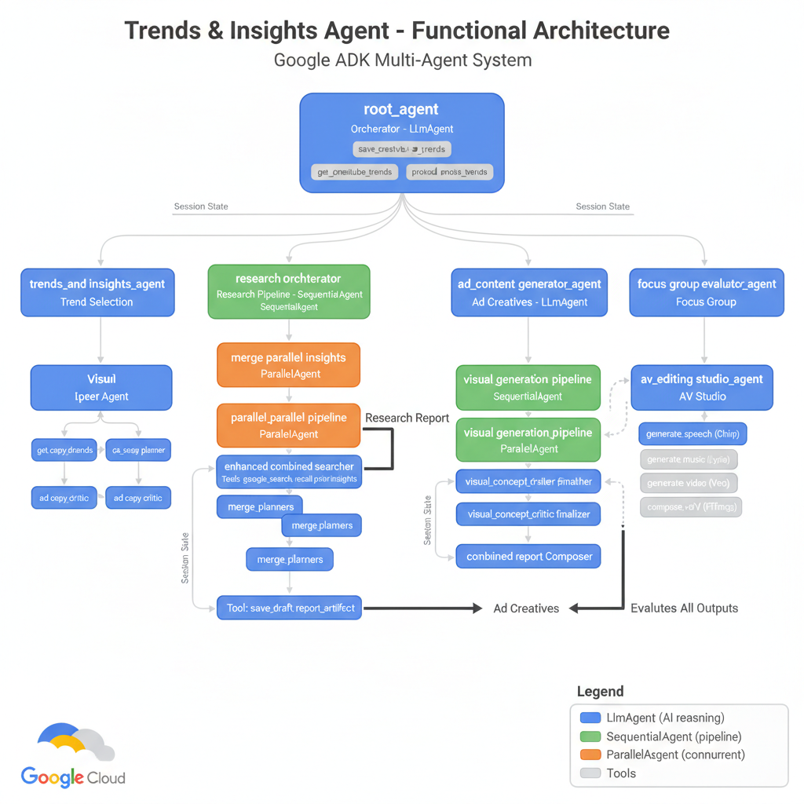
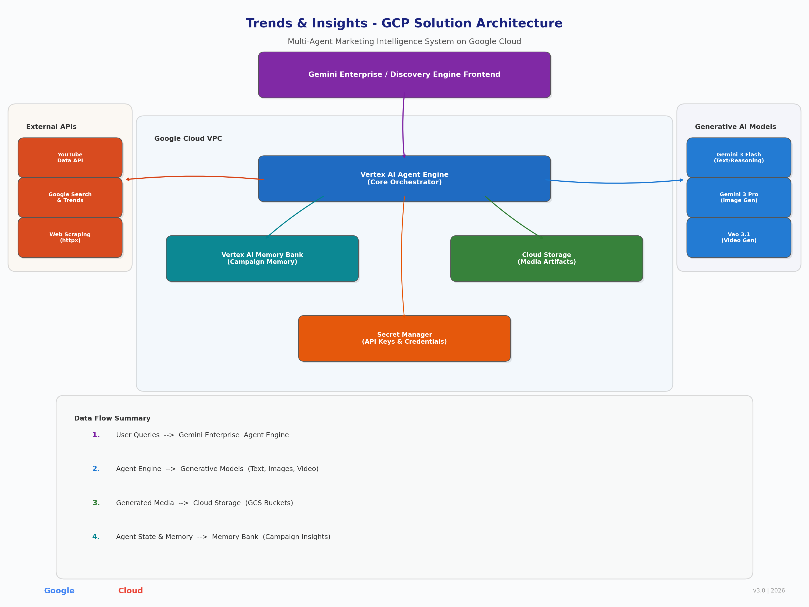
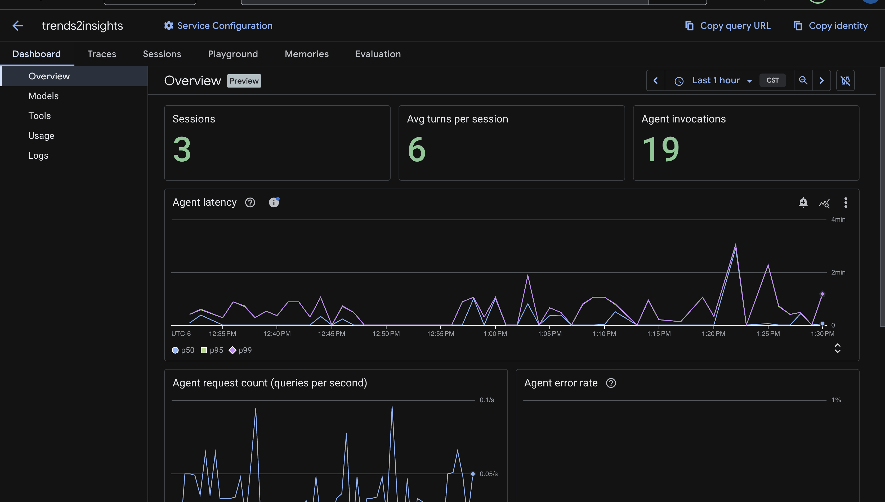
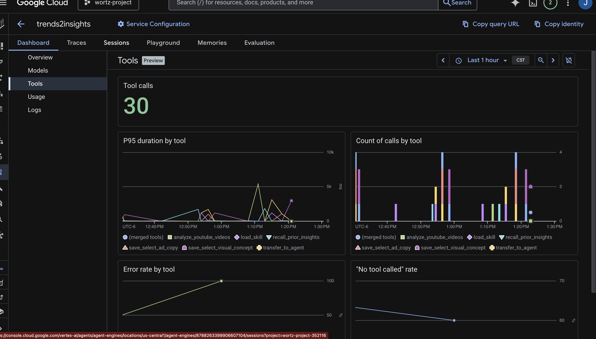
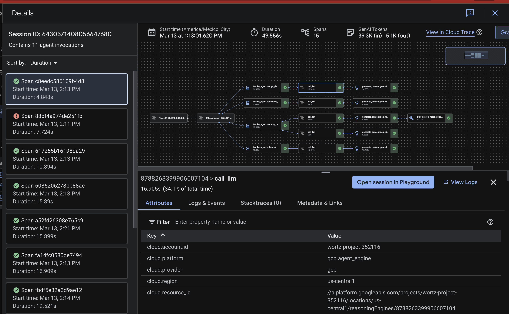

# Trends & Insights

> A multi-agent marketing intelligence system that transforms real-time cultural trends into broadcast-ready advertising campaigns — from research to finished commercial — in under 15 minutes.

<p align="center">
  
</p>

## What It Does

Trends & Insights is an AI-powered marketing platform that:

1. **Discovers trends** — surfaces what consumers care about right now from Google Search and YouTube
2. **Conducts research** — runs parallel market research across three dimensions (search trends, YouTube trends, campaign brief) and synthesizes a cited report
3. **Creates ad campaigns** — writes ad copy, generates campaign images, and produces 15-second commercials with AI video (Veo 3.1)
4. **Evaluates quality** — runs a simulated focus group with AI-generated panelist portraits and weighted scoring
5. **Delivers a PDF report** — compiles research, creatives, commercial, and focus group evaluation into a single downloadable artifact

The entire pipeline runs autonomously on [Vertex AI Agent Engine](https://cloud.google.com/vertex-ai/docs/reasoning-engine/overview), orchestrated by a deterministic state machine (no LLM decision-making at the top level).

## Architecture

<p align="center">
  
</p>

> Architecture diagrams are being actively updated — see `docs/` for the latest versions.

### Pipeline Stages

```
CampaignOrchestrator (BaseAgent state machine)
│
├── TRENDS       → trends_and_insights_agent
│                  Surfaces Google Search + YouTube trends, captures selections
│
├── RESEARCH     → research_orchestrator
│                  Parallel research (YT + Search + Campaign), memory recall,
│                  quality evaluation, cited report generation
│
├── CREATIVE     → CreativeProductionOrchestrator
│   ├── AD_CREATIVE    → Ad copy draft-critique + visual concept draft-critique-finalize
│   ├── IMAGE_GEN      → Deterministic image generation (Gemini 3 Pro)
│   ├── AV_STUDIO      → 15s commercial via Veo 3.1 with first-frame conditioning
│   └── COMMERCIAL_QA  → Gecko fidelity scoring + Gemini video analysis
│
├── FOCUS_GROUP  → focus_group_evaluator_agent
│                  3-person panel simulation with portrait generation,
│                  6-category weighted scoring, Go/No-Go recommendation
│
├── SAVE_REPORT  → PDF generation with all assets
│
└── COMPLETE
```

### Models & Services

| Component | Model / Service |
|-----------|----------------|
| Agent reasoning | Gemini 3 Flash Preview |
| Image generation | Gemini 3 Pro Image Preview |
| Video generation | Veo 3.1 Fast |
| Voice-over & dialogue | Chirp 3 HD |
| Music generation | Lyria 2 |
| Media fidelity scoring | Gecko (Vertex AI rubric-based evaluation) |
| Search trends | BigQuery (`google_trends.top_terms`) |
| Video trends | YouTube Data API v3 |
| Web research | Google Search grounding |
| Campaign memory | Vertex AI Memory Bank |
| Agent runtime | Vertex AI Agent Engine |

## Quick Start

### Prerequisites

- Google Cloud project with billing enabled
- Python 3.11+
- [uv](https://docs.astral.sh/uv/) package manager
- YouTube Data API key stored in Secret Manager

### 1. Clone and install

```bash
git clone https://github.com/tottenjordan/zghost.git
cd zghost
pip install uv
uv sync
```

### 2. Enable Google Cloud APIs

```bash
gcloud auth application-default login

gcloud services enable \
    aiplatform.googleapis.com \
    bigquery.googleapis.com \
    storage-component.googleapis.com \
    secretmanager.googleapis.com \
    youtube.googleapis.com \
    texttospeech.googleapis.com \
    run.googleapis.com
```

### 3. Create YouTube API key

Follow [these instructions](https://developers.google.com/youtube/v3/getting-started) to get a YouTube Data API key, then store it in Secret Manager:

```bash
echo -n "YOUR_API_KEY" | gcloud secrets create yt-data-api --data-file=-
```

### 4. Create GCS bucket

```bash
gcloud storage buckets create gs://YOUR_BUCKET_NAME --location=us-central1
```

### 5. Configure environment

Create `trends_and_insights_agent/.env`:

```bash
GOOGLE_GENAI_USE_VERTEXAI=1
GOOGLE_CLOUD_PROJECT=your-project-id
GOOGLE_CLOUD_PROJECT_NUMBER=123456789
GOOGLE_CLOUD_LOCATION=global
BUCKET=gs://your-bucket-name
YT_SECRET_MNGR_NAME=yt-data-api
```

### 6. Run locally

```bash
# Start all services (ADK server + frontend + voice + memory API)
./run_local.sh

# Or just the ADK server:
uv run adk web trends_and_insights_agent
```

Open [http://localhost:8000](http://localhost:8000) and select the agent from the dropdown.

## Deploy to Agent Engine

Agent Engine is the recommended deployment target for production use. It provides managed sessions, memory, and observability.

### Deploy

```bash
source trends_and_insights_agent/.env
uv run python deploy_to_ae.py --step agent-engine --update
```

This deploys the `CampaignOrchestrator` as a Vertex AI Reasoning Engine. The engine ID is saved to `deployment_info.json`.

### Run E2E on Agent Engine

The E2E runner creates a session with pre-populated campaign data and runs the full pipeline:

```bash
source trends_and_insights_agent/.env
uv run python e2e_demo_runner.py
```

**Quality gates** (all must pass):
- Research report > 500 chars with citations
- 1+ campaign images generated
- 15s commercial video via Veo 3.1
- Focus group evaluation with Go/No-Go score
- Final PDF report saved as artifact

### Publish to Gemini Enterprise

After deploying to Agent Engine, register with Gemini Enterprise (Agentspace):

```bash
./publish_to_agentspace_v2.sh --action create --config agent_config.json
```

See the Agentspace section below for full CLI options.

## Agent Engine Observability

The system provides full observability when running on Agent Engine.

### Dashboard


Sessions, agent latency (P50/P95/P99), invocation counts, and error rates.

### Tools


Per-tool call counts, P95 duration, and error rates across 30+ tool calls per campaign run.

### Cloud Trace


End-to-end distributed tracing with span-level detail for each pipeline stage.

## Project Structure

```
zghost/
├── trends_and_insights_agent/     # Main agent module
│   ├── orchestrator.py            # CampaignOrchestrator (top-level state machine)
│   ├── agent.py                   # Agent wiring and sub-agent definitions
│   ├── common_agents/
│   │   ├── ad_content_generator/
│   │   │   ├── creative_orchestrator.py  # Creative pipeline state machine
│   │   │   ├── agent.py                  # Ad copy + visual concept agents
│   │   │   └── tools.py                  # Image/video gen, Gecko fidelity
│   │   └── market_research/
│   │       ├── agent.py                  # Research pipeline agents
│   │       └── tools.py                  # Memory recall, report save
│   ├── skills/
│   │   ├── av_studio/                    # Commercial production (Veo + audio)
│   │   └── focus_group/                  # Focus group evaluation
│   └── shared_libraries/
│       ├── config.py                     # Model configuration
│       ├── callbacks.py                  # Status callbacks, rate limiting
│       └── fidelity_eval/                # Gecko image fidelity scoring
├── e2e_demo_runner.py             # Agent Engine E2E test runner
├── deploy_to_ae.py                # Agent Engine deployment script
├── deployment_info.json           # Current engine ID and project info
├── docs/
│   ├── CAPABILITIES.md            # Detailed capability documentation
│   ├── agent_engine_screenshots/  # AE dashboard screenshots
│   ├── NOVASTORM.md               # Skill self-reflection system design
│   └── NOVASTORM_INTEGRATION.md   # NovaStorm integration guide
├── functional_architecture_diagram.png
├── gcp_architecture_diagram.png
└── CLAUDE.md                      # Claude Code development instructions
```

## Autopilot Mode

Set `autopilot_mode: true` in session state to run the full pipeline end-to-end without user confirmations — from trend selection through finished commercial and focus group evaluation. The E2E runner uses this mode by default.

## Agentspace CLI Reference

Manage the agent in Gemini Enterprise (Agentspace):

```bash
# Create
./publish_to_agentspace_v2.sh --action create --config agent_config.json

# Update
./publish_to_agentspace_v2.sh --action update --config agent_config.json

# List
./publish_to_agentspace_v2.sh --action list --config agent_config.json

# Delete
./publish_to_agentspace_v2.sh --action delete --config agent_config.json
```

<details>
<summary>CLI options</summary>

```
Usage: ./publish_to_agentspace_v2.sh [OPTIONS]

Options:
  -a, --action <create|update|list|delete>  Action to perform (required)
  -c, --config <file>              JSON configuration file
  -p, --project-id <id>            Google Cloud project ID
  -n, --project-number <number>    Google Cloud project number
  -e, --app-id <id>                Agent Space application ID
  -r, --reasoning-engine <id>      Reasoning Engine ID
  -d, --display-name <name>        Agent display name
  -s, --description <desc>         Agent description
  -i, --agent-id <id>              Agent ID (for update/delete)
  -t, --instructions <text>        Agent instructions
  -u, --icon-uri <uri>             Icon URI
  -l, --location <location>        Location (default: us)
```

</details>

## Video Walkthrough

> Overview of the end-to-end workflow

[](https://www.youtube.com/watch?v=S8Bh4eBQSs0)

## Detailed Documentation

- [Capability Overview](docs/CAPABILITIES.md) — detailed breakdown of each pipeline stage with tools, models, and business value
- [NovaStorm Design](docs/NOVASTORM.md) — skill self-reflection and evolution system
- [NovaStorm Integration](docs/NOVASTORM_INTEGRATION.md) — how to wire NovaStorm into the pipeline
