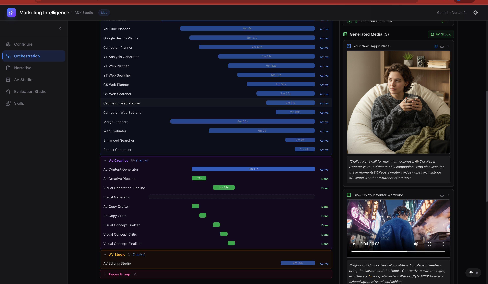
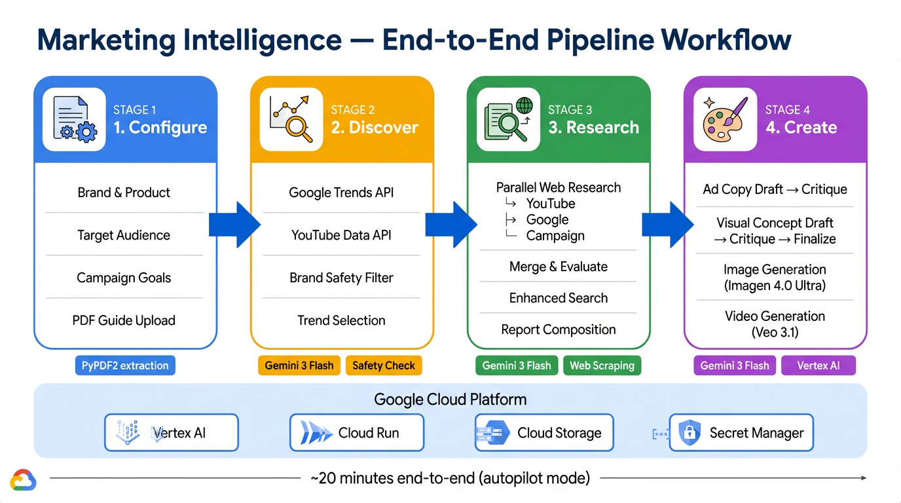
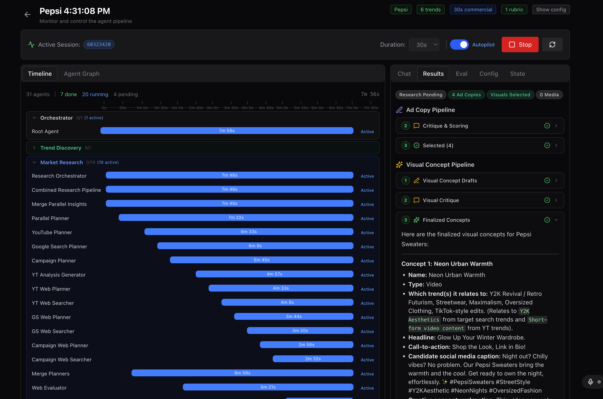
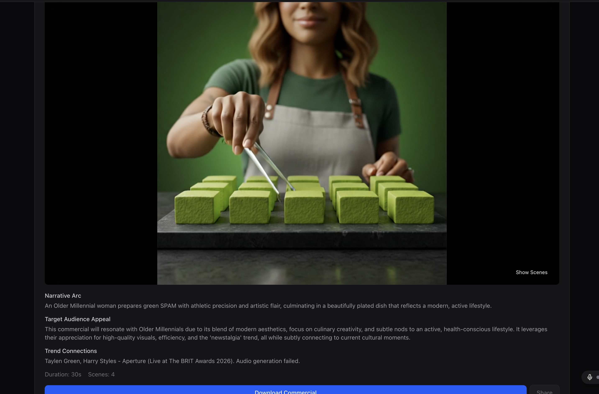
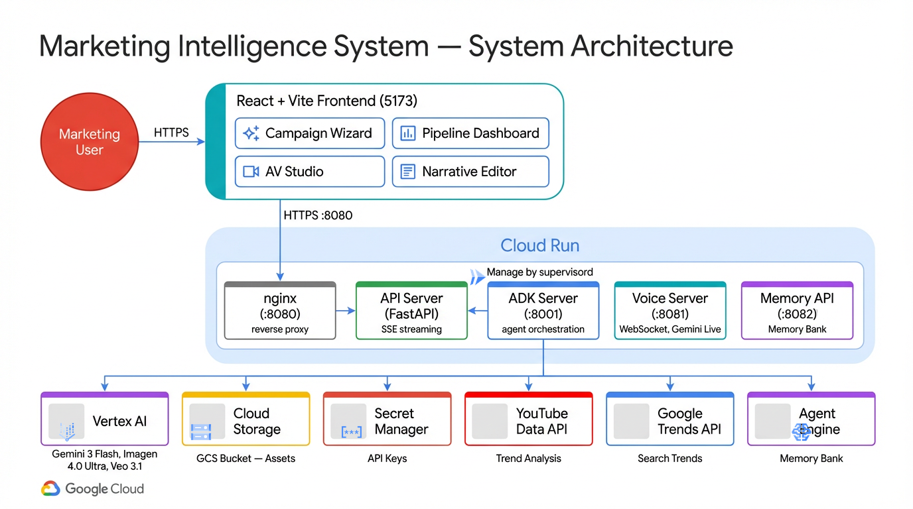
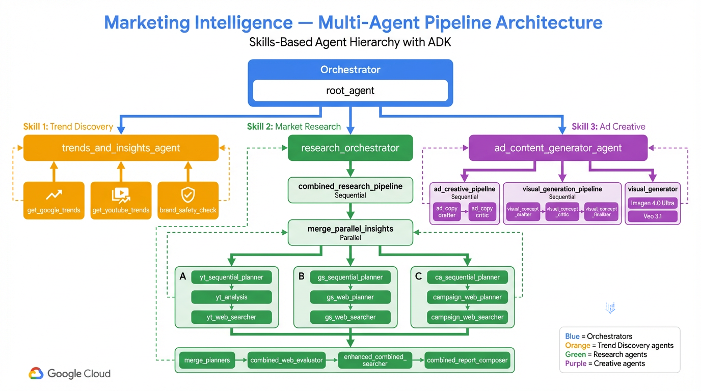
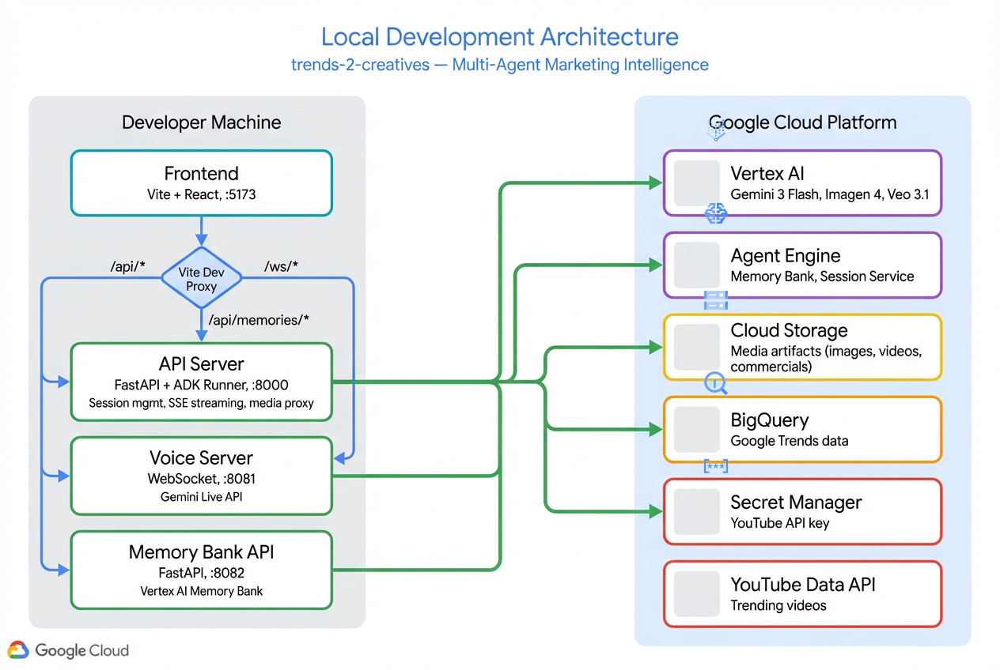
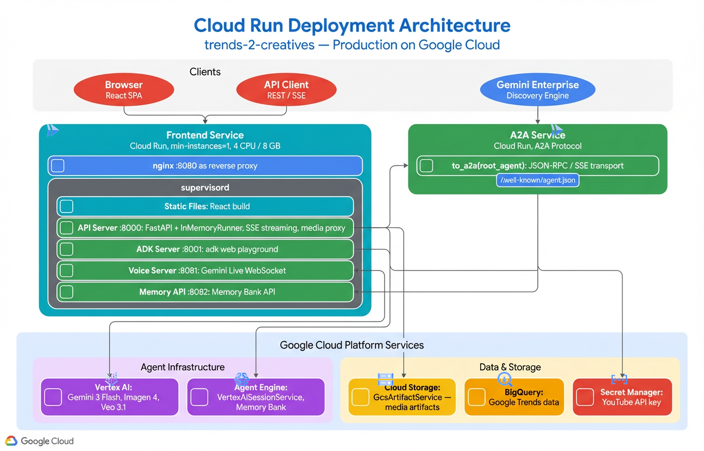

# Marketing Intelligence

> A multi-agent system that finds the intersection between product, trend, and audience — then produces the creative to match.

<p align="center">
  
</p>

## Why This Matters

| Traditional Campaign Development | With Marketing Intelligence |
|----------------------------------|----------------------------|
| 2-4 weeks to research trends and cultural context | 3 minutes (parallel AI research) |
| Days of copywriting and creative iteration | 5 minutes (draft-critique AI loop) |
| $10K+ for stock photos and video production | AI-generated with Imagen 4.0 and Veo 3.1 |
| Manual trend monitoring across platforms | Real-time Google Trends + YouTube API |
| Single campaign at a time | Run 42+ campaigns concurrently |
| **Total: weeks and significant budget** | **Total: ~20 minutes end-to-end in autopilot** |

### Why Google Cloud

- **Gemini 3 Flash Preview** — Best-in-class reasoning for multi-agent orchestration at scale
- **Imagen 4.0 Ultra** — Photorealistic image generation that matches brand guidelines
- **Veo 3.1 Fast** — Video generation with frame conditioning for scene continuity
- **Agent Engine** — Managed deployment with built-in sessions, memory, and observability
- **ADK** — Production-grade agent framework with Sequential, Parallel, and AgentTool composition

## About

Marketing Intelligence is a marketing tool for developing data-driven and culturally relevant marketing content. Built with Google's [Agent Development Kit (ADK)](https://google.github.io/adk-docs/), this multi-agent system helps users generate ad creatives from trending themes in Google Search and YouTube.

- Build LLM-based agents with [models supported in Vertex AI's Model Garden](https://cloud.google.com/vertex-ai/generative-ai/docs/model-garden/available-models)
- Explore [trending Search terms](https://cloud.google.com/blog/products/data-analytics/top-25-google-search-terms-now-in-bigquery?e=48754805) and [trending YouTube videos](https://developers.google.com/youtube/v3/docs/videos/list)
- Conduct web research to better understand the campaign, Search trend, and trending YouTube video
- Draft ad creatives (e.g., image and video) based on trends, campaign themes, or specific prompts
- Produce 30-second commercials with AI-generated video clips, voiceover, and music
- Evaluate completed commercials with a simulated AI focus group

### End-to-End Pipeline

<p align="center">
  
</p>

| Stage | What Happens | Powered By |
|-------|-------------|------------|
| **1. Configure** | Define brand, product, audience. Upload a campaign guide PDF. | Gemini 3 Flash |
| **2. Discover** | Surface trending topics from Google Search and YouTube with brand-safety filtering | Google Trends (BigQuery), YouTube Data API, Gemini |
| **3. Research** | Parallel web research across three dimensions, merged into a cited intelligence report | Gemini 3 Flash, Google Search |
| **4. Create** | Generate ad copy (draft-critique), visual concepts (draft-critique-finalize), images, and video | Gemini 3 Flash, Imagen 4.0 Ultra, Veo 3.1 Fast |
| **5. Produce** | Chain Veo clips with frame matching into a 30-second commercial | Veo 3.1 Fast, ffmpeg |
| **6. Evaluate** | Simulated focus group scores the commercial on quality, narrative, and audience appeal | Gemini 3 Flash |

---

## Platform Screenshots

### Campaign Setup and Trend Discovery

<table>
  <tr>
    <td></td>
    <td></td>
  </tr>
  <tr>
    <td><em>Step 1: Configure your campaign — brand, product, audience, selling points</em></td>
    <td><em>Step 2: AI-recommended trends with brand safety filtering (unsafe topics auto-filtered)</em></td>
  </tr>
</table>

### Pipeline Orchestration

31 specialized agents coordinate in real-time. The timeline shows parallel research lanes completing simultaneously, followed by creative generation.

<p align="center">
  
</p>

### Generated Creative

<table>
  <tr>
    <td></td>
    <td></td>
  </tr>
  <tr>
    <td><em>Pepsi Sweaters — AI-generated urban streetwear visual (Imagen 4.0 Ultra)</em></td>
    <td><em>Spam — AI-generated culinary visual (Imagen 4.0 Ultra)</em></td>
  </tr>
</table>

### AV Studio and Commercials

<table>
  <tr>
    <td></td>
    <td></td>
  </tr>
  <tr>
    <td><em>AV Studio — timeline editor with clips, voice, music, and characters</em></td>
    <td><em>McDonald's McRib — 30s AI-generated commercial</em></td>
  </tr>
</table>

### Pipeline Runs at Scale

Run multiple campaigns concurrently with full autopilot mode.

<p align="center">
  
</p>

---

## Video Walkthrough

> This demo gives a quick overview of the end-to-end workflow

[](https://www.youtube.com/watch?v=S8Bh4eBQSs0)

---

## How to Use This Repo

### 1. Clone the repository

```bash
git clone https://github.com/tottenjordan/zghost.git
```

### 2. Create a virtual environment and install dependencies

```bash
uv sync
```

### 3. Authenticate and enable Google Cloud APIs

```bash
gcloud auth application-default login

gcloud services enable artifactregistry.googleapis.com \
    bigquery.googleapis.com \
    logging.googleapis.com \
    run.googleapis.com \
    storage-component.googleapis.com  \
    eventarc.googleapis.com \
    serviceusage.googleapis.com \
    secretmanager.googleapis.com \
    aiplatform.googleapis.com \
    youtube.googleapis.com
```

### 4. Create and store YouTube API key

- See [these instructions](https://developers.google.com/youtube/v3/getting-started) for getting a `YOUTUBE_DATA_API_KEY`
- Store this API key in [Secret Manager](https://cloud.google.com/secret-manager/docs/creating-and-accessing-secrets) as `yt-data-api` (see `YT_SECRET_MNGR_NAME` in `.env` file)
  - For step-by-step guidance, see [create a secret and access a secret version](https://cloud.google.com/secret-manager/docs/create-secret-quickstart#create_a_secret_and_access_a_secret_version)

### 5. Create and populate `.env` file(s)

```bash
GOOGLE_GENAI_USE_VERTEXAI=1
GOOGLE_CLOUD_PROJECT=<YOUR_GCP_PROJECT_ID>
GOOGLE_CLOUD_PROJECT_NUMBER=<YOUR_GCP_PROJECT_NUMBER> # e.g., 1234756
GOOGLE_CLOUD_LOCATION=<YOUR_LOCATION> # e.g., us-central1
BUCKET=gs://<YOUR_GCS_BUCKET_NAME> # create a GCS bucket
YT_SECRET_MNGR_NAME=<YOUR_SECRET_NAME> # e.g., yt-data-api
MEMORY_BANK_AGENT_ENGINE_ID=<YOUR_MEMORY_BANK_AGENT_ID> # e.g., 6534772537337839616
# SESSION_STATE_JSON_PATH=example_state_pixel.json # uncomment to use default config values
```

Copy `.env` file to `root_agent` dir:

```bash
cp .env trends_and_insights_agent/.env
source .env
```

### 6. Create Cloud Storage bucket

```bash
gcloud storage buckets create $BUCKET --location=$GOOGLE_CLOUD_LOCATION
```

### 7. Launch the ADK developer UI

```bash
uv run adk web
```

Open your browser and navigate to [http://localhost:8000](http://localhost:8000) and select an agent from the drop-down (top left).

<details>
  <summary>If port :8000 in use</summary>

```bash
lsof -i :8000
kill -9 $PID
```

</details>

### Option B: Full stack with frontend UI

For the full experience (campaign wizard, orchestration dashboard, AV studio, voice assistant), use `run_local.sh` which starts all services:

```bash
./run_local.sh
```

This launches 4 services:

| Service | Port | Description |
|---------|------|-------------|
| API Server | `8000` | Custom FastAPI backend (ADK runner, session management, SSE streaming) |
| Voice Server | `8081` | WebSocket server for Gemini Live voice assistant |
| Memory API | `8082` | FastAPI server for Vertex AI Memory Bank |
| Frontend | `5173` | Vite + React dev server |

Open [http://localhost:5173](http://localhost:5173) in your browser.

> **Note:** The API server takes ~2-3 minutes to initialize (it loads the full agent tree on startup). The frontend UI will load immediately, but pipeline execution won't work until the API server finishes importing `root_agent`.

<details>
  <summary>If a port is already in use</summary>

```bash
lsof -i :8000   # or :5173, :8081, :8082
kill -9 <PID>
```

Or kill all related processes:

```bash
pkill -f "api_server|voice_server|memory_api|vite"
```

</details>

<details>
  <summary>Opening ports in a remote IDE (VS Code, Cloud Workstations, SSH)</summary>

**VS Code Remote (recommended)**

VS Code automatically detects listening ports. Open the **Ports** panel and forward port `5173`. Vite's dev proxy routes `/api/*`, `/ws/*`, and `/api/memories/*` to the correct backend ports automatically.

**Manual SSH port forwarding**

```bash
# Forward just the frontend (sufficient for most use cases)
ssh -L 5173:localhost:5173 your-remote-host
```

**tmux / screen users**

```bash
tmux new -s zghost
./run_local.sh
# Ctrl+B, D to detach
```

</details>

---

## Architecture

### System Architecture

<p align="center">
  
</p>

### Agent Hierarchy

<p align="center">
  
</p>

### Skills-Based Agent System

The system uses a **skills-based architecture** where each domain is a self-contained skill with its own agents, tools, and prompts:

```
root_agent (orchestrator)
├── [trend-discovery skill]
│   └── trends_and_insights_agent              # Campaign metadata + trend selection
├── [market-research skill]
│   └── research_orchestrator                  # Coordinate research pipeline
│       └── combined_research_pipeline         # Sequential research flow (AgentTool)
│           ├── merge_parallel_insights        # Parallel research coordination
│           │   ├── parallel_planner_agent     # Runs 3 research types simultaneously
│           │   │   ├── yt_sequential_planner  # YouTube trend analysis
│           │   │   ├── gs_sequential_planner  # Google Search trend analysis
│           │   │   └── ca_sequential_planner  # Campaign research
│           │   └── merge_planners
│           ├── combined_web_evaluator         # Quality check
│           ├── enhanced_combined_searcher     # Expand web search
│           └── combined_report_composer       # Generate unified research report
├── [ad-creative skill]
│   └── ad_content_generator_agent             # Create comprehensive ad campaigns
│       ├── ad_creative_pipeline               # Ad copy: draft → critique (AgentTool)
│       ├── visual_generation_pipeline         # Visuals: draft → critique → finalize (AgentTool)
│       └── visual_generator                   # Imagen/Veo generation (AgentTool)
├── [av-studio skill]
│   └── av_editing_studio_agent                # 30s commercial production (clip chaining, ffmpeg)
└── [focus-group skill]
    └── focus_group_evaluator_agent            # Simulated focus group review
```

### Local Development Architecture

<p align="center">
  
</p>

The frontend (`:5173`) proxies requests via `vite.config.ts`:
- `/api/*` → API Server (`:8000`)
- `/api/memories/*` → Memory Bank API (`:8082`)
- `/ws/*` → Voice Server (`:8081`)

### Cloud Run Deployment Architecture

<p align="center">
  
</p>

For detailed technical architecture, see [docs/ARCHITECTURE.md](docs/ARCHITECTURE.md).

---

## How It Works

<details>
  <summary>Example usage (step-by-step)</summary>

#### [1] Capture campaign metadata & user-selected trends

The agent will ask for **campaign metadata** in the UI:

```
> [agent]: Hello! I'm your AI Marketing Research & Strategy Assistant...
> Please provide: Brand, Target Product, Key Selling Points, Target Audience
```

<details>
  <summary>[Optional] Preload campaign metadata</summary>

Use one of the example JSON configs, e.g., [shared_libraries/profiles/example_state_pixel.json](trends_and_insights_agent/shared_libraries/profiles/example_state_pixel.json). Set in your `.env` file:

```
SESSION_STATE_JSON_PATH=example_state_prs.json
```

</details>

#### [2] Autonomous research workflow

Three parallel research streams (YouTube, Google Search, Campaign) run simultaneously, then merge into a unified cited report.

#### [3] Interactive ad content generator

> Note: configured for **human-in-the-loop** — agent iterates with user when generating creatives

- Choose a subset of ad copies to proceed with
- Choose a subset of visual concepts to proceed with
- Generate image and video creatives with visual concepts

<p align="center">
  
</p>

#### [4] Compile final research and creative report

</details>

---

## CI and Testing

Using `pytest`, users can test for tool coverage as well as Agent evaluations. More detail on agent evaluations [can be found here](https://google.github.io/adk-docs/evaluate/#2-pytest-run-tests-programmatically).

```bash
uv run pytest tests/*.py
```

---

## Deployment

### Option 1: Full-Stack Cloud Run (Frontend + Backend)

Deploys the React frontend, API server, ADK server, voice server, and Memory Bank API as a single Cloud Run service with nginx routing:

```bash
./deploy/deploy_custom.sh
```

This builds a multi-stage Docker image (see `deploy/Dockerfile`), uses supervisord to manage all 5 processes, and serves everything behind nginx on port 8080. Key flags:
- `--min-instances=1` — avoids cold start delays (~10 min for root_agent import)
- `--no-cpu-throttling` — keeps CPU available during startup
- `--cpu=4 --memory=8Gi` — sufficient for concurrent model calls

### Option 2: Agent Engine

For managed deployment with Vertex AI Agent Engine:

```bash
# Grant Agent Engine access to Secret Manager
./setup_ae_sm_access.sh

# Deploy
python deploy_to_ae.py
```

### Option 3: ADK Cloud Run (agent-only, no frontend)

```bash
source trends_and_insights_agent/.env
uv run pytest tests/*.py
uv export --format requirements-txt --no-hashes > trends_and_insights_agent/requirements.txt
adk deploy cloud_run \
  --project=$GOOGLE_CLOUD_PROJECT \
  --region=$GOOGLE_CLOUD_LOCATION \
  --service_name='trends-and-insights-agent' \
  --with_ui \
  trends_and_insights_agent/
```

### Deployment to Agentspace

First deploy to Agent Engine, then publish:

```bash
./publish_to_agentspace_v2.sh --action create --config agent_config.json
```

<details>
  <summary>Agentspace CLI usage</summary>

```bash
./publish_to_agentspace_v2.sh [OPTIONS]

Options:
  -a, --action <create|update|list|delete>  Action to perform (required)
  -c, --config <file>              JSON configuration file
  -p, --project-id <id>            Google Cloud project ID
  -r, --reasoning-engine <id>      Reasoning Engine ID
  -d, --display-name <name>        Agent display name
  -s, --description <desc>         Agent description
  -i, --agent-id <id>              Agent ID (for update/delete)
  -h, --help                       Display this help message
```

</details>

---

## Google Cloud Services

| Service | Role |
|---------|------|
| **Vertex AI — Gemini 3 Flash Preview** | Agent reasoning, research synthesis, ad copywriting, focus group evaluation |
| **Vertex AI — Gemini 3 Pro Image Preview** | Subject reference image generation for commercials |
| **Vertex AI — Imagen 4.0 Ultra** | High-quality image generation from visual concepts |
| **Vertex AI — Veo 3.1 Fast** | Video clip generation with frame conditioning |
| **BigQuery** | Google Trends data warehouse |
| **YouTube Data API v3** | Trending video discovery |
| **Cloud Storage (GCS)** | Media artifact storage (images, videos, reports) |
| **Secret Manager** | API key management |
| **Cloud Run** | Production deployment with auto-scaling |
| **Agent Engine** | Managed agent deployment with sessions and memory |
| **Memory Bank** | Persistent cross-session memory |

---

## Documentation

- [User Guide](docs/USER_GUIDE.md) — Step-by-step walkthrough of the full platform workflow
- [Architecture](docs/ARCHITECTURE.md) — Technical architecture, agent hierarchy, data flow, deployment patterns
