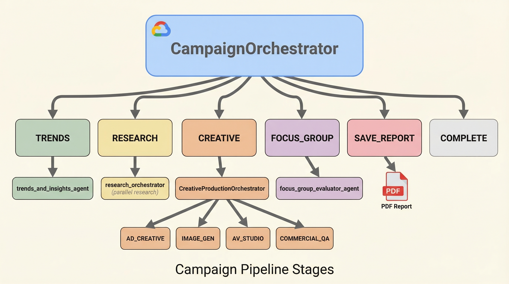
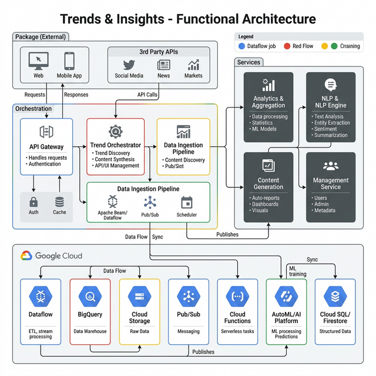
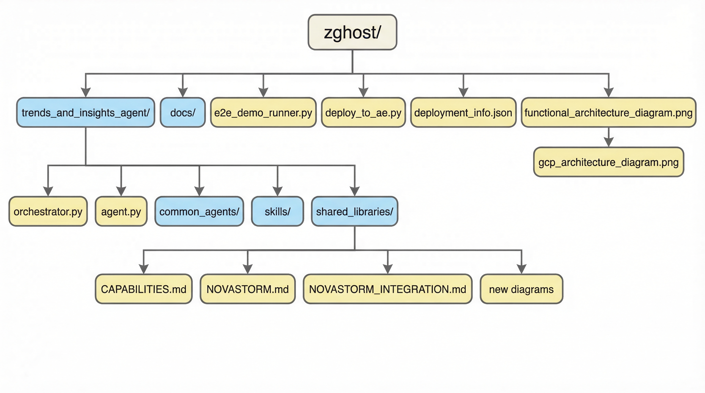

# Trends & Insights

> A multi-agent marketing intelligence system that transforms real-time cultural trends into broadcast-ready advertising campaigns — from research to finished commercial — in under 15 minutes.

<p align="center">
  
</p>

## What It Does

Trends & Insights is an AI-powered marketing platform that:

1. **Discovers trends** — surfaces what consumers care about right now from Google Search and YouTube
2. **Conducts research** — runs parallel market research across three dimensions (search trends, YouTube trends, campaign brief) and synthesizes a cited report
3. **Creates ad campaigns** — writes ad copy, generates campaign images, and produces 15-second commercials with AI video (Veo 3.1)
4. **Evaluates quality** — runs a simulated focus group with AI-generated panelist portraits and weighted scoring
5. **Delivers a PDF report** — compiles research, creatives, commercial, and focus group evaluation into a single downloadable artifact

The entire pipeline runs autonomously on [Vertex AI Agent Engine](https://cloud.google.com/vertex-ai/docs/reasoning-engine/overview), orchestrated by a deterministic state machine (no LLM decision-making at the top level).

## Architecture

<p align="center">
  
</p>

### GCP Architecture

<p align="center">
  
</p>

> Architecture diagrams are being actively updated — see `docs/` for the latest versions.

### Pipeline Stages


### Models & Services

| Component | Model / Service |
|-----------|----------------|
| Agent reasoning | Gemini 3 Flash Preview |
| Image generation | Gemini 3 Pro Image Preview |
| Video generation | Veo 3.1 Fast |
| Voice-over & dialogue | Chirp 3 HD |
| Music generation | Lyria 2 |
| Media fidelity scoring | Gecko (Vertex AI rubric-based evaluation) |
| Search trends | BigQuery (`google_trends.top_terms`) |
| Video trends | YouTube Data API v3 |
| Web research | Google Search grounding |
| Campaign memory | Vertex AI Memory Bank |
| Agent runtime | Vertex AI Agent Engine |

## Quick Start

### Prerequisites

- Google Cloud project with billing enabled
- Python 3.11+
- [uv](https://docs.astral.sh/uv/) package manager
- YouTube Data API key stored in Secret Manager

### 1. Clone and install

```bash
git clone https://github.com/tottenjordan/zghost.git
cd zghost
pip install uv
uv sync
```

### 2. Enable Google Cloud APIs

```bash
gcloud auth application-default login

gcloud services enable \
    aiplatform.googleapis.com \
    bigquery.googleapis.com \
    storage-component.googleapis.com \
    secretmanager.googleapis.com \
    youtube.googleapis.com \
    texttospeech.googleapis.com \
    run.googleapis.com \
    discoveryengine.googleapis.com
```

### 3. Create YouTube API key

Follow [these instructions](https://developers.google.com/youtube/v3/getting-started) to get a YouTube Data API key, then store it in Secret Manager:

```bash
echo -n "YOUR_API_KEY" | gcloud secrets create yt-data-api --data-file=-
```

### 4. Create GCS bucket

```bash
gcloud storage buckets create gs://YOUR_BUCKET_NAME --location=us-central1
```

### 5. Configure environment

Create `trends_and_insights_agent/.env`:

```bash
GOOGLE_GENAI_USE_VERTEXAI=1
GOOGLE_CLOUD_PROJECT=your-project-id
GOOGLE_CLOUD_PROJECT_NUMBER=123456789
GOOGLE_CLOUD_LOCATION=global
BUCKET=gs://your-bucket-name
YT_SECRET_MNGR_NAME=yt-data-api
```

### 6. Run locally

```bash
# Start all services (ADK server + frontend + voice + memory API)
./run_local.sh

# Or just the ADK server:
uv run adk web trends_and_insights_agent
```

Open [http://localhost:8000](http://localhost:8000) and select the agent from the dropdown.

## Deploy to Agent Engine

Agent Engine is the recommended deployment target for production use. It provides managed sessions, memory, and observability.

### Deploy

```bash
source trends_and_insights_agent/.env
uv run python deploy_to_ae.py --step agent-engine --update
```

This deploys the `CampaignOrchestrator` as a Vertex AI Reasoning Engine. The engine ID is saved to `deployment_info.json`.

### Run E2E on Agent Engine

The E2E runner creates a session with pre-populated campaign data and runs the full pipeline:

```bash
source trends_and_insights_agent/.env
uv run python e2e_demo_runner.py
```

**Quality gates** (all must pass):
- Research report > 500 chars with citations
- 1+ campaign images generated
- 15s commercial video via Veo 3.1
- Focus group evaluation with Go/No-Go score
- Final PDF report saved as artifact

### Publish to Gemini Enterprise

After deploying to Agent Engine, register with Gemini Enterprise (Discovery Engine):

```bash
# Register agent with GE (reads engine ID from deployment_info.json)
source trends_and_insights_agent/.env
uv run python deploy_to_ae.py --step gemini-enterprise
```

Or deploy everything in one command:

```bash
# Deploy to Agent Engine + register with GE
source trends_and_insights_agent/.env
uv run python deploy_to_ae.py --step all --update
```

The GE agent ID is saved to `deployment_info.json` for use by tests and the streamAssist API.

## Agent Engine Observability

The system provides full observability when running on Agent Engine.

### Dashboard


Sessions, agent latency (P50/P95/P99), invocation counts, and error rates.

### Tools


Per-tool call counts, P95 duration, and error rates across 30+ tool calls per campaign run.

### Cloud Trace


End-to-end distributed tracing with span-level detail for each pipeline stage.

## Project Structure



## Autopilot Mode

Set `autopilot_mode: true` in session state to run the full pipeline end-to-end without user confirmations — from trend selection through finished commercial and focus group evaluation. The E2E runner uses this mode by default.

## Gemini Enterprise Integration

The agent is accessible through Gemini Enterprise (Discovery Engine) via the `streamAssist` API. GE provides an enterprise chat interface with thinking visualization, status chips, and artifact display.

### How It Works

1. **Agent Engine deployment** creates a Vertex AI Reasoning Engine (`8788263399906607104`)
2. **GE registration** creates an agent entry in the Discovery Engine that routes to the reasoning engine
3. **streamAssist API** sends user queries through GE, which delegates to the ADK agent via `agentsSpec`

### Key IDs (from `deployment_info.json`)

| ID | Purpose |
|----|---------|
| `engine_id` | Agent Engine (Reasoning Engine) ID |
| `ge_engine` | Discovery Engine app ID |
| `ge_agent_id` | GE agent ID (routes to reasoning engine) |

### streamAssist API

```bash
TOKEN=$(gcloud auth print-access-token)

curl -s -X POST \
  "https://global-discoveryengine.googleapis.com/v1alpha/projects/PROJECT_NUMBER/locations/global/collections/default_collection/engines/GE_ENGINE/assistants/default_assistant:streamAssist" \
  -H "Authorization: Bearer $TOKEN" \
  -H "Content-Type: application/json" \
  -d '{
    "query": {"text": "Create a campaign for Tide Fabric Softener"},
    "agentsSpec": {"agentSpecs": [{"agentId": "GE_AGENT_ID"}]},
    "session": "projects/PROJECT_NUMBER/locations/global/collections/default_collection/engines/GE_ENGINE/sessions/-"
  }'
```

**`agentsSpec` is required** — without it, GE answers with generic Gemini knowledge instead of routing to the ADK agent. Use `sessions/-` to auto-create a new session.

### Manage GE Agents

```bash
# List registered agents
uv run python -m deploy.register_gemini_enterprise list --from-deployment-info

# Register (idempotent — skips if exists)
uv run python -m deploy.register_gemini_enterprise register --from-deployment-info

# Delete
uv run python -m deploy.register_gemini_enterprise delete --agent-id AGENT_ID --from-deployment-info
```

## Video Walkthrough

> Overview of the end-to-end workflow

[](https://www.youtube.com/watch?v=S8Bh4eBQSs0)

## Detailed Documentation

- [Capability Overview](docs/CAPABILITIES.md) — detailed breakdown of each pipeline stage with tools, models, and business value
- [NovaStorm Design](docs/NOVASTORM.md) — skill self-reflection and evolution system
- [NovaStorm Integration](docs/NOVASTORM_INTEGRATION.md) — how to wire NovaStorm into the pipeline
- [Skill Critic Agent](docs/skill_critic.md) — scores skill outputs using GEPA
- [Research Pipeline Orchestrator](docs/staged_researcher.md) — deterministic research pipeline
- [Trends & Insights Agent](docs/trend_assistant.md) — captures metadata and fetches trends

