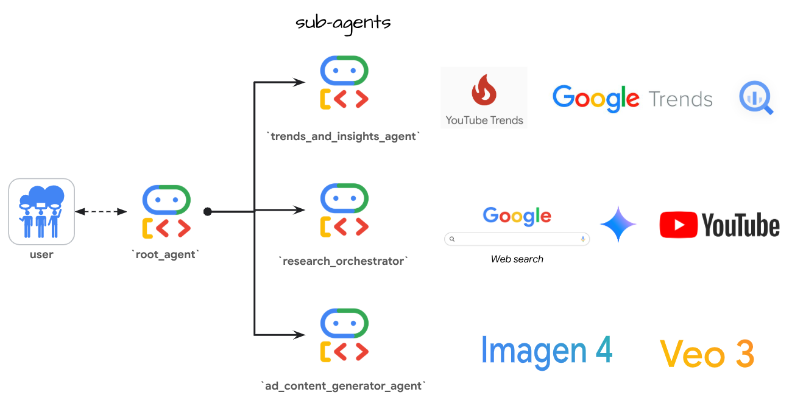
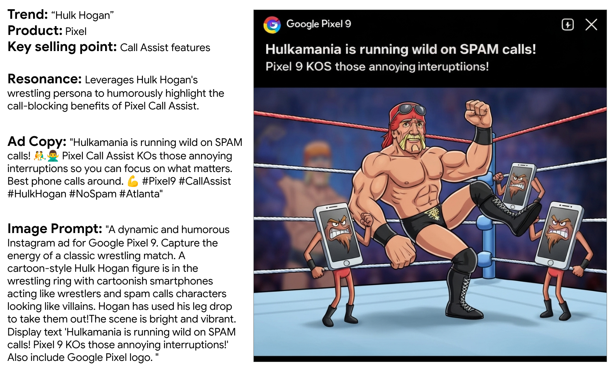
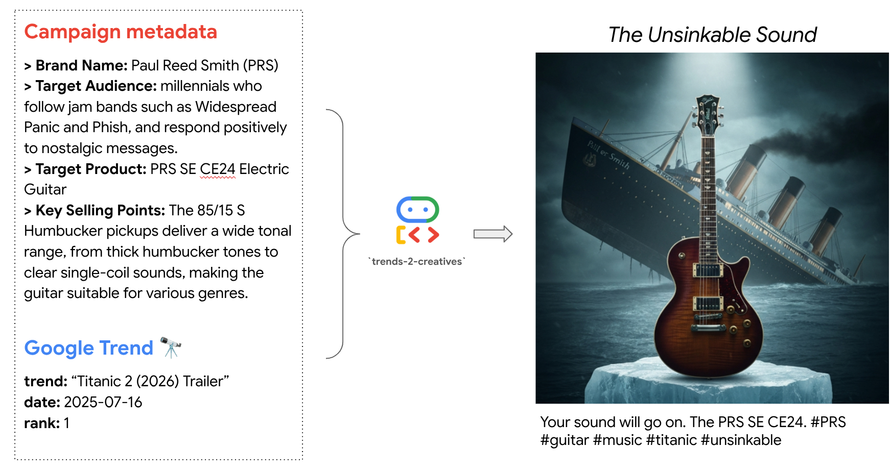
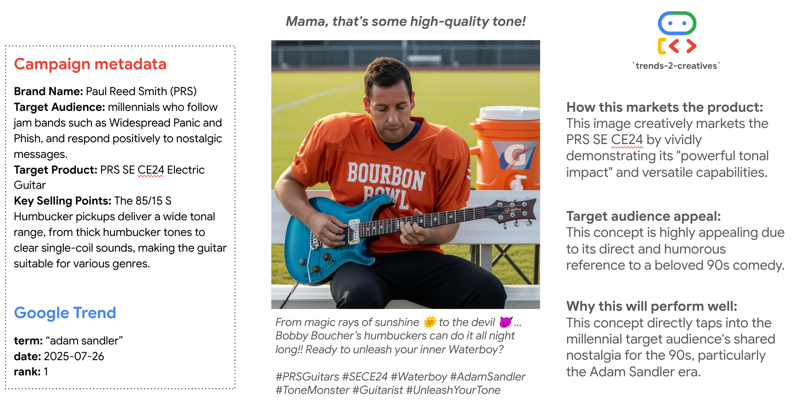
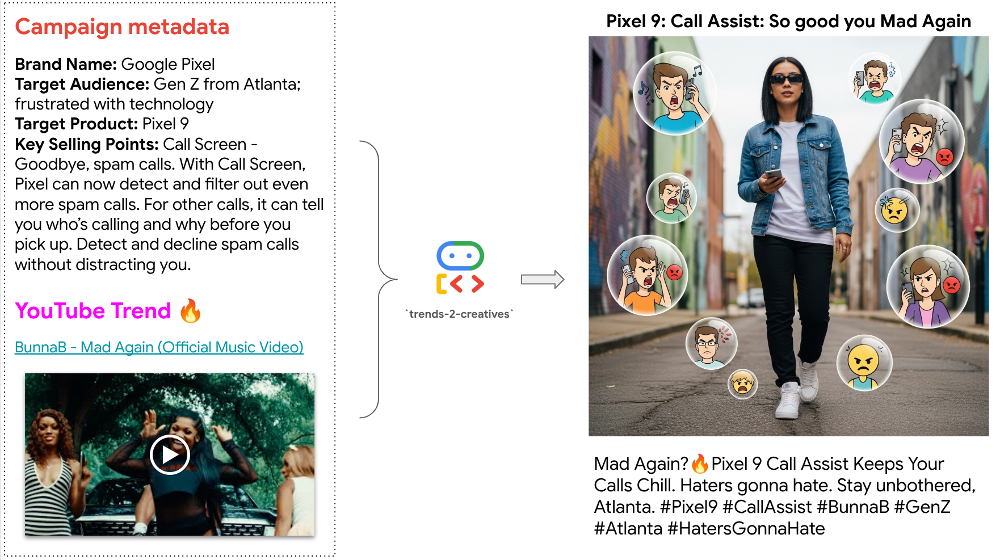
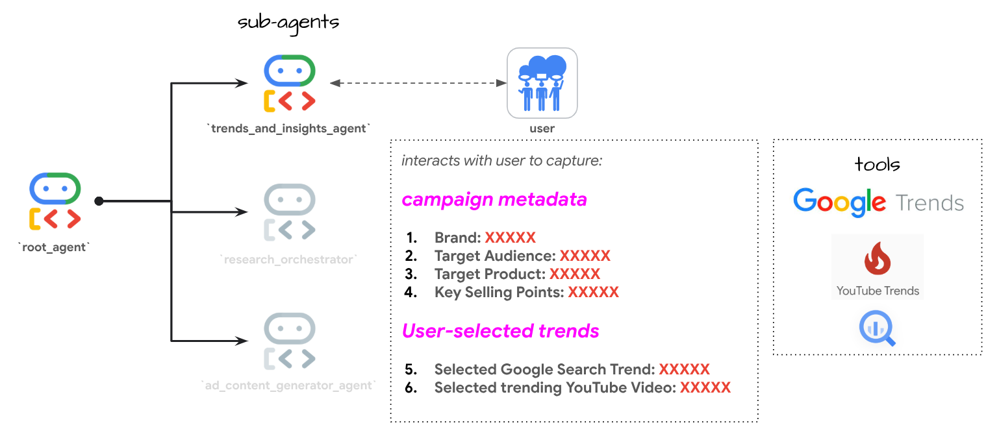
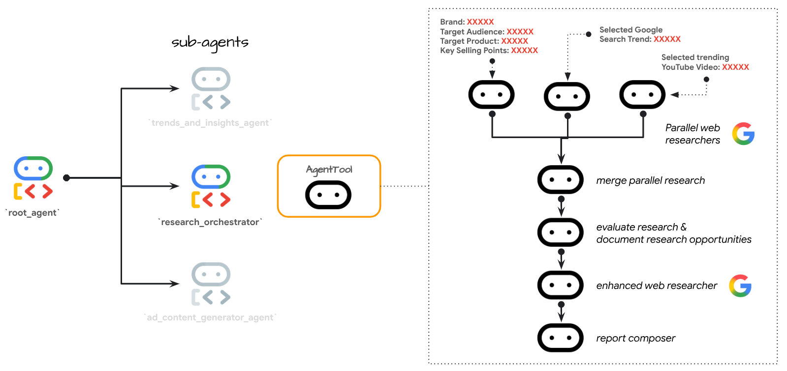
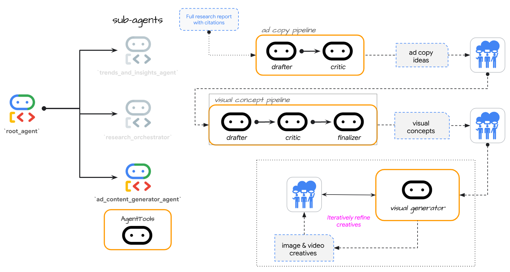

# trends-2-creatives

> a multi-agent system finding the intersection between product, trend, and audience

<details>
  <summary>trends R us</summary>

<p align="center">
  
</p>

</details>

## About

_trends-2-creatives_ is a marketing tool for developing data-driven and culturally relevant marketing content. Built with Google’s [Agent Development Kit (ADK)](https://google.github.io/adk-docs/), this multi-agent system helps users generate ad creatives from trending themes in Google Search and YouTube.

- Build LLM-based agents with [models supported in Vertex AI's Model Garden](https://cloud.google.com/vertex-ai/generative-ai/docs/model-garden/available-models)
- Explore [trending Search terms](https://cloud.google.com/blog/products/data-analytics/top-25-google-search-terms-now-in-bigquery?e=48754805) and [trending YouTube videos](https://developers.google.com/youtube/v3/docs/videos/list)
- Conduct web research to better understand the campaign, Search trend, and trending YouTube video
- Draft ad creatives (e.g., image and video) based on trends, campaign themes, or specific prompts

<p align="center">
  
</p>

## How to use this repo

1. **Clone the repository**

```bash
git clone https://github.com/tottenjordan/zghost.git
```

2. **Create a virtual environment and install dependencies**

```bash
uv sync
```

3. **Authenticate and Enable Google Cloud APIs**

```bash
gcloud auth application-default login

gcloud services enable artifactregistry.googleapis.com \
    bigquery.googleapis.com \
    logging.googleapis.com \
    run.googleapis.com \
    storage-component.googleapis.com  \
    eventarc.googleapis.com \
    serviceusage.googleapis.com \
    secretmanager.googleapis.com \
    aiplatform.googleapis.com \
    youtube.googleapis.com
```

4. **Create and store YouTube API key**

- See [these instructions](https://developers.google.com/youtube/v3/getting-started) for getting a `YOUTUBE_DATA_API_KEY`
- Store this API key in [Secret Manager](https://cloud.google.com/secret-manager/docs/creating-and-accessing-secrets) as `yt-data-api` (see `YT_SECRET_MNGR_NAME` in `.env` file)
  - For step-by-step guidance, see [create a secret and access a secret version](https://cloud.google.com/secret-manager/docs/create-secret-quickstart#create_a_secret_and_access_a_secret_version)

5. **Create and populate `.env` file(s)**

```bash
GOOGLE_GENAI_USE_VERTEXAI=1
GOOGLE_CLOUD_PROJECT=<YOUR_GCP_PROJECT_ID>
GOOGLE_CLOUD_PROJECT_NUMBER=<YOUR_GCP_PROJECT_NUMBER> # e.g., 1234756
GOOGLE_CLOUD_LOCATION=<YOUR_LOCATION> # e.g., us-central1
BUCKET=gs://<YOUR_GCS_BUCKET_NAME> # create a GCS bucket
YT_SECRET_MNGR_NAME=<YOUR_SECRET_NAME> # e.g., yt-data-api
MEMORY_BANK_AGENT_ENGINE_ID=<YOUR_MEMORY_BANK_AGENT_ID> # e.g., 6534772537337839616
# SESSION_STATE_JSON_PATH=example_state_pixel.json # uncomment to use default config values
```

_copy `.env` file to `root_agent` dir:_

```bash
cp .env trends_and_insights_agent/.env
cat trends_and_insights_agent/.env

source .env
```

6.  **Create Cloud Storage bucket**

```bash
gcloud storage buckets create $BUCKET --location=$GOOGLE_CLOUD_LOCATION
```

7. **Launch the adk developer UI**

```bash
uv run adk web
```

Open your browser and navigate to [http://localhost:8000](http://localhost:8000) and select an agent from the drop-down (top left)

```bash
INFO:     Started server process [750453]
INFO:     Waiting for application startup.

+-----------------------------------------------------------------------------+
| ADK Web Server started                                                      |
|                                                                             |
| For local testing, access at http://localhost:8000.                         |
+-----------------------------------------------------------------------------+

INFO:     Application startup complete.
INFO:     Uvicorn running on http://0.0.0.0:8000 (Press CTRL+C to quit)
```

<details>
  <summary>If port :8000 in use</summary>

_find any processes listening to port `:8000`, kill them, then return to step (7):_

```bash
lsof -i :8000
kill -9 $PID
lsof -i :8000
```

</details>

### Option B: Full stack with frontend UI

For the full experience (campaign wizard, orchestration dashboard, voice assistant), use `run_local.sh` which starts all services:

```bash
./run_local.sh
```

This launches 4 services:

| Service | Port | Description |
|---------|------|-------------|
| API Server | `8000` | Custom FastAPI backend (ADK runner, session management, SSE streaming) |
| Voice Server | `8081` | WebSocket server for Gemini Live voice assistant |
| Memory API | `8082` | FastAPI server for Vertex AI Memory Bank |
| Frontend | `5173` | Vite + React dev server |

Open [http://localhost:5173](http://localhost:5173) in your browser.

> **Note:** The API server takes ~2-3 minutes to initialize (it loads the full agent tree on startup). The frontend UI will load immediately, but pipeline execution won't work until the API server finishes importing `root_agent`.

Press `Ctrl+C` to stop all services.

<details>
  <summary>If a port is already in use</summary>

Find and kill the process occupying the port:

```bash
# Check which process is using a port
lsof -i :8000   # or :5173, :8081, :8082

# Kill it
kill -9 <PID>
```

Alternatively, kill all zghost-related processes:

```bash
pkill -f "api_server|voice_server|memory_api|vite"
```

</details>

<details>
  <summary>Opening ports in a remote IDE (VS Code, Cloud Workstations, SSH)</summary>

If you're developing on a remote machine (VM, Cloud Workstation, or SSH session), you need to forward the ports to your local browser.

**VS Code Remote (recommended)**

VS Code automatically detects listening ports. Open the **Ports** panel (`Ctrl+Shift+P` → "Ports: Focus on Ports View") and forward:

| Port | Label |
|------|-------|
| `5173` | Frontend (this is the one you open in the browser) |
| `8000` | API Server (proxied by Vite — no need to forward separately) |
| `8081` | Voice WebSocket (proxied by Vite) |
| `8082` | Memory API (proxied by Vite) |

Only port **5173** needs to be forwarded if you access the app through the frontend. Vite's dev proxy (`vite.config.ts`) routes `/api/*`, `/ws/*`, and `/api/memories/*` to the correct backend ports automatically.

**Manual SSH port forwarding**

```bash
# Forward just the frontend (sufficient for most use cases)
ssh -L 5173:localhost:5173 your-remote-host

# Forward all ports (if you need direct backend access)
ssh -L 5173:localhost:5173 \
    -L 8000:localhost:8000 \
    -L 8081:localhost:8081 \
    -L 8082:localhost:8082 \
    your-remote-host
```

**Google Cloud Workstations**

Cloud Workstations automatically expose forwarded ports. Use the built-in port forwarding in the IDE, or access via the Workstation proxy URL.

**tmux / screen users**

Run `./run_local.sh` in a persistent tmux session so services survive terminal disconnects:

```bash
tmux new -s zghost
./run_local.sh
# Ctrl+B, D to detach
# tmux attach -t zghost to reconnect
```

</details>

## How it works

<details>
  <summary> Example usage </summary>

#### [1] Capture campaign metadata & user-selected trends

Agent will ask user for **campaign metadata** in the UI

```
> [agent]: Hello! I'm your AI Marketing Research & Strategy Assistant... To start, what please provide the following campaign metadata:

    * Brand
    * Target Product
    * Key Selling Points
    * Target Audience
```

<details>
  <summary> [Optional] preload campaign metadata </summary>

preload these values using one of the example json configs e.g., [shared_libraries/profiles/example_state_pixel.json](trends_and_insights_agent/shared_libraries/profiles/example_state_pixel.json) or upload your own. The json config you wish to reference should be set in your `.env` file like below. _Note: remove or comment out this variable to use default option (1)_

```
SESSION_STATE_JSON_PATH=example_state_prs.json
```

</details>

#### [2] Autonomous research workflow

#### [3] Interactive ad content generator

> Note: this section is configured for **human-in-the-loop** i.e., agent will iterate with user when generating image and video creatives

- Choose a subset of ad copies to proceed with
- Choose a subset of visual concepts to proceed with
- Generate image and video creatives with visual concepts

#### [4] Compile final research and creative report

</details>

## Example ad creatives

<details>
  <summary>Hulkamania & Pixel 9's Call Assist</summary>

<p align="center">
  
</p>

</details>

<details>
  <summary>Titanic & PRS Guitars</summary>

<p align="center">
  
</p>

</details>

<details>
  <summary>Adam Sandler (Waterboy) & PRS Guitars</summary>

<p align="center">
  
</p>

</details>

<details>
  <summary>Mad Again & Pixel 9' Call Assist</summary>

<p align="center">
  
</p>

</details>

## Video walkthrough

> This demo gives a quick overview of the end-to-end workflow

[](https://www.youtube.com/watch?v=S8Bh4eBQSs0)

## Sub-agents & Tools

```
root_agent (orchestrator)
├── trends_and_insights_agent              # Display/capture trend selections
├── research_orchestrator                  # Coordinate research pipeline
│   └── combined_research_pipeline         # Sequential research flow (AgentTool)
│       ├── merge_parallel_insights        # Parallel research coordination
│       │   ├── parallel_planner_agent     # Runs 3 research types simultaneously
│       │   │   ├── yt_sequential_planner  # YouTube trend analysis
│       │   │   │   ├── yt_analysis_generator_agent
│       │   │   │   ├── yt_web_planner
│       │   │   │   └── yt_web_searcher
│       │   │   ├── gs_sequential_planner  # Google Search trend analysis
│       │   │   │   ├── gs_web_planner
│       │   │   │   └── gs_web_searcher
│       │   │   └── ca_sequential_planner  # Campaign research
│       │   │       ├── campaign_web_planner
│       │   │       └── campaign_web_searcher
│       │   └── merge_planners             # Combines research plans
│       ├── combined_web_evaluator         # Quality check
│       ├── enhanced_combined_searcher     # Expand web search
│       └── combined_report_composer       # Generate unified research report
├── ad_content_generator_agent             # Create comprehensive ad campaigns
│   ├── ad_creative_pipeline               # Ad copy actor-critic framework (AgentTool)
│   │   ├── ad_copy_drafter
│   │   └── ad_copy_critic
│   ├── visual_generation_pipeline         # Visual concept actor-critic framework (AgentTool)
│   │   ├── visual_concept_drafter
│   │   ├── visual_concept_critic
│   │   └── visual_concept_finalizer
│   └── visual_generator                   # Image/video generation (AgentTool)
├── av_editing_studio_agent                # 30s commercial generation (clip chaining, ffmpeg)
└── focus_group_evaluator_agent            # Simulated focus group review of commercials
```

Expand sections below to visualize complex agent workflows

<details>
  <summary>Trend and Insight Agent</summary>

> This agent is responsible for gathering input from the user.

<p align="center">
  
</p>

</details>

<details>
  <summary>Research Orchestrator Pipeline</summary>

**The research workflow has two phases:**

1. Parallel web research for individual topics: search trend, YouTube video, and campaign metadata e.g., target audience, product, brand, etc.
2. Combined web research for the intersection of individual topics

> This structure helps us achieve a deeper understanding of each subject first. And this helps us ask better questions for a second round of research where we are solely focused on finding any culturally relevant overlaps to exploit for ad creatives.

<p align="center">
  
</p>

</details>

<details>
  <summary>Ad Content Generator Pipeline</summary>

> This agent uses the research report to generate relevant ad copy, visual concepts, and creatives (image and video).

<p align="center">
  
</p>

</details>

# CI And Testing

Using `pytest`, users can test for tool coverage as well as Agent evaluations.

More detail on agent evaluations [can be found here](https://google.github.io/adk-docs/evaluate/#2-pytest-run-tests-programmatically), along with how to run a `pytest` eval.

#### Running `pytest`

From the project root, run:

```bash
uv run pytest tests/*.py
```

## Deployment

The agent can be deployed in a couple of different ways

1. Agent Engine
   - Be sure to first run the `setup_ae_sm_access.sh` script to give Agent Engine access to Secret Manager
   - Run `python deploy_to_ae.py` to deploy the agent
2. Cloud Run
   - Run `deploy_to_cloud_run.sh`
   - Note this runs unit tests prior to deploying

Script for Cloud Run:

```bash
#!/bin/bash
source trends_and_insights_agent/.env

# run unit tests before deploying
uv run pytest tests/*.py

# write requirements.txt to the agent folder
uv export --format requirements-txt --no-hashes > trends_and_insights_agent/requirements.txt

#deploy to cloud run
adk deploy cloud_run \
  --project=$GOOGLE_CLOUD_PROJECT \
  --region=$GOOGLE_CLOUD_LOCATION \
  --service_name='trends-and-insights-agent' \
  --with_ui \
  trends_and_insights_agent/
```

## Deployment to Agentspace

First deploy to Agent Engine using `python deploy_to_ae.py`, then note the Agent Engine ID (last numeric portion of the Resource Name). e.g.:

```bash
agent_engine = vertexai.agent_engines.get('projects/679926387543/locations/us-central1/reasoningEngines/1093257605637210112')
```

Update the `agent_config_example.json`, then run:

```bash
./publish_to_agentspace_v2.sh --action create --config agent_config.json
```

Usage: `./publish_to_agentspace_v2.sh [OPTIONS]`

```bash
Options:
  -a, --action <create|update|list|delete>  Action to perform (required)
  -c, --config <file>              JSON configuration file
  -p, --project-id <id>            Google Cloud project ID
  -n, --project-number <number>    Google Cloud project number
  -e, --app-id <id>                Agent Space application ID
  -r, --reasoning-engine <id>      Reasoning Engine ID (required for create/update)
  -d, --display-name <name>        Agent display name (required for create/update)
  -s, --description <desc>         Agent description (required for create)
  -i, --agent-id <id>              Agent ID (required for update/delete)
  -t, --instructions <text>        Agent instructions/tool description (required for create)
  -u, --icon-uri <uri>             Icon URI (optional)
  -l, --location <location>        Location (default: us)
  -h, --help                       Display this help message
```

### Example with config file:

```bash
./publish_to_agentspace_v2.sh --action create --config agent_config.json
./publish_to_agentspace_v2.sh --action update --config agent_config.json
./publish_to_agentspace_v2.sh --action list --config agent_config.json
./publish_to_agentspace_v2.sh --action delete --config agent_config.json
```

### Example with command line args:

Create agent:

```bash
./publish_to_agentspace_v2.sh --action create --project-id my-project --project-number 12345 \
--app-id my-app --reasoning-engine 67890 --display-name 'My Agent' \
--description 'Agent description' --instructions 'Agent instructions here'
```

Update agent:

```bash
./publish_to_agentspace_v2.sh --action update --project-id my-project --project-number 12345 \
--app-id my-app --reasoning-engine 67890 --display-name 'My Agent' \
--agent-id 123456789 --description 'Updated description'
```

List agents:

```bash
./publish_to_agentspace_v2.sh --action list --project-id my-project --project-number 12345 \
--app-id my-app
```

Delete agent:

```bash
./publish_to_agentspace_v2.sh --action delete --project-id my-project --project-number 12345 \
--app-id my-app --agent-id 123456789
```

## MCP Server Integration

This project supports [Model Context Protocol (MCP)](https://modelcontextprotocol.io/) servers for enhanced development workflows, design integration, and team collaboration.

### Configured MCP Servers

- **GitHub** - Repository management, CI/CD workflows, PR/issue tracking
- **Puppeteer** - Browser automation, screenshots, web scraping
- **Memory** - Persistent knowledge graph across sessions
- **Sentry** - Error tracking and performance monitoring (optional)
- **Slack** - Team communication and notifications (optional)
- **Figma** - Design system integration (optional)

### Quick Setup

1. Add required environment variables to `.env`:
   ```bash
   # Minimum setup (GitHub only)
   GITHUB_TOKEN=your_github_personal_access_token
   ```

2. Configuration is already in `.mcp.json` - just restart Claude Code

3. See detailed setup instructions:
   - `MCP_SERVERS_SETUP.md` - Complete configuration guide
   - `MCP_QUICK_REFERENCE.md` - Quick reference and examples

### Example MCP Queries

- "Show me the CI/CD status for the latest commit"
- "Take a screenshot of the marketing dashboard"
- "Remember that our target audience is Gen Z"
- "Send a campaign summary to #marketing on Slack"
