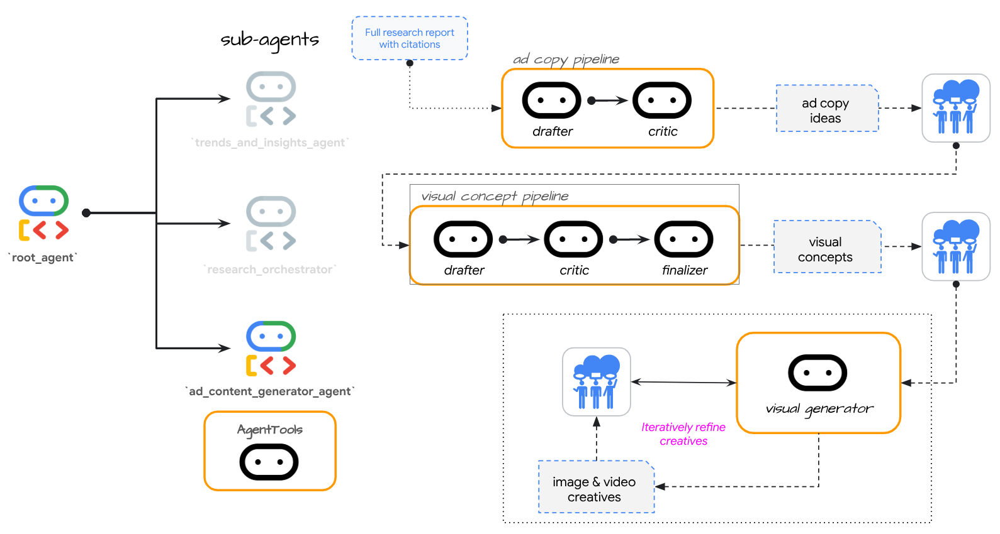

# trends-2-creatives

> a multi-agent system finding the intersection between product, trend, and audience

<details>
  <summary>trends R us</summary>

<p align="center">
  
</p>

</details>

## About

*trends-2-creatives* is a marketing tool for developing data-driven and culturally relevant marketing content. Built with Google’s [Agent Development Kit (ADK)](https://google.github.io/adk-docs/), this multi-agent system helps users generate ad creatives from trending themes in Google Search and YouTube.

- Build LLM-based agents with [models supported in Vertex AI's Model Garden](https://cloud.google.com/vertex-ai/generative-ai/docs/model-garden/available-models)
- Explore [trending Search terms](https://cloud.google.com/blog/products/data-analytics/top-25-google-search-terms-now-in-bigquery?e=48754805) and [trending YouTube videos](https://developers.google.com/youtube/v3/docs/videos/list)
- Conduct web research to better understand the campaign, Search trend, and trending YouTube video
- Draft ad creatives (e.g., image and video) based on trends, campaign themes, or specific prompts

<p align="center">
  
</p>

## How to use this repo

1. **Clone the repository**

```bash
git clone https://github.com/tottenjordan/zghost.git
```

2. **Create a virtual environment and install dependencies**

```bash
python3 -m venv .venv && source .venv/bin/activate

pip install pipx
pip install -U poetry packaging ipykernel

poetry install
```

3. **Authenticate and Enable Google Cloud APIs**

```bash
gcloud auth application-default login

gcloud services enable artifactregistry.googleapis.com \
    bigquery.googleapis.com \
    logging.googleapis.com \
    run.googleapis.com \
    storage-component.googleapis.com  \
    eventarc.googleapis.com \
    serviceusage.googleapis.com \
    secretmanager.googleapis.com \
    aiplatform.googleapis.com \
    youtube.googleapis.com
```

4. **Create and store YouTube API key**

  - See [these instructions](https://developers.google.com/youtube/v3/getting-started) for getting a `YOUTUBE_DATA_API_KEY`
  - Store this API key in [Secret Manager](https://cloud.google.com/secret-manager/docs/creating-and-accessing-secrets) as `yt-data-api` (see `YT_SECRET_MNGR_NAME` in `.env` file)
     - For step-by-step guidance, see [create a secret and access a secret version](https://cloud.google.com/secret-manager/docs/create-secret-quickstart#create_a_secret_and_access_a_secret_version)


5. **Create and populate `.env` file(s)**

```bash
GOOGLE_GENAI_USE_VERTEXAI=1
GOOGLE_CLOUD_PROJECT=<YOUR_GCP_PROJECT_ID>
GOOGLE_CLOUD_PROJECT_NUMBER=<YOUR_GCP_PROJECT_NUMBER> # e.g., 1234756
GOOGLE_CLOUD_LOCATION=<YOUR_LOCATION> # e.g., us-central1
BUCKET=gs://<YOUR_GCS_BUCKET_NAME> # create a GCS bucket
YT_SECRET_MNGR_NAME=<YOUR_SECRET_NAME> # e.g., yt-data-api
# SESSION_STATE_JSON_PATH=example_state_pixel.json # uncomment to use default config values
```

*copy `.env` file to `root_agent` dir:*

```bash
cp .env trends_and_insights_agent/.env
cat trends_and_insights_agent/.env

source .env
```

 6. **Create Cloud Storage bucket**

```bash
gcloud storage buckets create $BUCKET --location=$GOOGLE_CLOUD_LOCATION
```

7. **Launch the adk developer UI**

```bash
poetry run adk web
```

Open your browser and navigate to [http://localhost:8000](http://localhost:8000) and select an agent from the drop-down (top left)

```bash
INFO:     Started server process [750453]
INFO:     Waiting for application startup.

+-----------------------------------------------------------------------------+
| ADK Web Server started                                                      |
|                                                                             |
| For local testing, access at http://localhost:8000.                         |
+-----------------------------------------------------------------------------+

INFO:     Application startup complete.
INFO:     Uvicorn running on http://0.0.0.0:8000 (Press CTRL+C to quit)
```

<details>
  <summary>If port :8000 in use</summary>

*find any processes listening to port `:8000`, kill them, then return to step (7):*

```bash
lsof -i :8000
kill -9 $PID
lsof -i :8000
```

</details>

## How it works

<details>
  <summary> Example usage </summary>

#### [1] Capture campaign metadata & user-selected trends

Agent will ask user for **campaign metadata** in the UI

```
> [agent]: Hello! I'm your AI Marketing Research & Strategy Assistant... To start, what please provide the following campaign metadata:

    * Brand
    * Target Product
    * Key Selling Points
    * Target Audience
```

<details>
  <summary> [Optional] preload campaign metadata </summary>

preload these values using one of the example json configs e.g., [shared_libraries/profiles/example_state_pixel.json](trends_and_insights_agent/shared_libraries/profiles/example_state_pixel.json) or upload your own. The json config you wish to reference should be set in your `.env` file like below. *Note: remove or comment out this variable to use default option (1)*

```
SESSION_STATE_JSON_PATH=example_state_prs.json
```
</details>


#### [2] Autonomous research workflow

#### [3] Interactive ad content generator

> Note: this section is configured for **human-in-the-loop** i.e., agent will iterate with user when generating image and video creatives

  - Choose a subset of ad copies to proceed with
  - Choose a subset of visual concepts to proceed with
  - Generate image and video creatives with visual concepts

#### [4] Compile final research and creative report

</details>

## Example ad creatives

<details>
  <summary>Hulkamania & Pixel 9's Call Assist</summary>

<p align="center">
  
</p>

</details>


<details>
  <summary>Titanic & PRS Guitars</summary>

<p align="center">
  
</p>

</details>


<details>
  <summary>Adam Sandler (Waterboy) & PRS Guitars</summary>

<p align="center">
  
</p>

</details>


<details>
  <summary>Mad Again & Pixel 9' Call Assist</summary>

<p align="center">
  
</p>

</details>


## Video walkthrough

> Updated version coming soon!


## Sub-agents & Tools

```
root_agent (orchestrator)
├── trends_and_insights_agent              # Display/capture trend selections
├── research_orchestrator                  # Coordinate research pipeline
│   ├── combined_research_pipeline         # Sub-agent for SequentialAgent workflow
│   │   ├── merge_parallel_insights        # Parallel research coordination
│   │   │   ├── parallel_planner_agent     # Runs 3 research types simultaneously
│   │   │   │   ├── yt_sequential_planner  # YouTube trend analysis
│   │   │   │   ├── gs_sequential_planner  # Google Search trend analysis
│   │   │   │   └── ca_sequential_planner  # Campaign research
│   │   │   └── merge_planners             # Combines research plans
│   │   ├── combined_web_evaluator         # Quality check
│   │   ├── enhanced_combined_searcher     # Expand web search
│   │   └── combined_report_composer       # Generate unified research report
├── ad_content_generator_agent             # Create comprehensive ad campaigns
│   ├── ad_creative_pipeline               # Ad copy actor-critic framework
│   │   ├── ad_copy_drafter
│   │   ├── ad_copy_critic
│   ├── visual_generation_pipeline         # Visual concept actor-critic framework
│   │   ├── visual_concept_drafter
│   │   ├── visual_concept_critic
│   │   └── visual_concept_finalizer
│   └── visual_generator                   # Image/video generation
└── save_creatives_and_research_report     # Compile PDF reports

```

Expand sections below to visualize complex agent workflows

<details>
  <summary>Trend and Insight Agent</summary>

> This agent is responsible for gathering input from the user. 

<p align="center">
  
</p>

</details>


<details>
  <summary>Research Orchestrator Pipeline</summary>

**The research workflow has two phases:**
1. Parallel web research for individual topics: search trend, YouTube video, and campaign metadata e.g., target audience, product, brand, etc.
2. Combined web research for the intersection of individual topics

> This structure helps us achieve a deeper understanding of each subject first. And this helps us ask better questions for a second round of research where we are solely focused on finding any culturally relevant overlaps to exploit for ad creatives. 

<p align="center">
  
</p>

</details>


<details>
  <summary>Ad Content Generator Pipeline</summary>

> This agent uses the research report to generate relevant ad copy, visual concepts, and creatives (image and video). 

<p align="center">
  
</p>

</details>


# CI And Testing

Using `pytest`, users can test for tool coverage as well as Agent evaluations.

More detail on agent evaluations [can be found here](https://google.github.io/adk-docs/evaluate/#2-pytest-run-tests-programmatically), along with how to run a `pytest` eval.

#### Running `pytest`

From the project root, run:

```bash
pytest tests/*.py
```

## Deployment

The agent can be deployed in a couple of different ways

1. Agent Engine
   * Here's an end-to-end guide on deploying
   * Be sure to first run the `setup_ae_sm_access.sh` script to give Agent Engine access to Secret Manager
   * Run the [deployment guide](.notebooks/deployment_guide.ipynb) to deploy the agent
2. Cloud Run
   * Run `deploy_to_cloud_run.sh`
   * Note this runs unit tests prior to deploying

Script for Cloud Run:

```bash
#!/bin/bash
source trends_and_insights_agent/.env

# run unit tests before deploying
pytest tests/*.py

# write requirements.txt to the agent folder
poetry export --without-hashes --format=requirements.txt >   trends_and_insights_agent/requirements.txt

#deploy to cloud run
adk deploy cloud_run \
  --project=$GOOGLE_CLOUD_PROJECT \
  --region=$GOOGLE_CLOUD_LOCATION \
  --service_name='trends-and-insights-agent' \
  --with_ui \
  trends_and_insights_agent/
```

## Deployment to Agentspace


Create an Agent Engine in the `notebooks/deployment_guide.ipynb` notebook

Then note the Agent Engine ID (last numeric portion of the Resource Name). e.g.:

```bash
agent_engine = vertexai.agent_engines.get('projects/679926387543/locations/us-central1/reasoningEngines/1093257605637210112')
```

Update the `agent_config_example.json`, then run:

```bash
./publish_to_agentspace_v2.sh --action create --config agent_config.json
```

Usage: `./publish_to_agentspace_v2.sh [OPTIONS]`

```bash
Options:
  -a, --action <create|update|list|delete>  Action to perform (required)
  -c, --config <file>              JSON configuration file
  -p, --project-id <id>            Google Cloud project ID
  -n, --project-number <number>    Google Cloud project number
  -e, --app-id <id>                Agent Space application ID
  -r, --reasoning-engine <id>      Reasoning Engine ID (required for create/update)
  -d, --display-name <name>        Agent display name (required for create/update)
  -s, --description <desc>         Agent description (required for create)
  -i, --agent-id <id>              Agent ID (required for update/delete)
  -t, --instructions <text>        Agent instructions/tool description (required for create)
  -u, --icon-uri <uri>             Icon URI (optional)
  -l, --location <location>        Location (default: us)
  -h, --help                       Display this help message
```

### Example with config file:
```bash
./publish_to_agentspace_v2.sh --action create --config agent_config.json
./publish_to_agentspace_v2.sh --action update --config agent_config.json
./publish_to_agentspace_v2.sh --action list --config agent_config.json
./publish_to_agentspace_v2.sh --action delete --config agent_config.json
```
### Example with command line args:

Create agent:
```bash
./publish_to_agentspace_v2.sh --action create --project-id my-project --project-number 12345 \
--app-id my-app --reasoning-engine 67890 --display-name 'My Agent' \
--description 'Agent description' --instructions 'Agent instructions here'
```
  Update agent:
```bash
./publish_to_agentspace_v2.sh --action update --project-id my-project --project-number 12345 \
--app-id my-app --reasoning-engine 67890 --display-name 'My Agent' \
--agent-id 123456789 --description 'Updated description'
```
  List agents:
```bash
./publish_to_agentspace_v2.sh --action list --project-id my-project --project-number 12345 \
--app-id my-app
```

  Delete agent:
```bash
./publish_to_agentspace_v2.sh --action delete --project-id my-project --project-number 12345 \
--app-id my-app --agent-id 123456789
```