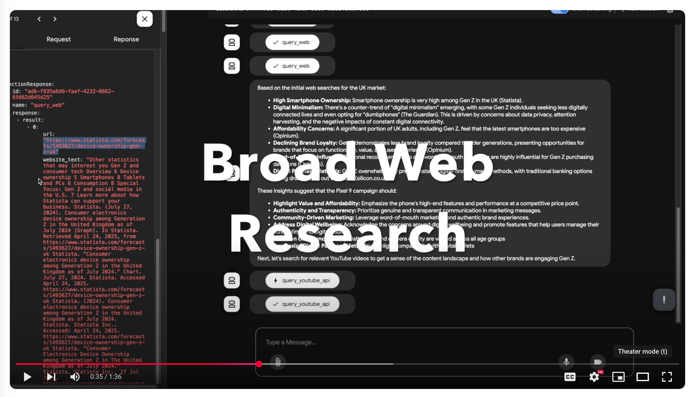

# Trend & Insight Agents

> *building multi-agent systems with Google's [Agent Development Kit](https://google.github.io/adk-docs/) (ADK)*

## About

Trends & Insights Agent is an advanced marketing tool built upon the foundation of Retail, CPG, and Google’s AI marketing tooling best practices. This version represents a significant leap forward, bringing enhanced capabilities with Google’s new [Agent Development Kit (ADK)](https://google.github.io/adk-docs/)

**What Trends & Insights Can Do:**

-   **Streamline the Marketing Process:** From initial inspiration and competitive analysis to final creative drafts and reporting, TIA streamlines every step of the marketing workflow, making it easier to ideate, execute, and analyze campaigns, **significantly improving marketing use case velocity**.
-   **Leverage Advanced AI:** Utilizing cutting-edge LLM-based agents, Trends & Insights Agent empowers users to generate refined marketing briefs, draft ad creatives, and compile comprehensive report. These agents are powered by the diverse range of models available in Vertex AI's Model Garden.
-   **Deep Integration with Google Ecosystem:** Seamlessly gather real-time insights from Google Search trends, YouTube trends, using guardrails from your own internal campaign guidelines. This ensures marketing strategies are data-driven and culturally relevant.


**Rooted in Alphabet's/Google's Marketing Practices:**

-   **Act on Real-Time Insights:** Tap into the pulse of current trends and audience interests, ensuring that campaigns are always timely and relevant.
-   **Maintain Brand Consistency:** Ingest campaign guidelines to ensure all creative and messaging aligns with established brand voice and objectives.
-   **Optimize for Performance:** Leverage data-driven insights to refine strategies and maximize the impact of marketing efforts.

## Key Features

- Build LLM-based agents with [models supported in Vertex AI's Model Garden](https://cloud.google.com/vertex-ai/generative-ai/docs/model-garden/available-models)
- Ingest campaign guidelines outlining e.g., target audience, regions of interest, campaign objectives, product details, etc.
- Gather related content from Google Search and [YouTube](https://developers.google.com/youtube/v3/docs/search) for initial inspiration, competitor insights
- Explore trending Search terms and [trending YouTube videos](https://developers.google.com/youtube/v3/docs/videos/list)
- Generate refined marketing brief that includes e.g., campaign concepts, taglines, messaging angles, key insights, etc.
- Draft ad creatives (e.g., image and video) based on campaign themes or specific prompts
- Compile trends, insights, and campaign research into a comprehensive report


## Example usage

When interacting with the agent users can:
- Upload a PDF and get structured data outputs
- Query for general trends that are popular in various locations
- Broad research on new marketing ideas, leveraging web searching tools
- Generate new images based on insights from web searching or trend tool use

## How to use this repo

1. Clone this repo (to local or Vertex AI Workbench Instance)
2. Open a terminal and run below commands

### One-time setup

```bash
git clone https://github.com/tottenjordan/zghost.git
```

<details>
  <summary>Create & activate virtual environment</summary>

```bash
sudo apt-get install virtualenv python3-venv python3-pip

python3 -m venv .venv

source .venv/bin/activate
```

</details>


<details>
  <summary>Install packages</summary>

*Optionally install `ipykernel` to run/test in notebooks*

```bash
pip install pipx
pip install -U poetry packaging ipykernel

poetry install

poetry env use 3.12
```

</details>


<details>
  <summary>Authenticate and Enable Google Cloud APIs</summary>

```bash
gcloud auth application-default login

gcloud services enable artifactregistry.googleapis.com \
    bigquery.googleapis.com \
    logging.googleapis.com \
    run.googleapis.com \
    storage-component.googleapis.com  \
    eventarc.googleapis.com \
    serviceusage.googleapis.com \
    secretmanager.googleapis.com \
    aiplatform.googleapis.com
```

</details>


<details>
  <summary>Create and store YouTube API key</summary>

1. See [these instructions](https://developers.google.com/youtube/v3/getting-started) for getting a `YOUTUBE_DATA_API_KEY`

2. Store this API key in [Secret Manager](https://cloud.google.com/secret-manager/docs/creating-and-accessing-secrets) as `yt-data-api` (if you choose a different name, pass this to the `YT_SECRET_MNGR_NAME` in your `.env` file). See [create a secret and access a secret version](https://cloud.google.com/secret-manager/docs/create-secret-quickstart#create_a_secret_and_access_a_secret_version) or step-by-step guidance

</details>


<details>
  <summary>Optionally, create notebook kernels</summary>

*create kernel with required packages for notebooks hosted locally or in [Vertex AI Workbench Instances](https://cloud.google.com/vertex-ai/docs/workbench/instances/introduction)* 

**Notebook hosted locally**

```bash
export ENV_NAME=py312_venv
python3 -m ipykernel install --user --name $ENV_NAME --display-name $ENV_NAME
```

**Notebook hosted in Vertex AI Workbench**

*run this in instance terminal window:*

```bash
export ENV_NAME=py312_venv
DL_ANACONDA_ENV_HOME="${DL_ANACONDA_HOME}/envs/$ENV_NAME"
echo $DL_ANACONDA_ENV_HOME

python3 -m ipykernel install --prefix "${DL_ANACONDA_ENV_HOME}" --name $ENV_NAME --display-name $ENV_NAME
```

*In either option, open a notebook file and select your kernel (top right). Should see `$ENV_NAME` as an available kernel* 

</details>


<details>
  <summary>Create and populate `.env` file(s)</summary>

*create `.env` file for `root_agent`:*

```bash
touch .env
nano .env
```

*edit variables as needed:*

```bash
GOOGLE_GENAI_USE_VERTEXAI=1
GOOGLE_CLOUD_PROJECT=YOUR_GCP_PROJECT_ID
PROJECT_NUMBER=YOUR_GCP_PROJECT_NUMBER # e.g., 1234756
GOOGLE_CLOUD_LOCATION=YOUR_LOCATION # e.g., us-central1
YT_SECRET_MNGR_NAME=YOUR_SECRET_NAME # e.g., yt-data-api
GOOGLE_API_KEY=None # Optional
BUCKET=gs://YOUR_GCS_BUCKET_NAME # create a GCS bucket
```

*copy `.env` file to `root_agent` dir:*

```bash
cp .env trends_and_insights_agent/.env
cat trends_and_insights_agent/.env
```

*read and execute `.env` file:*

```bash
source .env
```

</details>


<details>
  <summary>Create GCP assets and grant IAM</summary>

*create Cloud Storage bucket:*

```bash
gcloud storage buckets create gs://$BUCKET --location=$GOOGLE_CLOUD_LOCATION
```

**TODOs:**
* create BigQuery tables for Trends dataset
* create commands for granting proper IAM to each asset

</details>


### Running locally

When starting a new session (e.g., after a new code commit, package update/add, etc.):

1. activate the `virtual environment` 
2. `source` the `.env` file 

```bash
source .venv/bin/activate`

source .env
echo $BUCKET
```

3. launch the adk developer UI

```bash
adk web
```

4. To start interacting with your agents, open the provided `localhost` link (e.g., `http://localhost:8000`) and select an agent from the drop-down (top left)

```bash
INFO:     Started server process [750453]
INFO:     Waiting for application startup.

+-----------------------------------------------------------------------------+
| ADK Web Server started                                                      |
|                                                                             |
| For local testing, access at http://localhost:8000.                         |
+-----------------------------------------------------------------------------+

INFO:     Application startup complete.
INFO:     Uvicorn running on http://0.0.0.0:8000 (Press CTRL+C to quit)
```

5. *Note: if port in use, find any processes listening to port `:8000`, kill them, then return to step (3):*

```bash
lsof -i :8000
kill -9 $PID
lsof -i :8000
```

### Video walkthrough

[](https://www.youtube.com/watch?v=rDqFdTJfsFA "TIA Video Demo")

# Tools


## CI And Testing

Using `pytest`, users can test for tool coverage as well as Agent evaluations.

More detail on agent evaluations [can be found here](https://google.github.io/adk-docs/evaluate/#2-pytest-run-tests-programmatically), along with how to run a `pytest` eval.

#### Running `pytest`

From the project root, run:

```bash
pytest tests/*.py
```

## Deployment

The agent can be deployed in a couple of different ways

1. Agent Engine
   * Here's an end-to-end guide on deploying
   * Be sure to first run the `setup_ae_sm_access.sh` script to give Agent Engine access to Secret Manager
   * Run the [deployment guide](.notebooks/deployment_guide.ipynb) to deploy the agent
2. Cloud Run
   * Run `deploy_to_cloud_run.sh`
   * Note this runs unit tests prior to deploying

Script for Cloud Run:

```bash
#!/bin/bash
source trends_and_insights_agent/.env

# run unit tests before deploying
pytest tests/*.py

# write requirements.txt to the agent folder
poetry export --without-hashes --format=requirements.txt >   trends_and_insights_agent/requirements.txt

#deploy to cloud run
adk deploy cloud_run \
  --project=$GOOGLE_CLOUD_PROJECT \
  --region=$GOOGLE_CLOUD_LOCATION \
  --service_name='trends-and-insights-agent' \
  --with_ui \
  trends_and_insights_agent/
```
