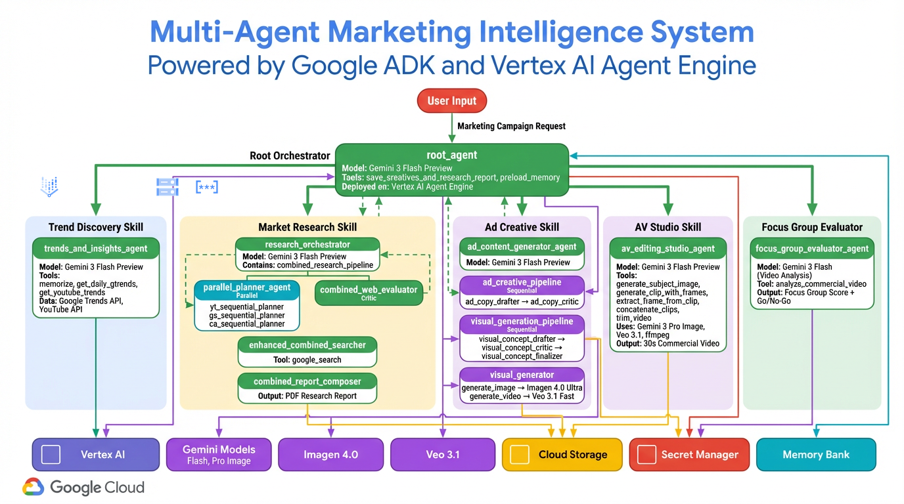
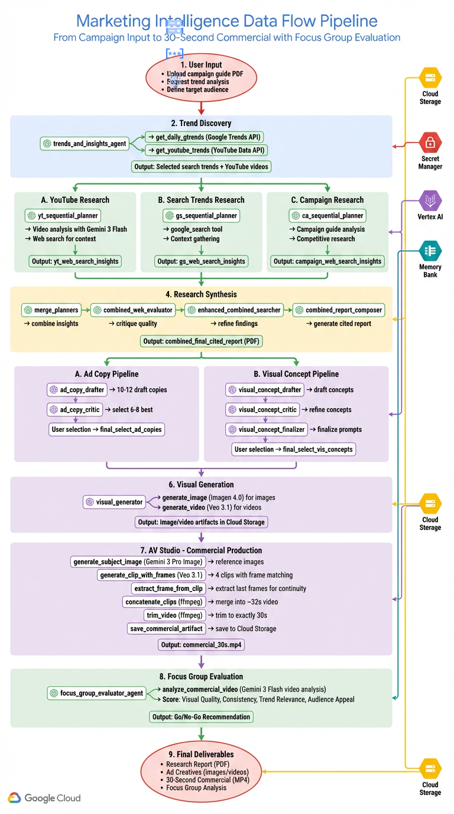
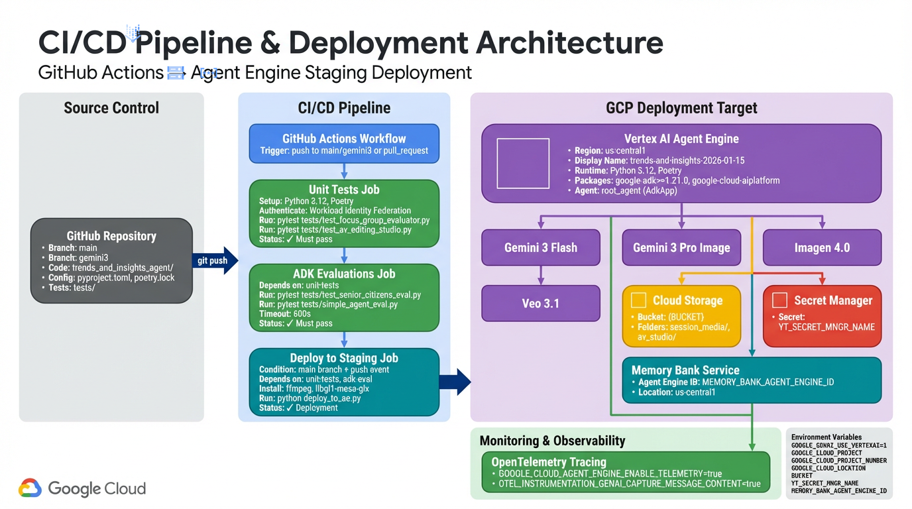
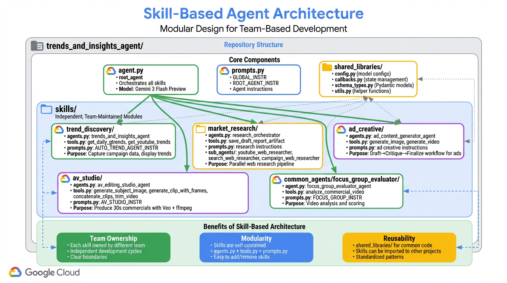

# Architecture Documentation

> Multi-Agent Marketing Intelligence System
>
> Powered by Google ADK and Vertex AI Agent Engine

## Table of Contents

1. [System Overview](#system-overview)
2. [Agent Architecture](#agent-architecture)
3. [Data Flow Pipeline](#data-flow-pipeline)
4. [Deployment Architecture](#deployment-architecture)
5. [Skill-Based Architecture](#skill-based-architecture)
6. [Technology Stack](#technology-stack)
7. [Key Design Patterns](#key-design-patterns)

---

## System Overview

This is a sophisticated multi-agent marketing intelligence system that automates the entire creative campaign development process, from trend discovery to commercial production and evaluation. Built with Google's Agent Development Kit (ADK) and deployed on Vertex AI Agent Engine, it leverages cutting-edge AI models including Gemini 3 Flash Preview, Gemini 3 Pro Image Preview, Imagen 4.0 Ultra, and Veo 3.1 Fast.

### Core Capabilities

- **Trend Discovery**: Automatically identifies trending topics from Google Trends (via BigQuery) and YouTube (via YouTube Data API v3)
- **Market Research**: Conducts parallel web research across multiple dimensions (YouTube, Search, Campaign)
- **Creative Generation**: Produces ad copy and visual concepts using actor-critic workflows
- **Commercial Production**: Generates 30-second commercials by chaining Veo clips with frame matching
- **Focus Group Evaluation**: Analyzes completed commercials with simulated focus group scoring

---

## Agent Architecture



### Root Agent Orchestration

The `root_agent` serves as the central orchestrator with BuiltInPlanner (thinking enabled), coordinating five specialized skill-based sub-agents:

```
root_agent (Gemini 3 Flash Preview)
├── trends_and_insights_agent      # Trend Discovery Skill
├── research_orchestrator           # Market Research Skill
├── ad_content_generator_agent      # Ad Creative Skill
├── av_editing_studio_agent         # AV Studio Skill
└── focus_group_evaluator_agent     # Focus Group Skill
```

### Skill-Based Sub-Agents

Each skill is loaded with ADK SkillToolset for dynamic discovery and includes self-contained documentation in SKILL.md files.

#### 1. Trend Discovery Skill
**Agent**: `trends_and_insights_agent`
**Directory**: `skills/trend_discovery/`

Captures campaign metadata and displays trending topics:
- Extracts campaign data from PDF guides
- Fetches daily Google Trends via BigQuery
- Retrieves trending YouTube videos via YouTube Data API v3
- Allows user to select relevant trends for campaign

**Key Tools**:
- `memorize` - Store campaign metadata in session state
- `get_daily_gtrends` - Fetch Google Trends data from BigQuery
- `get_youtube_trends` - Retrieve trending videos (up to 45 results)
- `save_yt_trends_to_session_state` - Persist selected YouTube trends
- `save_search_trends_to_session_state` - Persist selected search trends

#### 2. Market Research Skill
**Agent**: `research_orchestrator`
**Directory**: `skills/market_research/`

Coordinates comprehensive web research with parallel execution:

```
research_orchestrator
└── combined_research_pipeline (AgentTool - Sequential)
    ├── merge_parallel_insights (Sequential)
    │   ├── parallel_planner_agent (Parallel)
    │   │   ├── yt_sequential_planner (Sequential)
    │   │   │   ├── yt_analysis_generator_agent
    │   │   │   ├── yt_web_planner
    │   │   │   └── yt_web_searcher
    │   │   ├── gs_sequential_planner (Sequential)
    │   │   │   ├── gs_web_planner
    │   │   │   └── gs_web_searcher
    │   │   └── ca_sequential_planner (Sequential)
    │   │       ├── campaign_web_planner
    │   │       └── campaign_web_searcher
    │   └── merge_planners
    ├── combined_web_evaluator
    ├── enhanced_combined_searcher
    └── combined_report_composer
```

**Sub-agent Organization**:
- Sub-agents located in `skills/market_research/sub_agents/`
- Three specialized researchers: `youtube_web_researcher/`, `search_web_researcher/`, `campaign_web_researcher/`

**Research Pipeline**:
1. **Parallel Research Phase**: Three research tracks run simultaneously
   - YouTube: Analyze trending videos with Gemini 3 Flash, conduct contextual web search
   - Google Search: Research trending topics, gather competitive intelligence
   - Campaign: Analyze campaign guide, research target audience
2. **Merge Phase**: Combine insights from all three tracks
3. **Evaluation Phase**: Critic agent identifies gaps and generates follow-up queries
4. **Enhancement Phase**: Execute follow-up searches, integrate new findings
5. **Composition Phase**: Generate comprehensive PDF report with citation tracking

#### 3. Ad Creative Skill
**Agent**: `ad_content_generator_agent`
**Directory**: `skills/ad_creative/`

Generates ad copy and visual concepts using actor-critic workflow:

```
ad_content_generator_agent
├── ad_creative_pipeline (AgentTool - Sequential)
│   ├── ad_copy_drafter   # Generate 10-12 initial ad copy ideas
│   └── ad_copy_critic    # Narrow down to 6-8 best copies
├── visual_generation_pipeline (AgentTool - Sequential)
│   ├── visual_concept_drafter     # Draft visual concepts
│   ├── visual_concept_critic      # Refine concepts
│   └── visual_concept_finalizer   # Finalize Imagen/Veo prompts
└── visual_generator (AgentTool)
    ├── generate_image  # Imagen 4.0 Ultra
    └── generate_video  # Veo 3.1 Fast
```

**Creative Process**:
1. Draft 10-12 ad copy variations based on research and trends (temperature=1.5)
2. Critic selects 6-8 best copies with detailed rationale (temperature=0.7)
3. User selects final copies to proceed with
4. Draft visual concepts for each selected copy
5. Critic refines concepts with verbose prompts for consistency
6. User selects final visual concepts
7. Generate actual images (Imagen 4.0 Ultra) and videos (Veo 3.1 Fast)

#### 4. AV Studio Skill
**Agent**: `av_editing_studio_agent`
**Directory**: `skills/av_studio/`

Produces 30-second commercials by chaining Veo clips with frame matching:

**Workflow**:
1. Generate subject reference images (Gemini 3 Pro Image Preview)
2. Generate Clip 1 with subject image as first frame (Veo 3.1 Fast, ~8s)
3. Extract last frame from Clip 1
4. Generate Clip 2 with Clip 1's last frame as first frame (frame matching for continuity)
5. Repeat for Clips 3 and 4
6. Concatenate all 4 clips (~8s each = ~32s total) using ffmpeg
7. Trim to exactly 30 seconds
8. Save as ADK artifact

**Key Tools** (6 total):
- `generate_subject_image` - Create reference images for characters/props (Gemini 3 Pro Image Preview)
- `generate_clip_with_frames` - Generate 8s video clips with first/last frame conditioning (Veo 3.1 Fast)
- `extract_frame_from_clip` - Extract frames from video for continuity
- `concatenate_clips` - Merge clips with ffmpeg
- `trim_video` - Trim to target duration
- `save_commercial_artifact` - Save final commercial to session state

#### 5. Focus Group Skill
**Agent**: `focus_group_evaluator_agent`
**Directory**: `skills/focus_group/`

Simulates focus group evaluation of the completed commercial:

**Evaluation Criteria**:
- **Visual Quality**: Production value, image clarity, motion smoothness
- **Narrative Consistency**: Story flow, scene transitions, pacing
- **Trend Relevance**: How well the commercial incorporates selected trends
- **Audience Appeal**: Resonance with target demographic
- **Overall Score**: Weighted composite score
- **Go/No-Go Recommendation**: Final approval decision

**Key Tools**:
- `analyze_commercial_video` - Analyze 30s commercial with Gemini 3 Flash Preview video understanding
- SkillToolset integration for self-documentation

### GCP Services Integration

The system integrates deeply with Google Cloud Platform:

- **Vertex AI Agent Engine**: Serverless deployment platform for ADK agents
- **Gemini 3 Flash Preview**: Primary worker and critic model for agent reasoning
- **Gemini 3 Pro Image Preview**: Subject image generation for commercial production
- **Imagen 4.0 Ultra**: High-quality image generation for ad creatives (imagen-4.0-ultra-generate-preview-06-06)
- **Veo 3.1 Fast**: Video generation for commercials with frame conditioning (veo-3.1-fast-generate-001)
- **Cloud Storage**: GCS bucket for media artifacts (gs://zghost-media-center)
- **Secret Manager**: Secure storage for YouTube API keys
- **BigQuery**: Google Trends data warehouse
- **YouTube Data API v3**: Trending video discovery
- **Memory Bank Service**: Persistent session state across conversations
- **OpenTelemetry**: Distributed tracing for observability

---

## Data Flow Pipeline



### End-to-End Workflow

The system processes user input through nine sequential stages:

#### Stage 1: User Input
- User uploads campaign guide PDF
- User requests trend analysis
- User defines target audience and product

#### Stage 2: Trend Discovery
- `trends_and_insights_agent` activates
- Fetches Google Trends from BigQuery
- Retrieves YouTube trending videos via API
- User selects relevant search trends and YouTube videos

#### Stage 3: Parallel Market Research
Three research tracks execute simultaneously:

**Path A - YouTube Research**:
- `yt_sequential_planner` analyzes selected YouTube videos
- Gemini 3 Flash performs video understanding
- Conducts web search for video context
- Outputs: `yt_web_search_insights`

**Path B - Search Trends Research**:
- `gs_sequential_planner` researches selected search trends
- Uses `google_search` tool for competitive analysis
- Gathers cultural context
- Outputs: `gs_web_search_insights`

**Path C - Campaign Research**:
- `ca_sequential_planner` analyzes campaign guide
- Researches target audience demographics
- Identifies key selling points
- Outputs: `campaign_web_search_insights`

#### Stage 4: Research Synthesis
- `merge_planners` combines all three insight tracks
- `combined_web_evaluator` critiques completeness
- `enhanced_combined_searcher` fills identified gaps
- `combined_report_composer` generates cited PDF report
- Output: `combined_final_cited_report`

#### Stage 5: Ad Creative Generation
Two parallel pipelines:

**Path A - Ad Copy Pipeline**:
- `ad_copy_drafter` generates 10-12 draft copies
- `ad_copy_critic` selects 6-8 best copies
- User reviews and selects final copies
- Output: `final_select_ad_copies`

**Path B - Visual Concept Pipeline**:
- `visual_concept_drafter` creates concept ideas
- `visual_concept_critic` refines with verbose prompts
- `visual_concept_finalizer` prepares final prompts
- User reviews and selects final concepts
- Output: `final_select_vis_concepts`

#### Stage 6: Visual Generation
- `visual_generator` produces actual creatives
- Imagen 4.0 generates images from image concepts
- Veo 3.1 generates videos from video concepts
- All artifacts saved to Cloud Storage

#### Stage 7: AV Studio - Commercial Production
Sequential clip chain production:
1. Generate subject reference images (Gemini 3 Pro Image)
2. Generate Clip 1 with subject as first frame (Veo 3.1, 8s)
3. Extract last frame from Clip 1
4. Generate Clip 2 with Clip 1 last frame as first frame (8s)
5. Extract last frame from Clip 2
6. Generate Clip 3 with Clip 2 last frame as first frame (8s)
7. Extract last frame from Clip 3
8. Generate Clip 4 with Clip 3 last frame as first frame (8s)
9. Concatenate all clips (~32s total) with ffmpeg
10. Trim to exactly 30 seconds
11. Save as `commercial_30s.mp4` artifact

#### Stage 8: Focus Group Evaluation
- `focus_group_evaluator_agent` analyzes commercial
- Gemini 3 Flash with video analysis scores:
  - Visual Quality
  - Narrative Consistency
  - Trend Relevance
  - Audience Appeal
- Generates Go/No-Go recommendation

#### Stage 9: Final Deliverables
User receives:
- Research Report (PDF with citations)
- Ad Creatives (images and videos)
- 30-Second Commercial (MP4)
- Focus Group Analysis Report

### Data Persistence

**Session State** (stored in Memory Bank):
- Campaign metadata (brand, product, audience, selling points)
- Selected trends (search and YouTube)
- Research insights and citations
- Selected ad copies and visual concepts
- Generated artifact keys
- Commercial metadata

**Cloud Storage** (GCS bucket organized by session):
```
gs://{bucket}/{session_id}/
├── av_studio/
│   ├── subjects/        # Reference images
│   ├── frames/          # Extracted frames
│   ├── clips/           # Individual clips
│   └── commercial_30s.mp4
├── images/              # Generated image creatives
├── videos/              # Generated video creatives
└── reports/
    ├── draft_research_report.pdf
    └── final_report_with_creatives.pdf
```

---

## Deployment Architecture



The system supports two deployment targets with different capabilities:

### 1. Vertex AI Agent Engine Deployment

**Deployment Script**: `deploy_to_ae.py`

Uses `vertexai.preview.reasoning_engines.AdkApp` for production deployment:

```python
# Key configuration
vertexai.init(
    project=GOOGLE_CLOUD_PROJECT,
    location="us-central1",  # Deployment region
    staging_bucket=BUCKET,
)

env_vars = {
    "GOOGLE_CLOUD_LOCATION": "global",  # Required for Gemini 3 preview models
    "GOOGLE_CLOUD_AGENT_ENGINE_ENABLE_TELEMETRY": "true",
    "OTEL_INSTRUMENTATION_GENAI_CAPTURE_MESSAGE_CONTENT": "true",
}

my_agent = AdkApp(
    agent=root_agent,
    enable_tracing=True,
    env_vars=env_vars,
)

remote_agent = agent_engines.create(
    agent_engine=my_agent,
    display_name="trends-and-insights-2026-02-25",
    requirements=[...],  # 20+ packages
    extra_packages=["trends_and_insights_agent"],
    build_options={
        "installation": [
            "installation_scripts/install_opencv.sh",
            "installation_scripts/install_ffmpeg.sh",
        ]
    },
)
```

**Deployment Details**:
- **Working Agent Engine ID**: 225649472833585152
- **Region**: us-central1 (deployment), global (model access)
- **Features**: Sessions, Memory Bank, OpenTelemetry tracing
- **Test Script**: `test_deployed_agent.py {agent_id}`

### 2. Cloud Run Deployment

**Deployment Script**: `deploy_to_cloud_run.sh`

Uses ADK's built-in web UI for interactive testing:

```bash
# Export requirements
uv export --format requirements-txt > trends_and_insights_agent/requirements.txt

# Deploy with UI
adk deploy cloud_run \
  --project=$GOOGLE_CLOUD_PROJECT \
  --region=$CLOUD_RUN_REGION \
  --service_name='trends-and-insights-agent' \
  --with_ui \
  trends_and_insights_agent/
```

**Deployment Details**:
- **Service URL**: https://trends-and-insights-agent-in2bk2mdwa-uc.a.run.app
- **Region**: us-central1
- **Access**: Public (allUsers invoker)
- **Features**: Built-in ADK web UI for testing

### CI/CD Pipeline

The system uses GitHub Actions for continuous integration:

#### Stage 1: Source Control
- **Repository**: GitHub (main, gemini3 branches)
- **Code Structure**: `trends_and_insights_agent/` package
- **Dependencies**: Managed by uv (`pyproject.toml`)
- **Tests**: Unit tests, integration tests, ADK evaluations

#### Stage 2: Unit Tests Job
Triggered on push to main/gemini3 or pull requests:
1. Setup Python 3.12 environment
2. Install Poetry and dependencies
3. Authenticate to GCP via Workload Identity Federation
4. Run pytest unit tests:
   - `tests/test_focus_group_evaluator.py`
   - `tests/test_av_editing_studio.py`
   - `tests/test_init.py`
5. Must pass before proceeding

#### Stage 3: ADK Evaluations Job
Depends on successful unit tests:
1. Run ADK agent evaluations (with 600s timeout):
   - `tests/test_senior_citizens_eval.py`
   - `tests/simple_agent_eval.py`
2. Validates agent behavior with real Vertex AI models
3. Must pass before deployment

#### Stage 4: Deploy to Staging Job
Triggered only on main branch pushes:
1. Install system dependencies (ffmpeg, libgl1-mesa-glx)
2. Authenticate to GCP
3. Set environment variables from GitHub Secrets
4. Execute `python deploy_to_ae.py`
5. Deploy to Vertex AI Agent Engine (us-central1)

### Environment Configuration

**Required Environment Variables**:
```bash
# Core settings
GOOGLE_GENAI_USE_VERTEXAI=1
GOOGLE_CLOUD_PROJECT={project_id}
GOOGLE_CLOUD_PROJECT_NUMBER={project_number}
GOOGLE_CLOUD_LOCATION=global  # For Gemini 3 preview models
BUCKET=gs://zghost-media-center
YT_SECRET_MNGR_NAME={secret_name}

# Optional
SESSION_STATE_JSON_PATH={path_to_profile_json}
MEMORY_BANK_AGENT_ENGINE_ID={agent_engine_id}

# Telemetry (Agent Engine only)
GOOGLE_CLOUD_AGENT_ENGINE_ENABLE_TELEMETRY=true
OTEL_INSTRUMENTATION_GENAI_CAPTURE_MESSAGE_CONTENT=true
```

**Required Packages** (from pyproject.toml):
```
google-cloud-aiplatform[adk,agent-engines]>=1.133.0
google-adk>=1.22.1
google-genai>=1.19.0
python-dotenv
pandas>=2.2.3, numpy
requests, aiohttp>=3.11.16
pillow>=11.1.0, opencv-python>=4.12.0.88
google-api-python-client
pydantic, cloudpickle
google-cloud-bigquery>=3.34.0, db-dtypes>=1.4.3
google-cloud-texttospeech>=2.34.0
markdown-pdf>=1.7, tabulate>=0.9.0
fastapi>=0.133.0, uvicorn>=0.41.0
```

### Connected GCP Services

Once deployed, the system connects to:

1. **Vertex AI Models**:
   - Gemini 3 Flash Preview (gemini-3-flash-preview) - worker & critic
   - Gemini 3 Pro Image Preview (gemini-3-pro-image-preview) - subject images
   - Imagen 4.0 Ultra (imagen-4.0-ultra-generate-preview-06-06) - image generation
   - Veo 3.1 Fast (veo-3.1-fast-generate-001) - video generation with frame conditioning

2. **Cloud Storage**:
   - Bucket: `gs://zghost-media-center`
   - Session-based media organization
   - PDF report artifacts
   - Generated images and videos

3. **BigQuery**:
   - Google Trends data warehouse
   - Daily trend data queries

4. **Secret Manager**:
   - YouTube Data API key (`YT_SECRET_MNGR_NAME`)

5. **YouTube Data API v3**:
   - Trending video discovery
   - Up to 45 results per query

6. **Memory Bank Service** (Agent Engine only):
   - Persistent session state
   - Cross-conversation memory
   - Agent Engine ID-scoped storage

7. **OpenTelemetry Tracing** (Agent Engine only):
   - Distributed tracing across agent calls
   - Model invocation telemetry
   - Performance monitoring

---

## Skill-Based Architecture



### Modular Design Philosophy

The system is organized into independent, team-maintainable skills under the `skills/` directory. This design provides:

#### Benefits

**1. Team Ownership**
- Each skill can be owned by a different team
- Independent development cycles
- Clear boundaries and responsibilities
- Parallel development without conflicts

**2. Modularity**
- Skills are self-contained modules
- Standard structure: `agents.py`, `tools.py`, `prompts.py`
- Easy to add new skills or remove unused ones
- Minimal coupling between skills

**3. Reusability**
- `shared_libraries/` provides common functionality
- Skills can be imported to other projects
- Standardized patterns across all skills
- Easier testing and validation

### Repository Structure

```
trends_and_insights_agent/
├── agent.py                 # Root agent definition with SkillToolset
├── prompts.py               # Global and root instructions
├── tools.py                 # Root-level tools
├── shared_libraries/
│   ├── config.py            # Model configurations (ResearchConfiguration)
│   ├── callbacks.py         # State management, rate limiting
│   ├── schema_types.py      # Pydantic data models
│   ├── utils.py             # GCS upload/download utilities
│   ├── secrets.py           # Secret Manager access
│   └── profiles/            # Example session state JSON configs
├── skills/
│   ├── SKILLS_GUIDE.md     # Comprehensive skills documentation
│   ├── skill_loader.py     # Utility for loading skills from directories
│   ├── trend_discovery/
│   │   ├── SKILL.md         # Skill documentation
│   │   ├── agents.py        # trends_and_insights_agent
│   │   ├── tools.py         # get_daily_gtrends, get_youtube_trends
│   │   ├── prompts.py       # AUTO_TREND_AGENT_INSTR
│   │   └── references/      # Reference materials
│   ├── market_research/
│   │   ├── SKILL.md         # Skill documentation
│   │   ├── agents.py        # research_orchestrator, pipeline agents
│   │   ├── tools.py         # save_draft_report_artifact
│   │   ├── prompts.py       # Research instructions
│   │   ├── sub_agents/
│   │   │   ├── youtube_web_researcher/
│   │   │   ├── search_web_researcher/
│   │   │   └── campaign_web_researcher/
│   │   └── references/      # Reference materials
│   ├── ad_creative/
│   │   ├── SKILL.md         # Skill documentation
│   │   ├── agents.py        # ad_content_generator_agent
│   │   ├── tools.py         # generate_image, generate_video
│   │   ├── prompts.py       # Ad creative instructions, Veo prompting
│   │   └── references/      # Reference materials
│   ├── av_studio/
│   │   ├── SKILL.md         # Skill documentation
│   │   ├── agents.py        # av_editing_studio_agent
│   │   ├── tools.py         # Video production tools (6 tools)
│   │   ├── prompts.py       # AV_STUDIO_INSTR
│   │   └── references/      # Reference materials
│   └── focus_group/
│       ├── SKILL.md         # Skill documentation
│       ├── agents.py        # focus_group_evaluator_agent
│       ├── tools.py         # analyze_commercial_video
│       ├── prompts.py       # FOCUS_GROUP_INSTR
│       └── references/      # Reference materials
```

### Skill Independence

Each skill is designed to be independently developable:

#### Standard Skill Structure
```python
# skills/{skill_name}/agents.py
from google.adk.agents import Agent
from ...shared_libraries.config import config
from .tools import skill_specific_tools
from .prompts import SKILL_INSTR

skill_agent = Agent(
    model=config.worker_model,
    name="skill_agent_name",
    description="What this skill does",
    instruction=SKILL_INSTR,
    tools=skill_specific_tools,
)
```

#### Shared Libraries
All skills have access to:
- **config.py**: Centralized model configurations (ResearchConfiguration dataclass)
  - `config.worker_model` - Gemini 3 Flash Preview
  - `config.critic_model` - Gemini 3 Flash Preview
  - `config.video_analysis_model` - Gemini 3 Flash Preview
  - `config.lite_planner_model` - Gemini 3 Flash Preview
  - `config.subject_image_gen_model` - Gemini 3 Pro Image Preview
  - `config.image_gen_model` - Imagen 4.0 Ultra
  - `config.video_gen_model` - Veo 3.1 Fast (GA model)
  - `config.max_results_yt_trends` - 45 (YouTube API results)
  - `config.rate_limit_seconds` - 60 (rate limit window)
  - `config.rpm_quota` - 1000 (requests per minute)

- **callbacks.py**: State management and hooks
  - `_load_session_state` - Load persistent state
  - `campaign_callback_function` - Inject campaign metadata
  - `rate_limit_callback` - Enforce API rate limits (before_model_callback)
  - `collect_research_sources_callback` - Track citations
  - `citation_replacement_callback` - Format citations

- **schema_types.py**: Pydantic models for data validation
  - Session state schemas
  - Research feedback schemas
  - Campaign metadata schemas

- **utils.py**: Helper functions
  - GCS upload/download utilities
  - Media file handling

- **secrets.py**: Secret Manager integration
  - YouTube API key retrieval

### Adding a New Skill

To add a new skill to the system:

1. Create skill directory: `skills/{new_skill}/`
2. Define agent in `agents.py`:
   ```python
   from google.adk.agents import Agent
   from ...shared_libraries.config import config

   new_skill_agent = Agent(
       model=config.worker_model,
       name="new_skill_agent",
       description="Description of new skill",
       instruction="Agent instructions",
       tools=[...],
   )
   ```
3. Implement tools in `tools.py`
4. Write instructions in `prompts.py`
5. Import in root `agent.py`:
   ```python
   from .skills.new_skill.agents import new_skill_agent

   root_agent = Agent(
       ...
       sub_agents=[
           ...,
           new_skill_agent,
       ],
   )
   ```

---

## Technology Stack

### Core Framework
- **Google ADK**: v1.22.1+ (Agent Development Kit)
- **Python**: 3.11+ (3.12 in CI/CD)
- **Package Manager**: uv (fast Python package manager)

### AI/ML Models
- **Gemini 3 Flash Preview**: Worker and critic agent model (gemini-3-flash-preview)
- **Gemini 3 Pro Image Preview**: Subject image generation (gemini-3-pro-image-preview)
- **Imagen 4.0 Ultra**: High-quality image generation (imagen-4.0-ultra-generate-preview-06-06)
- **Veo 3.1 Fast**: Video generation with frame conditioning (veo-3.1-fast-generate-001)

### GCP Services
- **Vertex AI Agent Engine**: Serverless agent deployment
- **Cloud Storage**: Media artifact storage (gs://zghost-media-center)
- **Secret Manager**: API key management
- **Memory Bank Service**: Persistent session state
- **BigQuery**: Google Trends data warehouse
- **YouTube Data API v3**: Trending video discovery
- **Cloud Build**: Container image builds
- **Cloud Run**: Web UI deployment with ADK interface

### Key Dependencies
```
google-cloud-aiplatform[adk,agent-engines]>=1.133.0
google-adk>=1.22.1
google-genai>=1.19.0
python-dotenv
pandas>=2.2.3, numpy
requests, aiohttp>=3.11.16
pillow>=11.1.0, opencv-python>=4.12.0.88
google-api-python-client
pydantic, cloudpickle
google-cloud-bigquery>=3.34.0, db-dtypes>=1.4.3
google-cloud-texttospeech>=2.34.0
markdown-pdf>=1.7, tabulate>=0.9.0
fastapi>=0.133.0, uvicorn>=0.41.0
jupyter>=1.1.1, ipython>=9.2.0
pytest>=8.3.5
```

### Development Tools
- **pytest**: Testing framework
- **GitHub Actions**: CI/CD pipeline
- **ffmpeg**: Video processing (installed via installation_scripts/install_ffmpeg.sh)
- **OpenCV**: Image processing (installed via installation_scripts/install_opencv.sh)
- **OpenTelemetry**: Distributed tracing (Agent Engine deployments)

---

## Key Design Patterns

### 1. Actor-Critic Workflow
Used extensively for creative generation:
- **Drafter** (actor): Generates multiple options with high temperature
- **Critic**: Evaluates and narrows down to best options
- **Finalizer**: Prepares final versions for execution

Example: Ad Creative Pipeline
```
ad_copy_drafter (temp=1.5, 10-12 drafts)
    ↓
ad_copy_critic (temp=0.7, select 6-8 best)
    ↓
user_selection (final_select_ad_copies)
```

### 2. Sequential and Parallel Agent Composition
Combines sequential and parallel execution:
```python
parallel_planner_agent = ParallelAgent(
    sub_agents=[
        yt_sequential_planner,
        gs_sequential_planner,
        ca_sequential_planner,
    ]
)

combined_research_pipeline = SequentialAgent(
    sub_agents=[
        merge_parallel_insights,    # Contains parallel_planner_agent
        combined_web_evaluator,
        enhanced_combined_searcher,
        combined_report_composer,
    ]
)
```

### 3. Session State Management
Persistent state across conversation turns:
```python
tool_context.state["key"] = value  # Write
value = tool_context.state.get("key")  # Read
```

State stored in Memory Bank, keyed by session ID.

### 4. Citation Tracking
Research agents track sources:
```python
# In report composer instruction:
"To cite a source, insert: <cite source=\"src-ID_NUMBER\" />"

# citation_replacement_callback replaces with hyperlinks
<cite source="src-1" /> → [1](https://example.com)
```

### 5. Frame Matching for Video Continuity
AV Studio uses last frame of previous clip as first frame of next clip:
```
Clip 1: subject_image → [8s video] → last_frame_1
Clip 2: last_frame_1 → [8s video] → last_frame_2
Clip 3: last_frame_2 → [8s video] → last_frame_3
Clip 4: last_frame_3 → [8s video] → end
```
This ensures smooth transitions without cuts.

### 6. Rate Limiting
Callback-based rate limiting for API quotas:
```python
from ...shared_libraries import callbacks

agent = Agent(
    ...
    before_model_callback=callbacks.rate_limit_callback,
)
```
Prevents exceeding Vertex AI API limits (configurable RPM quota).

### 7. Tool Context Pattern
All tools receive `ToolContext` for access to session state and artifacts:
```python
async def my_tool(param: str, tool_context: ToolContext) -> dict:
    # Access state
    value = tool_context.state.get("key")

    # Save artifact
    await tool_context.save_artifact(
        filename="output.pdf",
        artifact=types.Part.from_bytes(data, mime_type="application/pdf")
    )

    return {"status": "ok"}
```

### 8. Skill-Based Modularity
Root agent delegates to skill-specific sub-agents with SkillToolset integration:
```python
# Load all skills for dynamic discovery
_skills_dir = pathlib.Path(__file__).parent / "skills"
_skills = load_all_skills(_skills_dir)
_skill_toolset = SkillToolset(skills=_skills)

root_agent = Agent(
    model=config.worker_model,
    planner=BuiltInPlanner(
        thinking_config=types.ThinkingConfig(
            include_thoughts=True,
            thinking_level="LOW",
        )
    ),
    sub_agents=[
        trends_and_insights_agent,      # Skill: Trend Discovery
        research_orchestrator,           # Skill: Market Research
        ad_content_generator_agent,      # Skill: Ad Creative
        av_editing_studio_agent,         # Skill: AV Studio
        focus_group_evaluator_agent,     # Skill: Focus Group
    ],
    tools=[save_creatives_and_research_report, preload_memory, _skill_toolset],
)
```
Each skill is independently developed, tested, and maintained with its own SKILL.md documentation.

---

## Conclusion

This multi-agent system demonstrates advanced patterns in agent orchestration, parallel execution, and creative generation. The skill-based architecture enables team-based development while maintaining cohesion through shared libraries and standardized patterns. Deployed on Vertex AI Agent Engine, it scales seamlessly and integrates deeply with Google Cloud's AI/ML services.

For more information, see:
- **Code**: `/usr/local/google/home/jwortz/zghost/trends_and_insights_agent/`
- **Deployment**: `/usr/local/google/home/jwortz/zghost/deploy_to_ae.py`
- **CI/CD**: `/usr/local/google/home/jwortz/zghost/.github/workflows/ci-tests.yml`
- **Project Guide**: `/usr/local/google/home/jwortz/zghost/CLAUDE.md`
