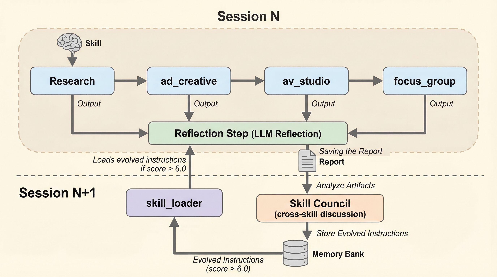

# NovaStorm: Skill Evolution System

GEPA-inspired self-reflection and cross-skill evolution for zghost marketing intelligence skills.

## Overview

NovaStorm enables skills to learn from each execution AND from each other:
- **Self-reflection**: LLM-based analysis of what worked/failed per skill
- **Skill Council**: Cross-skill discussion where pipeline neighbors suggest improvements to each other
- **Memory Bank storage**: Persistent skill evolution history
- **Dynamic runtime loading**: Skills bootstrap from their best known configuration via Memory Bank
- **GEPA-style evolution**: Mutate, crossover, and explore strategies

## How Dynamic Skill Improvement Works (Technical Details)

Skills dynamically improve at runtime. The evolved instructions from Memory Bank replace the static `SKILL.md` instructions when the score is high enough. The Skill Council ensures skills learn not just from their own execution, but from feedback by their upstream/downstream neighbors.

### Step-by-Step Technical Flow

**1. Pipeline Execution (Session N)**

The `CampaignOrchestrator` (a deterministic `BaseAgent`) runs skills in sequence:
```
research_orchestrator → creative_production_orchestrator → focus_group_evaluator_agent
```

**2. Individual Skill Reflection (after each stage)**

Each pipeline agent has `after_agent_callback=callbacks.after_agent_skill_reflection` wired in `agent.py`. When a skill finishes:

```python
# callbacks.py:after_agent_skill_reflection
agent_name = callback_context.agent_name
skill_name = SKILL_MAP.get(agent_name)  # e.g. "research_orchestrator" → "research"

# Gather execution artifacts from session state
output = callback_context.state.get("combined_final_cited_report", "")
tool_trajectory = f"Report length: {len(report)} chars..."

# LLM reflection via Gemini Flash
skill_dna = reflect_on_execution(skill_name, instructions, tool_trajectory, output, critique)
# → Returns SkillDNA: {score: 7.5, suggested_improvements: "Add competitive analysis..."}

# Save to Memory Bank
save_skill_dna(skill_dna, user_id)
# → Stored as facts with scope: {user_id, memory_type: "skill_dna", skill: "research"}
```

**3. Skill Council (after full pipeline, before PDF save)**

The `CampaignOrchestrator._save_final_report()` calls `run_skill_council()`:

```python
# orchestrator.py — triggered in SAVE_REPORT stage
council_result = run_skill_council(dict(state), user_id)
```

The Skill Council sends ALL pipeline artifacts to Gemini Flash in a single prompt. Each skill "speaks" about:
- What it received from its upstream neighbor
- What it would have preferred to receive
- What it thinks its downstream neighbor needs
- Specific instruction changes for itself AND neighbors

```python
# skill_evolution.py:run_skill_council
# Gathers artifacts: research report, images, videos, commercial, focus group evaluation
# Asks LLM to simulate a 4-way discussion between research, ad_creative, av_studio, focus_group
# Returns: cross-skill recommendations + pipeline_score + top_improvements
```

Saved to Memory Bank with scope: `{user_id, memory_type: "skill_council", skill: "pipeline"}`

**4. Dynamic Loading (Session N+1)**

When a skill is loaded for the next session, `skill_loader.py` checks Memory Bank:

```python
# skill_loader.py:load_skill_from_dir()
if novastorm_enabled:
    evolved_instructions = _load_evolved_instructions(skill_name, user_id)
    if evolved_instructions:
        instructions = evolved_instructions  # REPLACES static SKILL.md
```

The `_load_evolved_instructions()` function:
1. Queries Memory Bank for the latest `SkillDNA` with scope `{memory_type: "skill_dna", skill: "..."}`
2. Parses the JSON DNA from the stored fact
3. Checks if `score > 6.0` — if yes, returns the evolved instructions
4. If no evolved DNA exists or score is too low, returns `None` → falls back to static SKILL.md

### Architecture Diagram

```

```

### Key Data Structures

**SkillDNA** (`skill_evolution.py`):
```python
@dataclass
class SkillDNA:
    skill_name: str           # "research", "ad_creative", etc.
    version: int              # Increments with each reflection
    instructions_summary: str # Evolved instructions text
    score: float              # 0-10 effectiveness score
    generation: int           # Evolution generation
    suggested_improvements: str  # What to change next
    tool_trajectory: str      # What tools were called
    output_quality: str       # Quality assessment summary
    timestamp: float          # When this was generated
```

**Skill Council Result** (`skill_evolution.py:run_skill_council`):
```python
{
    "council_discussion": {
        "research": {
            "to_self": "Add more competitive analysis...",
            "to_ad_creative": "Include audience persona details...",
            "received_quality": 7.5,
            "handoff_quality": 8.0
        },
        "ad_creative": {
            "to_self": "More product-specific visuals...",
            "to_research": "Need trending hashtags...",
            "to_av_studio": "Provide scene-by-scene storyboard...",
            "received_quality": 7.0,
            "handoff_quality": 7.5
        },
        # ... av_studio, focus_group
    },
    "pipeline_score": 7.5,
    "top_improvements": [
        "Research should include trending hashtags for ad copy",
        "Ad creative should provide scene storyboards for AV studio",
        "AV studio should include brand-consistent transitions"
    ]
}
```

### Memory Bank Scopes

| Dimension | Scope Keys | What's Stored |
|-----------|-----------|---------------|
| Skill DNA | `{user_id, memory_type: "skill_dna", skill: "research"}` | SkillDNA JSON, scores, improvements |
| Skill Council | `{user_id, memory_type: "skill_council", skill: "pipeline"}` | Cross-skill recommendations, pipeline score |
| Campaign Insights | `{user_id, memory_type: "campaign_insight", brand: "Tide"}` | Brand research, trends, audiences |
| Skill Memory | `{user_id, memory_type: "skill_memory", skill: "ad_creative"}` | Successful prompts, patterns |
| Quality Metrics | `{user_id, memory_type: "quality_metric", skill: "ad_creative"}` | Gecko fidelity scores |

### Wiring Summary

| Agent | File | Callbacks |
|-------|------|-----------|
| `research_orchestrator` | `staged_researcher/agent.py` | `save_research_to_memory` + `after_agent_skill_reflection` |
| `creative_production_orchestrator` | `agent.py` | `save_creative_skill_to_memory` + `after_agent_skill_reflection` |
| `focus_group_evaluator_agent` | `focus_group/agents.py` | `after_agent_skill_reflection` |
| `CampaignOrchestrator` | `orchestrator.py` | Calls `run_skill_council()` in `SAVE_REPORT` stage |
| `skill_critic` | `skill_critic/agent.py` | Has `convene_skill_council` tool for manual invocation |

## Components

### 1. Core Engine (`skill_evolution.py`)

**SkillDNA**: The genetic code of a skill
```python
@dataclass
class SkillDNA:
    skill_name: str
    version: int
    score: float  # 0-10
    generation: int
    suggested_improvements: str
    tool_trajectory: str
    output_quality: str
    timestamp: float
```

**Key Functions**:
- `reflect_on_execution()`: LLM analyzes execution and suggests improvements
- `save_skill_dna()`: Persists to Memory Bank
- `load_skill_dna()`: Retrieves latest version
- `evolve_skill()`: GEPA-style evolution (mutate/crossover/explore)
- `get_skill_lineage()`: Full version history

### 2. ADK Tools (`skill_evolution_tools.py`)

Expose evolution to agents:

```python
async def reflect_and_improve_skill(
    skill_name: str,
    execution_summary: str,
    output_quality_assessment: str,
    tool_context: ToolContext,
) -> dict
```

```python
async def load_evolved_instructions(
    skill_name: str,
    tool_context: ToolContext,
) -> dict
```

```python
def list_skill_versions(
    skill_name: str,
    tool_context: ToolContext,
) -> dict
```

### 3. Skill Critic (`skill_critic/agent.py`)

GEPA-inspired multi-dimensional scoring:

- **Actionability** (0-10): How actionable are outputs?
- **Novelty** (0-10): How creative are approaches?
- **Specificity** (0-10): How detailed are recommendations?

Provides structured critique for reflection.

### 4. Callbacks Integration (`callbacks.py`)

**`after_agent_skill_reflection`**: Automatic reflection after pipeline stages

Monitors these agents:
- `research_orchestrator` → skill="research"
- `ad_content_generator_agent` → skill="ad_creative"
- `av_studio_agent` → skill="av_studio"
- `focus_group_agent` → skill="focus_group"

### 5. Skill Loader Integration (`skill_loader.py`)

**`load_skill_from_dir()`** enhanced with NovaStorm:
1. Loads static SKILL.md
2. If `NOVASTORM_ENABLED=true`, checks Memory Bank
3. If evolved DNA exists with score > 6.0, uses evolved instructions
4. Otherwise uses static instructions

## Usage

### Enable NovaStorm

```bash
export NOVASTORM_ENABLED=true
```

Or via session state:
```python
session_state["novastorm_enabled"] = True
```

### Reflection Happens Automatically

After each skill execution, the `after_agent_skill_reflection` callback:
1. Detects skill completion
2. Gathers execution data
3. Triggers reflection
4. Saves to Memory Bank

No manual intervention needed.

### View Evolution History

Use the `list_skill_versions` tool:

```python
result = list_skill_versions("research", tool_context)
# Returns:
# {
#   "num_versions": 5,
#   "versions": [
#     {"version": 1, "score": 6.5, "generation": 1},
#     {"version": 2, "score": 7.2, "generation": 2},
#     {"version": 3, "score": 8.1, "generation": 3},
#   ],
#   "best_version": 3,
#   "best_score": 8.1
# }
```

### Manual Evolution

For experimentation:

```python
from trends_and_insights_agent.shared_libraries.skill_evolution import (
    load_skill_dna,
    evolve_skill,
)

# Load current best
current = load_skill_dna("research")

# Evolve with different strategies
mutated = evolve_skill("research", current, strategy="mutate")
crossover = evolve_skill("research", current, strategy="crossover")
explored = evolve_skill("research", current, strategy="explore")
```

## Memory Bank Schema

### Scope Keys
```python
{
    "user_id": str,           # User identifier
    "memory_type": "skill_dna",
    "skill": str              # "research", "ad_creative", etc.
}
```

### Facts Stored
1. Version info: `"Skill 'research' version 3 scored 8.5/10 at generation 3"`
2. Improvements: `"Skill 'research' improvements: Add competitive analysis..."`
3. Quality: `"Skill 'research' quality assessment: Score: 8.5/10..."`
4. Full DNA: `"Skill 'research' DNA: {json_dump}"`

## GEPA Evolution Strategies

### Mutate (Conservative)
- Small incremental improvements
- Takes top 2-3 suggested improvements
- Low temperature (0.7) for focused changes
- Best for stable, working skills

### Crossover (Hybrid)
- Combines patterns from multiple versions
- Merges successful approaches
- Eliminates failing patterns
- Best for skills with mixed results

### Explore (Radical)
- Novel, experimental approaches
- High temperature (0.9) for creativity
- Takes calculated risks
- Best for breakthrough when stuck

## Testing

```bash
cd /usr/local/google/home/jwortz/zghost
uv run python tests/test_novastorm.py
```

Tests verify:
- ✅ Reflection generates valid SkillDNA
- ✅ Memory Bank save/load works
- ✅ Lineage tracking works
- ✅ Evolution strategies work

## Configuration

### Environment Variables

```bash
# Required for Memory Bank integration
MEMORY_BANK_AGENT_ENGINE_ID=8576660188117860352
GOOGLE_CLOUD_PROJECT=wortz-project-352116
GOOGLE_CLOUD_PROJECT_NUMBER=679926387543
MEMORY_BANK_LOCATION=us-central1

# Enable NovaStorm
NOVASTORM_ENABLED=true
```

### State Keys

Skills can check for evolved instructions:
```python
evolved = tool_context.state.get(f"{skill_name}_evolved_instructions", "")
latest_dna = tool_context.state.get(f"{skill_name}_latest_dna", {})
```

## Reflection Prompt Design

The reflection LLM call analyzes:

1. **Current Instructions**: What the skill was told to do
2. **Tool Trajectory**: What tools were actually called
3. **Output Sample**: What was produced
4. **Critique**: External assessment (if available)

Produces:
1. **Score** (0-10): Overall effectiveness
2. **What Worked**: Successful patterns
3. **What Failed**: Problems and inefficiencies
4. **Suggested Improvements**: Specific instruction changes

## Best Practices

### 1. Let It Run for Multiple Cycles
Evolution requires multiple executions to build up signal:
- Generation 1: Initial reflection, often generic
- Generation 2-3: Pattern recognition emerges
- Generation 4+: Consistent improvements compound

### 2. Monitor Scores
- Score < 6.0: Don't use evolved instructions yet
- Score 6.0-8.0: Good, keep evolving
- Score > 8.0: High quality, ready for production

### 3. Manual Review for Production
Before deploying evolved instructions to production:
1. Review the suggested improvements
2. Check the tool trajectory makes sense
3. Verify output quality assessment is accurate

### 4. Version Control
Memory Bank maintains full lineage, but consider:
- Exporting high-scoring DNAs to git
- Documenting major breakthroughs
- Rolling back if scores degrade

## Limitations

1. **Cold Start**: First execution has no history
2. **Memory Bank Lag**: May take seconds to index new facts
3. **LLM Variance**: Reflection quality depends on model performance
4. **Context Window**: Long instructions may be truncated
5. **Score Subjectivity**: LLM scoring isn't perfectly calibrated

## Roadmap

Future enhancements:
- [ ] A/B testing of skill versions
- [ ] Multi-user skill sharing (federated learning)
- [ ] Automatic regression detection
- [ ] Skill performance dashboards
- [ ] Cross-skill pattern transfer
- [ ] Human-in-the-loop approval for evolution

## References

- **GEPA Paper**: Genetic Evolution of Prompt Agents
- **Memory Bank API**: `trends_and_insights_agent/shared_libraries/callbacks.py`
- **Skill System**: `trends_and_insights_agent/skills/`
- **ADK Docs**: Google Agent Development Kit

---

Built for zghost multi-agent marketing intelligence system.
