# User Guide

This guide walks through the complete Marketing Intelligence workflow — from campaign setup to finished commercial.

---

## Step 1: Campaign Configuration

Navigate to the **Configure** page. This is where you define the campaign parameters that will guide every downstream agent.

  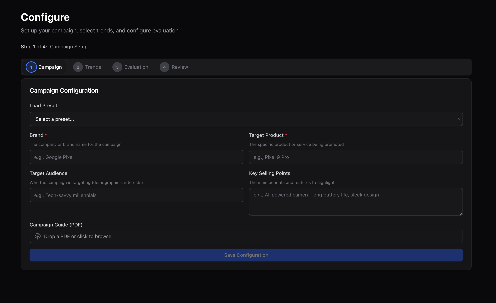

**Required fields:**

| Field | Description | Example |
|-------|-------------|---------|
| **Brand** | The company or brand name | Google Pixel |
| **Target Product** | The specific product being promoted | Pixel 9 Pro |
| **Target Audience** | Who the campaign targets | Tech-savvy millennials |
| **Key Selling Points** | Main benefits and features to highlight | AI-powered camera, Magic Eraser, Tensor G4 chip |

**Optional:**
- **Campaign Guide (PDF)** — Upload a marketing brief or brand guidelines document. The system extracts text and uses it to ground all downstream research and creative decisions.
- **Load Preset** — Select from saved campaign configurations for quick setup.

Click **Save Configuration** to proceed.

---

## Step 2: Trend Selection

The system surfaces currently trending topics from two sources: **Google Search Trends** and **YouTube Trending Videos**.

  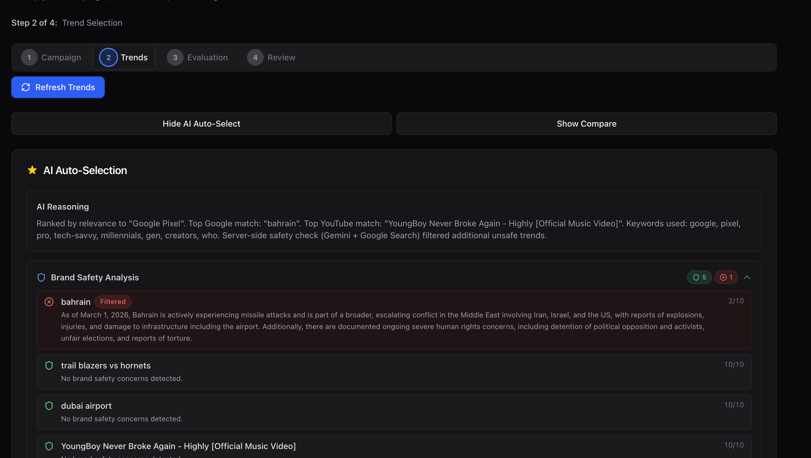

### AI Auto-Selection

The platform uses AI to recommend the most relevant trends for your brand and product. The **AI Reasoning** section explains why specific trends were selected.

### Brand Safety Filtering

Every trend passes through an AI-powered brand safety analysis. Each trend receives a safety score out of 10:

| Score | Status | Meaning |
|-------|--------|---------|
| 8-10 | Safe | No brand safety concerns detected |
| 4-7 | Review | Potential concerns — review before selecting |
| 0-3 | Filtered | Automatically filtered with explanation |

  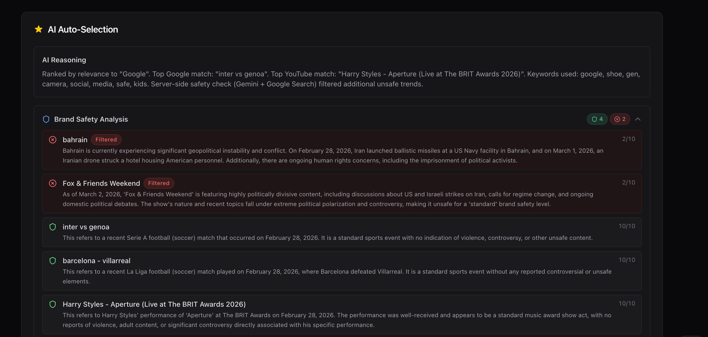

In the example above, "bahrain" and "Fox & Friends Weekend" are filtered due to geopolitical conflict and political controversy respectively, while sports events like "inter vs genoa" and music events like "Harry Styles" pass safely.

Select your preferred trends and proceed.

---

## Step 3: Review & Launch

The **Review** step shows a complete summary of your campaign configuration before launch.

  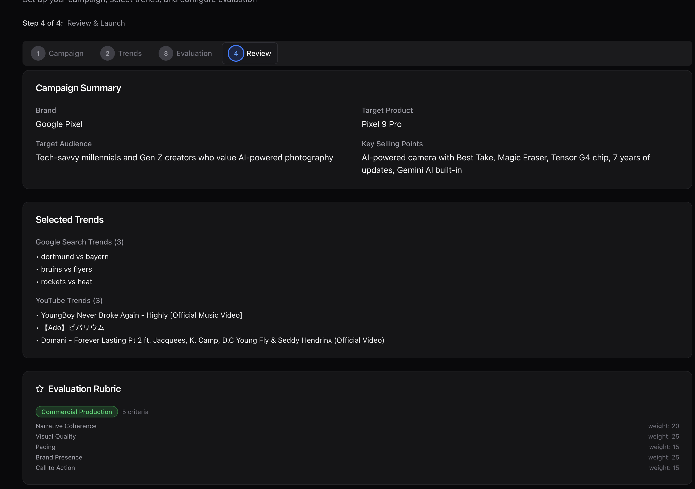

**What you'll see:**
- **Campaign Summary** — Brand, product, audience, selling points
- **Selected Trends** — Google Search trends and YouTube trends you chose
- **Evaluation Rubric** — Weighted criteria for evaluating the final output (Narrative Coherence, Visual Quality, Pacing, Brand Presence, Call to Action)

Review everything, then launch the pipeline.

---

## Performance Benchmarks

Typical pipeline completion times in autopilot mode:

| Phase | Duration | Agents Active |
|-------|----------|---------------|
| Trend Discovery | ~30 seconds | 1 |
| Market Research (parallel) | ~3 minutes | 15 |
| Ad Copy (draft + critique) | ~2 minutes | 3 |
| Visual Concepts (draft + critique + finalize) | ~3 minutes | 4 |
| Image Generation (Imagen 4.0) | ~2 minutes | 1 |
| Video Generation (Veo 3.1) | ~3 minutes | 1 |
| AV Studio (clip chaining + ffmpeg) | ~5 minutes | 1 |
| Focus Group Evaluation | ~1 minute | 1 |
| **Total end-to-end** | **~20 minutes** | **31 agents** |

> Times vary based on the number of selected trends, ad copies, and visual concepts. Running with human-in-the-loop (non-autopilot) adds review time at each checkpoint.

---

## Step 4: Pipeline Orchestration

Once launched, 31 specialized agents begin coordinating in real-time. The **Orchestration** page provides full visibility into every agent's progress.

  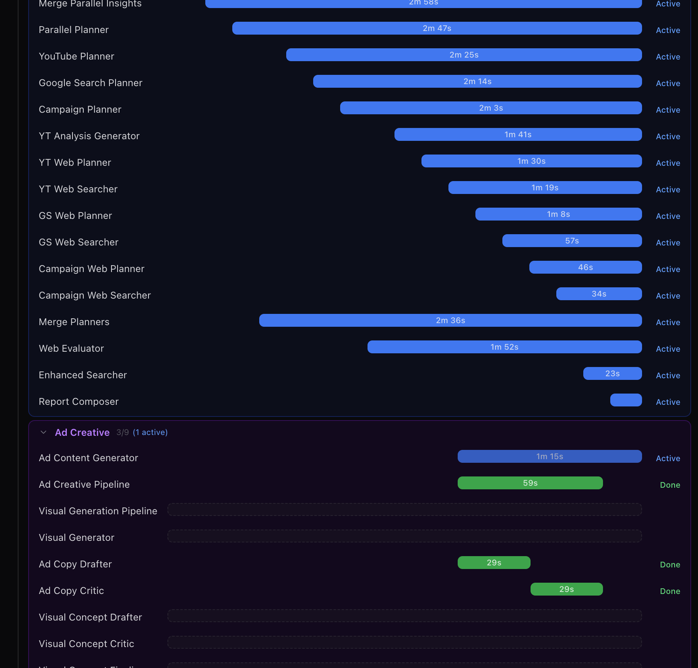

### Reading the Timeline

The timeline shows each agent as a horizontal bar:
- **Blue bars** — Active processing time
- **Green dots** — Completed successfully
- **Purple bars** — Creative generation in progress

The pipeline executes in three phases:

**Phase 1: Market Research** (parallel)
- YouTube Planner, Google Search Planner, and Campaign Planner run simultaneously
- Each planner spawns its own web searcher agents
- Results merge into a unified research report

**Phase 2: Ad Creative** (sequential)
- Ad Copy Pipeline: drafter → critic produces refined ad copy
- Visual Generation Pipeline: drafter → critic → finalizer produces visual concepts
- Visual Generator creates images and videos from finalized concepts

**Phase 3: AV Studio** (sequential)
- Generates video clips from visual concepts
- Assembles clips into a commercial with voiceover and music

### Autopilot Mode

Toggle **Autopilot** to let the pipeline run without human approval checkpoints. In autopilot mode, all agents proceed automatically and the full pipeline completes in approximately 15-25 minutes.

  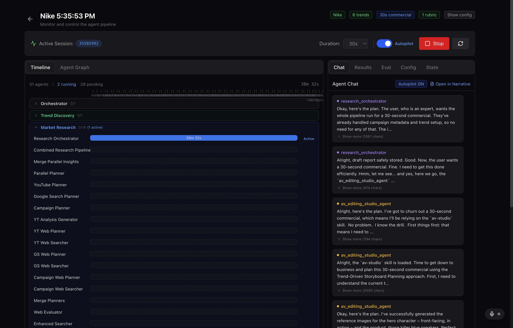

---

## Step 5: Review Results

Switch to the **Results** tab to browse generated artifacts.

### Ad Copy

The system generates multiple ad copies, each scored by the AI critic for alignment with your campaign goals.

  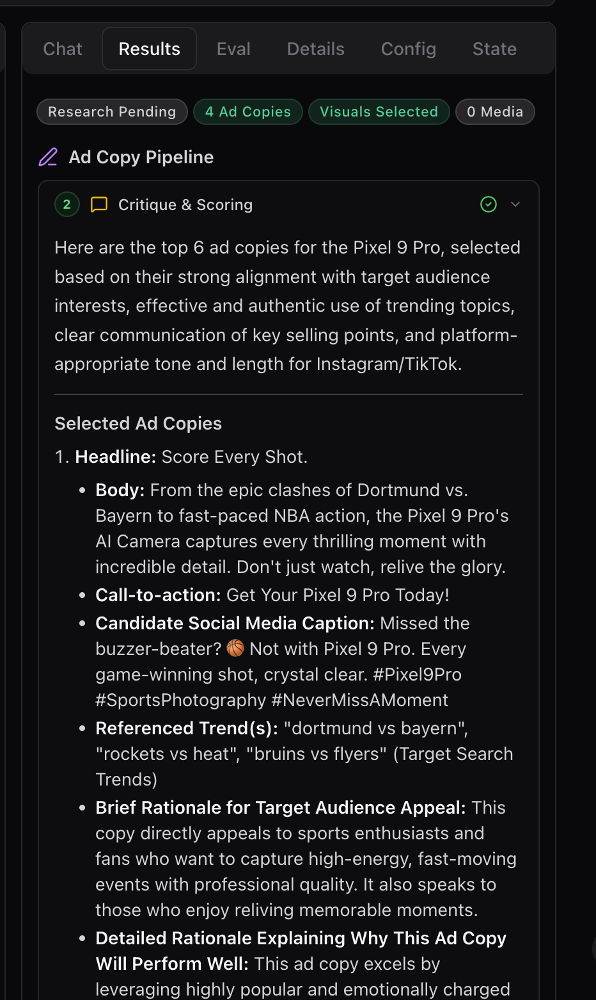

Each ad copy includes:
- **Headline** — Attention-grabbing title
- **Body** — Main copy text incorporating selected trends
- **Call-to-Action** — Direct response prompt
- **Social Media Caption** — Platform-optimized version
- **Rationale** — Why this copy works for the target audience

### Generated Images and Video

Visual concepts are generated as both still images (Imagen 4.0 Ultra) and video clips (Veo 3.1).

<table>
  <tr>
    <td>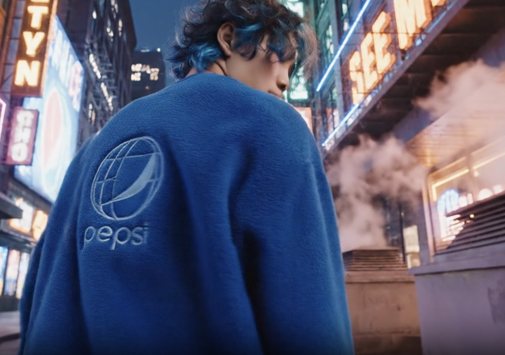</td>
    <td>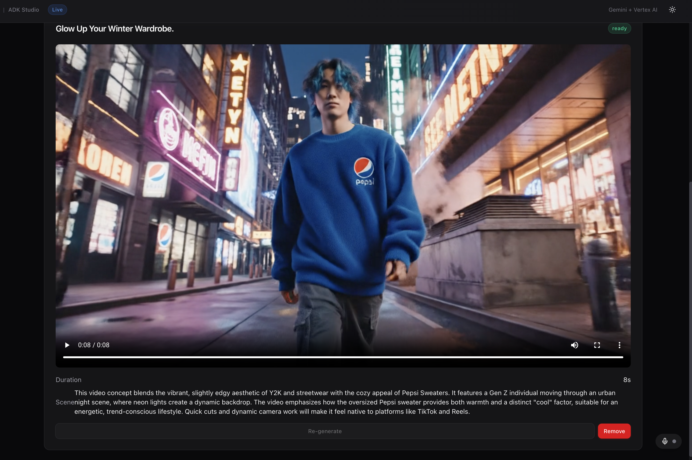</td>
  </tr>
  <tr>
    <td><em>AI-generated image — Pepsi Sweaters urban campaign</em></td>
    <td><em>AI-generated video clip — same concept in motion</em></td>
  </tr>
</table>

---

## Step 6: AV Studio

The **AV Studio** is a video editing workspace for assembling clips into a finished commercial.

  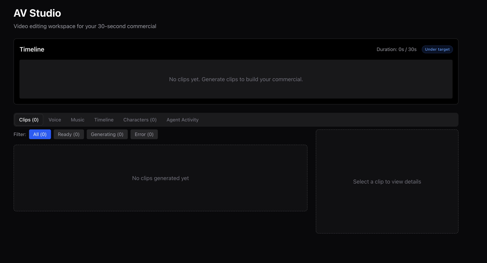

### Workspace Layout

| Section | Purpose |
|---------|---------|
| **Timeline** | Arrange clips in sequence with target duration indicator |
| **Clips** | Browse all generated video clips |
| **Voice** | Configure AI voiceover (text-to-speech) |
| **Music** | Add background music |
| **Characters** | View generated character/subject images |
| **Agent Activity** | Monitor the AV agent's decisions |

### Assembling a Commercial

1. Review generated clips and their descriptions
2. Arrange them on the timeline to tell your story
3. The system tracks duration against your target (10s or 30s)
4. Export the finished commercial

  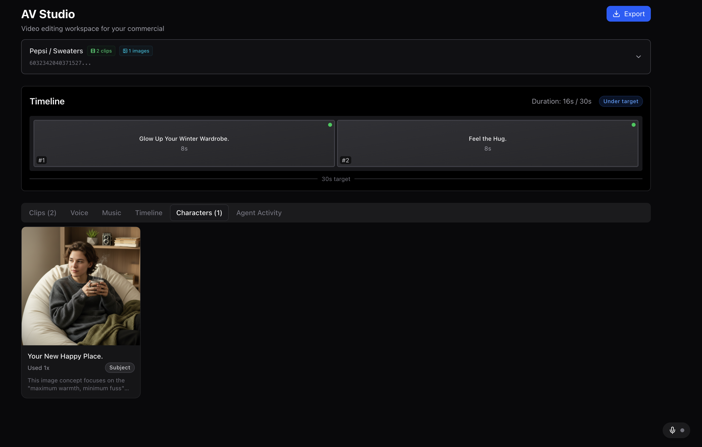

### Example Commercials

<table>
  <tr>
    <td>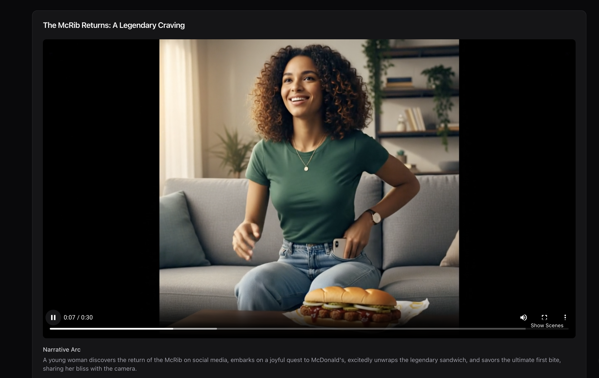</td>
    <td>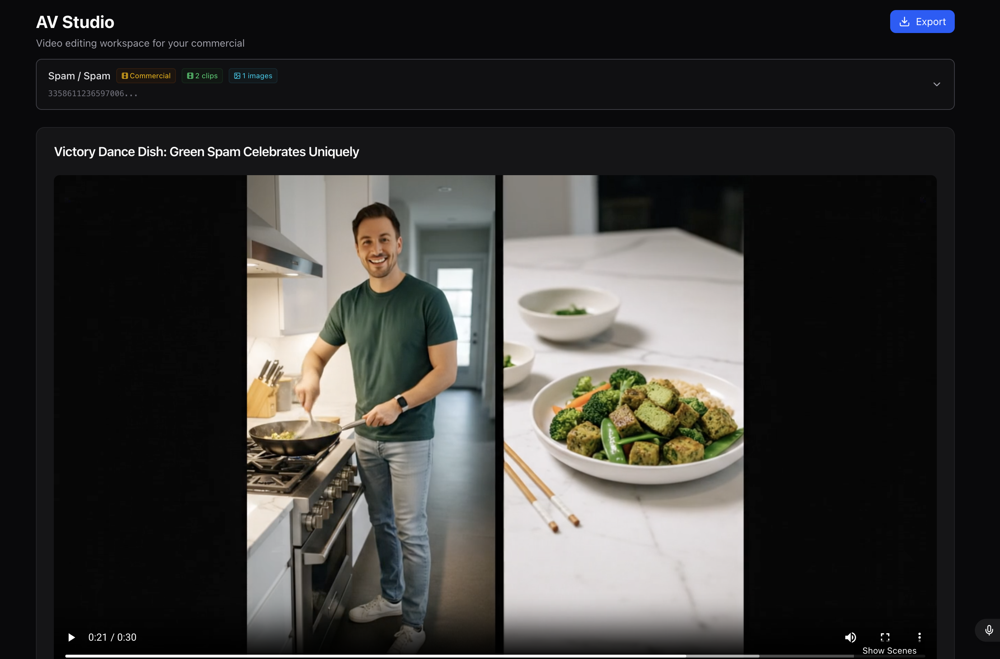</td>
  </tr>
  <tr>
    <td><em>McDonald's McRib — 30s narrative commercial</em></td>
    <td><em>Spam — culinary lifestyle commercial</em></td>
  </tr>
</table>

---

## Step 7: Narrative Interface

The **Narrative** page lets you collaborate with AI to refine your commercial's story arc.

  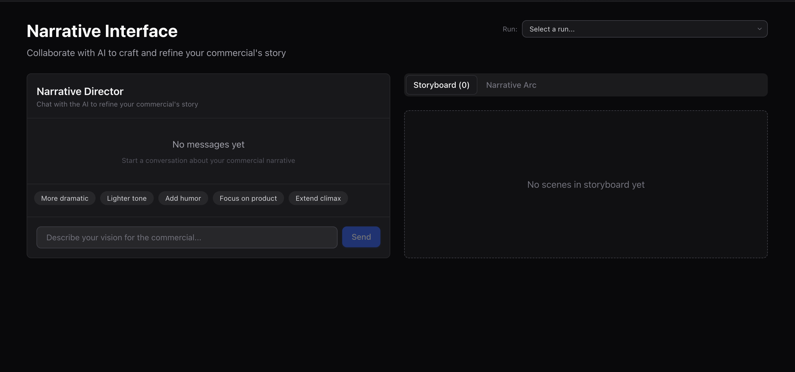

Chat with the Narrative Director to adjust tone, pacing, and emphasis. Quick-action buttons let you make common adjustments:
- **More dramatic** — Increase tension and emotional stakes
- **Lighter tone** — Shift toward humor and levity
- **Add humor** — Insert comedic moments
- **Focus on product** — Increase product visibility
- **Extend climax** — Build a stronger peak moment

The storyboard panel on the right visualizes the narrative arc as scenes.

---

## Step 8: Evaluation

The **Evaluation Studio** lets you rate generated content against custom rubrics.

  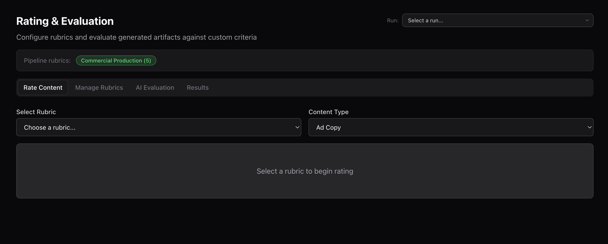

**Evaluation features:**
- **Select Rubric** — Choose from pre-built rubrics (e.g., Commercial Production with 5 weighted criteria)
- **Content Type** — Evaluate specific artifact types (Ad Copy, Visual Concepts, Commercial)
- **AI Evaluation** — Run automated evaluation using the configured rubric
- **Manage Rubrics** — Create custom evaluation criteria with custom weights

---

## Pipeline Runs Dashboard

The main **Pipeline Runs** page gives a bird's-eye view of all campaigns.

  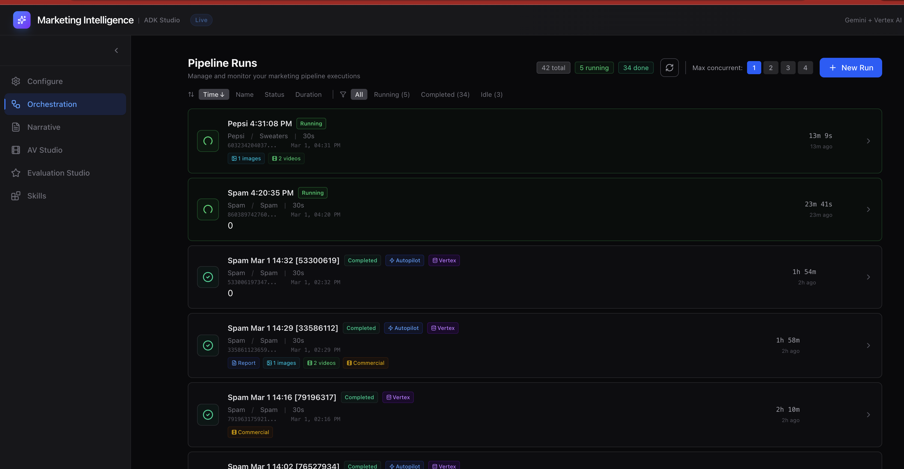

**Dashboard features:**
- **Status filters** — All, Running, Completed, Idle
- **Artifact badges** — Quick view of generated assets (Report, Images, Videos, Commercial)
- **Concurrent runs** — Run up to 4 campaigns simultaneously
- **Duration tracking** — Total pipeline time per campaign
- **Tags** — Autopilot mode, Vertex deployment indicators

Click any run to view its full orchestration timeline, results, and artifacts.

---

## Troubleshooting

### Common Issues

| Symptom | Cause | Solution |
|---------|-------|----------|
| Frontend loads but pipeline won't start | API server still initializing (~2-3 min on startup) | Wait for the API server to finish importing `root_agent`. Check terminal logs. |
| "Session not found" error | Session ID mismatch between frontend and backend | Refresh the page to create a new session, or check that `SESSION_APP_NAME` matches in `api_server.py` |
| All trends filtered by brand safety | Current trending topics are all flagged | Click **Refresh Trends** to fetch a new batch, or manually select safe trends |
| Image generation fails | Imagen API quota exceeded or safety filter triggered | Check Vertex AI quota in Cloud Console. Retry with a different visual concept. |
| Video generation times out | Veo API under high load | Retry after a few minutes. Veo 3.1 Fast typically completes within 2-3 minutes per clip. |
| Port already in use | Previous instance still running | Run `lsof -i :8000` to find the PID, then `kill -9 <PID>` |
| SSE stream hangs | Network timeout or proxy issue | Avoid using `networkidle` waits. Refresh the page and re-open the orchestration view. |
| Commercial export empty | AV Studio clips not generated yet | Ensure all pipeline phases complete before exporting. Check the AV Studio tab for clip status. |

### Tips for Best Results

- **Trend selection**: Choose 2-3 Google trends and 2-3 YouTube trends for balanced research depth
- **Campaign guide PDF**: Upload a marketing brief for more grounded and brand-aligned output
- **Autopilot mode**: Use for fastest end-to-end execution (~20 min). Disable for review at each checkpoint.
- **Concurrent runs**: Start with `Max concurrent: 1` to verify your setup, then scale to 2-4 for production runs

---

## FAQ

**Q: How long does a full pipeline run take?**
A: In autopilot mode, approximately 20 minutes end-to-end. With human-in-the-loop review, 30-45 minutes depending on review time.

**Q: Can I run multiple campaigns at once?**
A: Yes. The Pipeline Runs dashboard supports up to 4 concurrent runs. Each run uses its own session and isolated state.

**Q: What happens if a trend is marked as "Filtered"?**
A: The AI brand safety analysis detected potential risks. The trend is excluded from selection but you can see the reasoning. Select only trends with scores of 8+ for safest results.

**Q: Can I use my own evaluation rubric?**
A: Yes. Navigate to Evaluation Studio > Manage Rubrics to create custom criteria with custom weights.

**Q: Where are generated images and videos stored?**
A: All media artifacts are saved to Google Cloud Storage in your configured bucket, organized by session ID.
