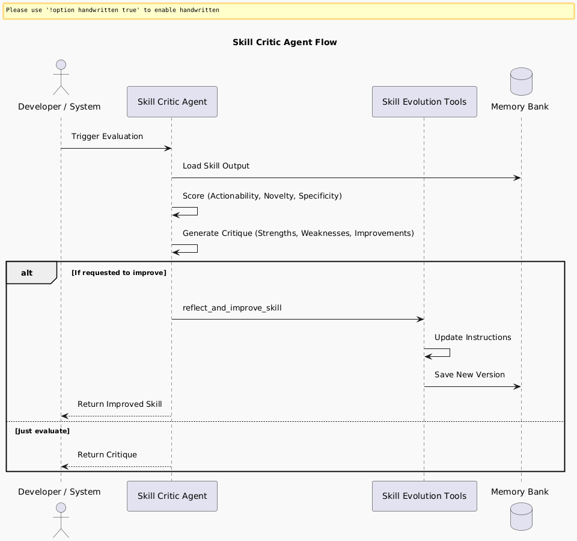

# Skill Critic Agent

The Skill Critic Agent scores skill outputs using a GEPA-inspired multi-dimensional evaluation.

## How it Works

The agent takes a skill output and evaluates it on three dimensions:
- **Actionability**: How actionable are the insights/outputs?
- **Novelty**: How novel/creative are the approaches?
- **Specificity**: How specific and detailed are the recommendations?

It provides 0-10 scores for each dimension, along with detailed reasoning, strengths, weaknesses, and recommended improvements.

## Flow Diagram

## Tools

The agent has access to tools for skill evolution:
- `reflect_and_improve_skill`: Reflects on the critique and updates the skill instructions.
- `load_evolved_instructions`: Loads previously evolved instructions.
- `list_skill_versions`: Lists available versions of a skill.
- `convene_skill_council`: Convenes a council of experts to improve the skill.
