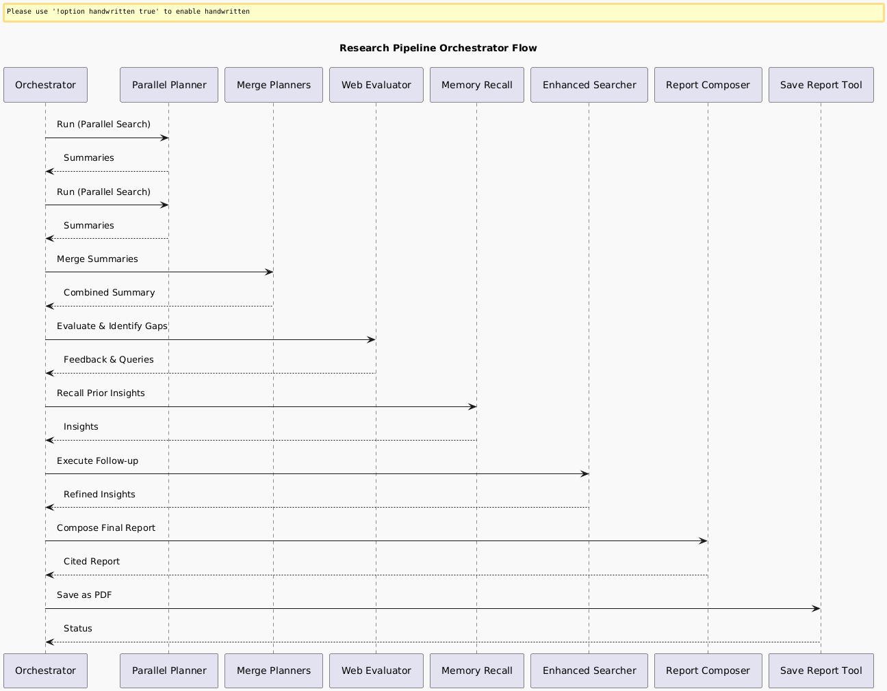

# Research Pipeline Orchestrator

The Research Pipeline Orchestrator is a deterministic orchestrator that runs the research pipeline.

## How it Works

The orchestrator runs several sub-agents in sequence:
1. **Parallel Planner Agent**: Runs parallel research (YouTube, Search, Campaign).
2. **Merge Planners**: Merges dynamic findings into a unified summary.
3. **Combined Web Evaluator**: Evaluates research quality and identifies gaps.
4. **Memory Recall Agent**: Retrieves prior campaign insights from the Memory Bank.
5. **Enhanced Combined Searcher**: Conducts follow-up research to fill gaps.
6. **Combined Report Composer**: Composes the final cited research report.

It also calls the `draft_research_report_tool` directly (no LLM wrapper) to save the report as a PDF.

## Flow Diagram

## AE Resumability

The orchestrator supports AE resumability via agent state. It can determine which stage to start from based on session state keys.
