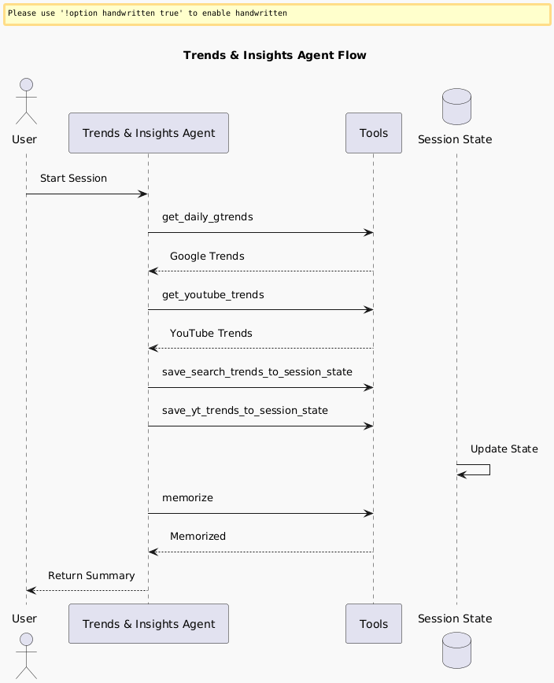

# Trends & Insights Agent

The Trends & Insights Agent captures campaign metadata and displays trending topics from Google Search and trending videos from YouTube.

## How it Works

The agent captures campaign metadata (brand, product, audience) and fetches trends from Google Search and YouTube.

## Flow Diagram

## Tools

The agent has access to tools for fetching trends and managing session state:
- `get_daily_gtrends`: Fetches daily Google Trends.
- `get_youtube_trends`: Fetches trending videos from YouTube.
- `save_search_trends_to_session_state`: Saves search trends to session state.
- `save_yt_trends_to_session_state`: Saves YouTube trends to session state.
- `memorize`: Saves insights to the memory bank.
