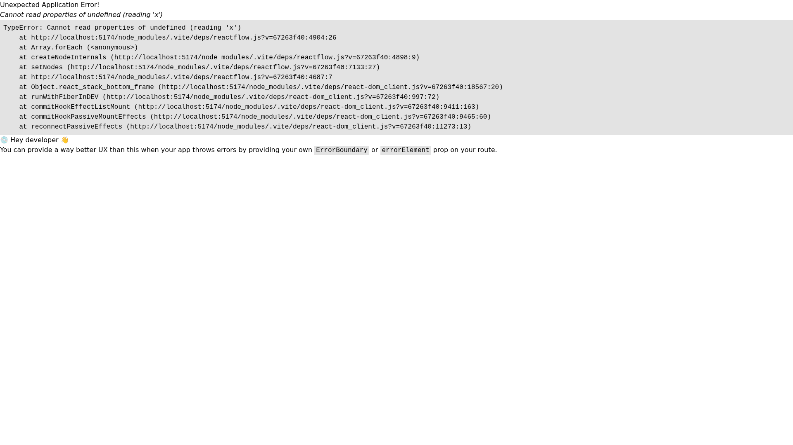
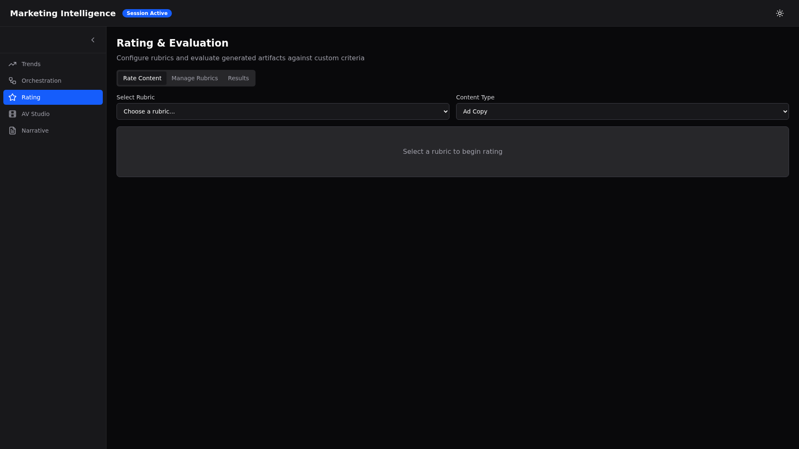
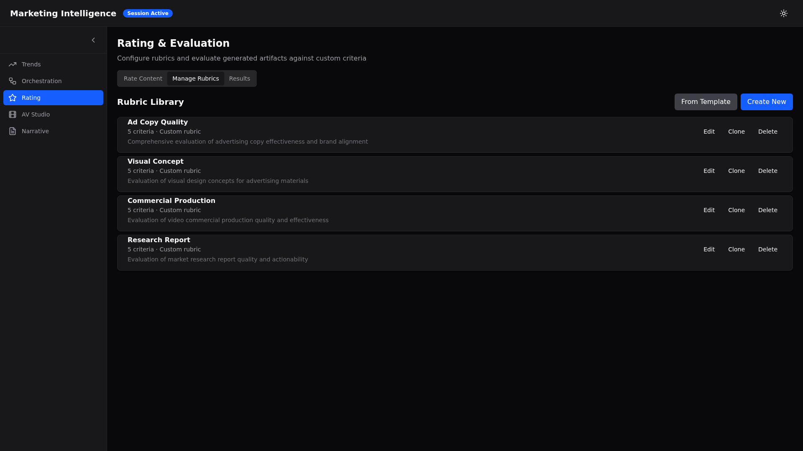
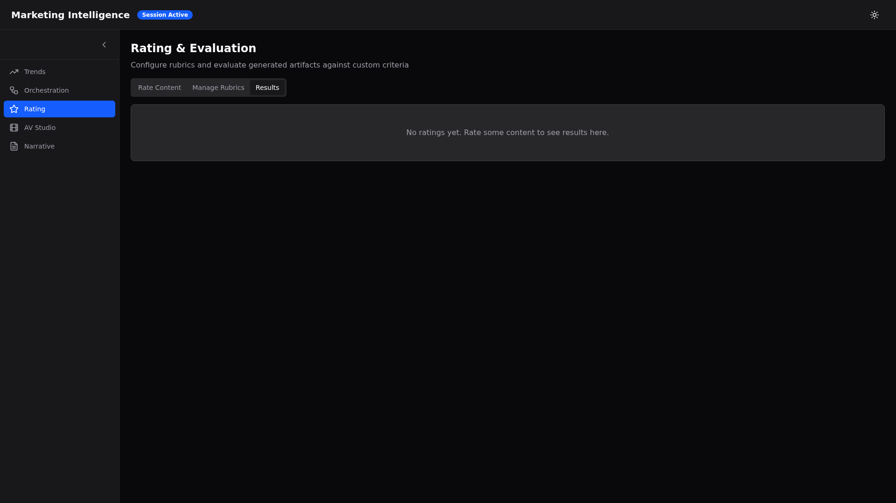
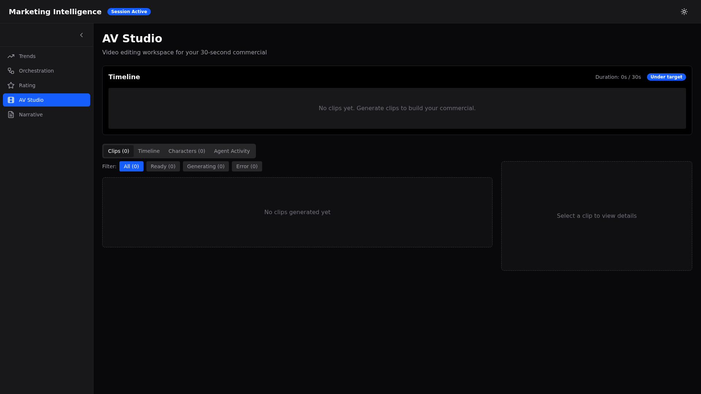
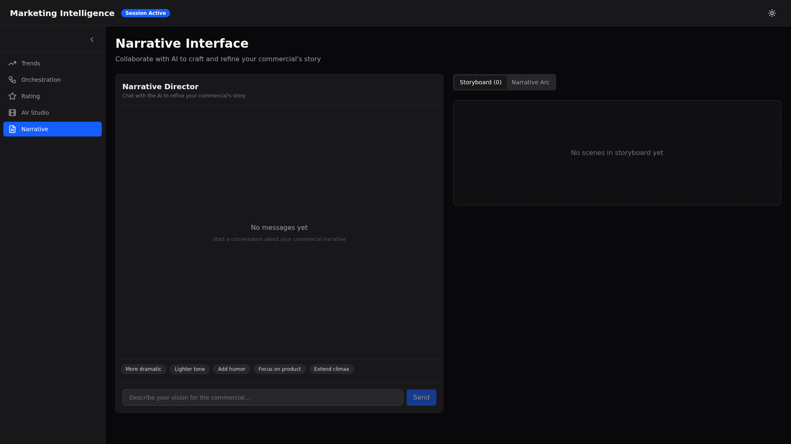
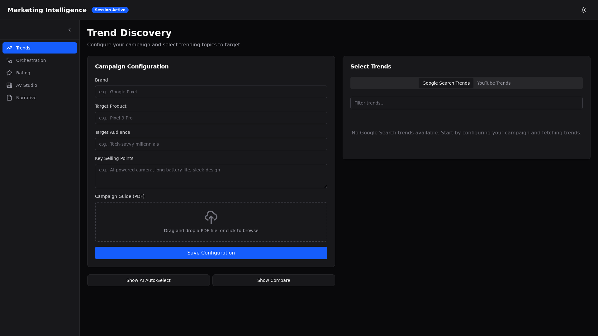

# Marketing Intelligence Frontend - Complete Documentation

> React 19 + TypeScript frontend for the multi-agent marketing intelligence system

## Table of Contents

1. [Overview & Architecture](#1-overview--architecture)
2. [Pages & Features](#2-pages--features)
3. [Navigation & Layout](#3-navigation--layout)
4. [API Integration](#4-api-integration)
5. [Component Library](#5-component-library)
6. [State Management](#6-state-management)
7. [Development Setup](#7-development-setup)
8. [Testing](#8-testing)
9. [Known Issues](#9-known-issues)

---

## 1. Overview & Architecture

### Tech Stack

| Category | Technology | Version | Purpose |
|----------|-----------|---------|---------|
| **Framework** | React | 19.2.0 | UI library |
| **Language** | TypeScript | 5.9.3 | Type safety |
| **Build Tool** | Vite | 7.3.1 | Development & bundling |
| **Styling** | Tailwind CSS | 4.2.1 | Utility-first CSS |
| **Routing** | React Router | 7.13.1 | Client-side routing |
| **Server State** | TanStack Query | 5.90.21 | Data fetching & caching |
| **Client State** | Zustand | 5.0.11 | Lightweight state management |
| **Visualization** | ReactFlow | 11.11.4 | Pipeline graph DAG |
| **Icons** | Lucide React | 0.575.0 | Icon library |
| **Testing** | Vitest | 4.0.18 | Unit & integration tests |

### Architecture Principles

1. **Feature-Based Organization**: Each domain (trends, orchestration, rating, studio, narrative) lives in `src/features/` as a self-contained module
2. **Type Safety**: TypeScript types mirror backend Pydantic models in `src/types/`
3. **Component Composition**: Reusable UI primitives in `src/components/ui/` follow a consistent API
4. **Server-First State**: React Query manages server state; localStorage handles client-only state (ratings)
5. **Responsive Design**: Mobile-first Tailwind CSS with breakpoints at 640px (sm), 768px (md), 1024px (lg), 1280px (xl)

### Project Structure

```
frontend/
├── src/
│   ├── app/                          # Application bootstrap
│   │   ├── App.tsx                   # Root component
│   │   ├── providers.tsx             # QueryClient, context providers
│   │   └── routes.tsx                # React Router configuration
│   ├── components/
│   │   ├── layout/                   # AppShell, Header, Sidebar
│   │   └── ui/                       # Reusable UI primitives (9 components)
│   ├── features/                     # Feature modules (5 pages)
│   │   ├── trends/                   # Campaign config & trend selection
│   │   ├── orchestration/            # Agent pipeline dashboard
│   │   ├── rating/                   # Rubric management & evaluation
│   │   ├── studio/                   # AV editing workspace
│   │   └── narrative/                # AI-powered story interface
│   ├── services/                     # API clients
│   │   ├── api.ts                    # REST API client
│   │   ├── session.ts                # Session management
│   │   ├── streaming.ts              # Server-Sent Events (SSE)
│   │   └── agents.ts                 # Agent dispatch
│   ├── hooks/                        # Custom React hooks
│   │   ├── useSession.ts             # Session lifecycle
│   │   ├── useStreaming.ts           # SSE event handling
│   │   └── useAgentStatus.ts         # Agent status polling
│   ├── types/                        # TypeScript definitions
│   │   ├── session.ts                # Session & state types
│   │   ├── agents.ts                 # Agent & event types
│   │   └── trends.ts                 # Trend types
│   ├── lib/                          # Utilities
│   │   └── utils.ts                  # cn() helper (clsx + tailwind-merge)
│   └── test/                         # Test suites & mocks
├── public/                           # Static assets
├── docs/                             # Documentation & screenshots
├── .env.example                      # Environment variables template
├── vite.config.ts                    # Vite configuration (proxy, port)
├── tailwind.config.js                # Tailwind theme
├── tsconfig.json                     # TypeScript config
└── package.json                      # Dependencies
```

### Routing

The app uses React Router with 5 main pages, all nested under the `AppShell` layout:

| Path | Component | Purpose |
|------|-----------|---------|
| `/` | Redirect to `/trends` | Landing redirect |
| `/trends` | `TrendsPage` | Campaign configuration & trend selection |
| `/orchestration` | `OrchestrationPage` | Agent pipeline monitoring |
| `/rating` | `RatingPage` | Rubric builder & content evaluation |
| `/studio` | `StudioPage` | AV timeline editor |
| `/narrative` | `NarrativePage` | Interactive story collaboration |

---

## 2. Pages & Features

### Page 1: Trend Discovery (`/trends`)

**Default landing page** for campaign configuration and trend selection.


#### Features

##### Campaign Configuration Panel (Left Column)
- **Form Fields**:
  - Brand name (text input)
  - Product name (text input)
  - Target audience (textarea)
  - Key selling points (textarea)
- **PDF Upload**: Drag-and-drop area for marketing guides
- **Save Config Button**: Saves to session state (currently console.log only)

##### Trend Selection (Right Column)
- **Tabs**: Google Search Trends / YouTube Trends
- **Trend Cards**: Displays trend title, volume, and selection checkbox
- **Confirm Selection**: Button to save selected trends to session

##### Additional Panels (Toggle Buttons)
- **AI Auto-Select**:
  - Sliders for # of search trends (1-10) and # of YouTube trends (1-10)
  - Strategy dropdown (Top, Diverse, Relevance)
  - "Auto-Select" button calls `/api/v1/trends/auto-select`
  - Accept/Reject buttons for results
- **Trend Compare**: Side-by-side comparison of selected trends

#### State Management
- `useTrends()` hook manages trend selections
- Session state tracked via `useSession()` hook
- Selections stored in local state arrays

#### Known Issues
1. Save Config only console.logs (does not PATCH session state)
2. Trends data is hardcoded empty in mock data

---

### Page 2: Agent Orchestration (`/orchestration`)

**Real-time monitoring dashboard** for the multi-agent pipeline.



#### Features

##### Pipeline Controls (Top Bar)
- Start/Stop buttons with parallel stream count selector
- Refresh button to reload status
- Session ID display

##### Pipeline Graph (Left: 2/3 width)
- **ReactFlow DAG visualization** with 20+ agent nodes
- **Node coloring by status**:
  - Gray: idle
  - Blue: running
  - Green: completed
  - Red: error
- **Animated edges** when agents are active
- **Click to drill down** on agent details
- **Controls**: Zoom, fit view, minimap

##### Right Panel (1/3 width)
- **Agent Details Tab**:
  - Selected agent name & status
  - Current tool being executed
  - Elapsed time
  - Recent events for that agent
- **Parallel Streams Tab**:
  - YouTube Research Stream (progress bar)
  - Google Search Stream (progress bar)
  - Campaign Research Stream (progress bar)

##### Event Stream (Bottom: 320px height)
- **Live event log** with filtering
- **Filters**: By agent name, event type, search term
- **Pause/Resume** button to freeze scroll
- **Event types**: `agent_start`, `agent_complete`, `tool_call`, `error`

#### State Management
- `useOrchestration()` hook polls `/api/v1/orchestration/status` every 2s
- SSE connection to `/run` endpoint for streaming events
- `useAgentStatus()` hook for status updates

#### Known Issues
**CRITICAL BUG**: This page **crashes** due to a ReactFlow TypeError in `PipelineGraph.tsx` lines 84-101. The crash occurs when calling `onNodesChange` with a reset action. The intended functionality is documented above, but the page is currently non-functional.

---

### Page 3: Rating & Evaluation (`/rating`)

**Rubric management and content evaluation system** with 3 tabs.



#### Tab 1: Rate Content

- **Rubric Selector**: Dropdown to choose active rubric
- **Content Viewer**: Displays artifact to rate (e.g., ad copy, visual concept)
- **Criteria Ratings**:
  - Each criterion shows name, description, weight (%)
  - 1-5 star scale buttons (currently non-functional)
  - Weighted score calculation
- **Overall Score**: Computed as weighted average
- **Submit Rating**: Saves to localStorage

#### Tab 2: Manage Rubrics



##### Rubric Library
- **Template Gallery**: 4 pre-built rubrics
  1. Ad Copy Quality Rubric (5 criteria)
  2. Visual Concept Rubric (5 criteria)
  3. Commercial Production Rubric (5 criteria)
  4. Research Report Rubric (5 criteria)
- **Actions**: Edit, Clone, Delete
- **Create New Button**: Opens rubric editor

##### Rubric Editor
- **Name & Description**: Text fields
- **Criteria Builder**:
  - Add/remove criteria
  - For each criterion: name, description, weight (slider 0-100%)
  - Weight validation (must sum to 100%)
- **Save/Cancel**: Persists to localStorage

#### Tab 3: Results



- **Rating History**: Table of all submitted ratings
- **Columns**: Artifact ID, Rubric, Score, Rater, Timestamp
- **Filtering**: By rubric, date range
- **Export**: (Not yet implemented)

#### State Management
- `useRating()` hook manages rubrics and ratings
- **Storage**: localStorage keys `rating-rubrics` and `rating-ratings`
- **Templates**: Hardcoded in `rubric-templates.ts`

#### Known Issues
1. Rating score buttons (1-5 stars) don't register clicks
2. No backend integration (all data client-side)

---

### Page 4: AV Studio (`/studio`)

**Video editing workspace** for assembling 30-second commercials.



#### Features

##### Timeline Editor (Top Section)
- **Visual timeline**: 0s to 30s scale with 5s markers
- **Clip blocks**: Draggable segments showing duration
- **Progress indicator**: Current playback position
- **Reorder clips**: Drag-and-drop to rearrange

##### Tab 1: Clips (Default)
- **Two-column layout**:
  - **Left (2/3)**: Clip library grid
  - **Right (1/3)**: Selected clip viewer
- **Clip Filters**: All / Ready / Generating / Error
- **Clip Cards**: Thumbnail, title, duration, status badge
- **Detail View**:
  - Video preview
  - Metadata (duration, prompt, generation params)
  - Remove from timeline button

##### Tab 2: Timeline
- **Full timeline view** with clip details
- Shows selected clip metadata

##### Tab 3: Characters
- **Character gallery**: Generated characters used in clips
- Cards show character image, name, description

##### Tab 4: Agent Activity
- **Live log** of AV editing agent actions
- Shows scene generation progress

#### State Management
- `useStudio()` hook loads clips/characters from session state
- Mock data includes 3 sample clips

#### Known Issues
- No video playback (only placeholders)
- Timeline drag-and-drop not implemented
- No connection to Veo 3.1 API

---

### Page 5: Narrative Interface (`/narrative`)

**AI-powered conversational interface** for story development.



#### Features

##### Layout
- **Split view**: Chat (left) + Storyboard (right)
- **Fixed height**: `calc(100vh - 16rem)` for scrollable areas

##### Chat Panel (Left)
- **Message History**: AI and user messages
- **Message Input**: Textarea with Send button
- **Suggestion Chips**: Quick prompts
  - "More dramatic"
  - "Lighter tone"
  - "Add humor"
  - "Focus on product"
  - "Extend climax"
- **Streaming Indicator**: Spinner when AI is responding

##### Storyboard Panel (Right)
- **Tabs**: Storyboard / Narrative Arc

###### Storyboard Tab
- **Scene Cards**: Grid of scenes with:
  - Scene number
  - Title
  - Description
  - Visual concept
  - Duration
  - Edit button
- **Reorder**: Drag-and-drop (not implemented)

###### Narrative Arc Tab
- **Arc Visualization**: Progress through story structure
  - Setup (Act 1)
  - Rising Action (Act 2)
  - Climax (Act 2)
  - Resolution (Act 3)
- **Scene Mapping**: Which scenes belong to each arc segment
- **Edit Arc**: Adjust pacing sliders

#### State Management
- `useNarrative()` hook manages messages, scenes, arc
- Mock data includes 3 sample scenes

#### Known Issues
1. Chat Send button doesn't render messages (only console.logs)
2. Storyboard editing not functional
3. No streaming connection to backend

---

## 3. Navigation & Layout

### AppShell Component

The `AppShell` wraps all pages with a consistent layout:

```
┌──────────────────────────────────────┐
│          Header                      │
├──────────┬───────────────────────────┤
│          │                           │
│ Sidebar  │   <Outlet />              │
│          │   (Page content)          │
│          │                           │
└──────────┴───────────────────────────┘
```



### Header

- **Left**: Logo (or app title)
- **Center**: Session Active indicator (green dot + text)
- **Right**: Theme toggle (sun/moon icon)

### Sidebar

- **Collapsible**: Toggle button to expand/collapse
- **Navigation Links**:
  1. Trend Discovery (chart icon)
  2. Agent Orchestration (network icon)
  3. Rating & Evaluation (star icon)
  4. AV Studio (video icon)
  5. Narrative Interface (message icon)
- **Active State**: Blue highlight on current page
- **Responsive**: Collapses to icons-only on mobile

### Theme

- **Dark Mode**: Default theme (zinc-900/950 background)
- **Color Palette**:
  - Background: `zinc-950` (#09090b)
  - Surface: `zinc-900` (#18181b)
  - Border: `zinc-800` (#27272a)
  - Text: `zinc-50` (#fafafa)
  - Accent: `blue-600` (#2563eb)
- **Typography**: System font stack (sans-serif)

### Responsive Behavior

- **Desktop (≥1024px)**: Sidebar expanded by default, two-column layouts
- **Tablet (768px-1023px)**: Sidebar collapsed, single column
- **Mobile (<768px)**: Sidebar hidden, hamburger menu (not implemented)

**Known Issue**: Sidebar not fully responsive on mobile (hamburger menu missing).

---

## 4. API Integration

### Base Configuration

The frontend communicates with the backend via REST API and Server-Sent Events (SSE).

**Environment Variables** (`.env`):
```env
VITE_API_BASE=http://localhost:8000
VITE_APP_NAME=trends_and_insights_agent
```

**Vite Proxy** (`vite.config.ts`):
```typescript
server: {
  port: 5173,
  proxy: {
    '/apps': { target: 'http://localhost:8000', changeOrigin: true },
    '/api': { target: 'http://localhost:8000', changeOrigin: true },
  },
}
```

### API Client (`src/services/api.ts`)

The `ApiClient` class provides typed methods for all backend endpoints:

#### Session Management

```typescript
// Create new session
POST /apps/{appName}/users/{userId}/sessions
Returns: Session

// Get existing session
GET /apps/{appName}/users/{userId}/sessions/{sessionId}
Returns: Session

// Update session state
PATCH /apps/{appName}/users/{userId}/sessions/{sessionId}
Body: { state: Partial<SessionState> }
Returns: Session
```

#### Agent Execution

```typescript
// Send message to agent (triggers pipeline)
POST /run
Body: { session_id: string, prompt: string }
Returns: Streaming response (SSE)
```

#### Extended API Endpoints

```typescript
// Dispatch parallel agent tasks
POST /api/v1/dispatch
Body: { sessionId: string, parallelCount: number }

// Get orchestration status
GET /api/v1/orchestration/status?session_id={sessionId}
Returns: OrchestrationStatus

// Auto-select trends
POST /api/v1/trends/auto-select
Body: { num_search_trends: number, num_yt_trends: number, strategy: string }
```

### Session Types

```typescript
interface Session {
  id: string;
  app_name: string;
  user_id: string;
  state: SessionState;
  created_at: string;
  updated_at: string;
}

interface SessionState {
  // Campaign metadata
  brand?: string;
  product?: string;
  audience?: string;
  sellingPoints?: string[];
  pdfUrl?: string;

  // Selected trends
  selectedSearchTrends?: string[];
  selectedYtTrends?: string[];

  // Research output
  researchReport?: string;

  // Creative output
  adCopies?: AdCopy[];
  visualConcepts?: VisualConcept[];

  // AV output
  clips?: Clip[];
  commercial?: Commercial;
}
```

### Streaming Service (`src/services/streaming.ts`)

The `useStreaming` hook connects to SSE endpoints for real-time events:

```typescript
const { events, isConnected } = useStreaming(streamUrl);

// Event types
type AgentEvent =
  | { type: 'agent_start'; agentName: string; timestamp: number }
  | { type: 'agent_complete'; agentName: string; data: any }
  | { type: 'tool_call'; agentName: string; data: { tool: string } }
  | { type: 'error'; agentName: string; error: string };
```

### Error Handling

All API calls include basic error handling:

```typescript
try {
  const data = await api.getSession(appName, userId, sessionId);
} catch (error) {
  console.error('API request failed:', error);
  // Display error toast/modal
}
```

**Known Issue**: CORS errors when backend is not running. The app should display a connection error banner.

---

## 5. Component Library

All UI components live in `src/components/ui/` and follow a consistent API:

### 1. Badge

**Purpose**: Status indicators, labels

```typescript
<Badge variant="default">New</Badge>
<Badge variant="success">Completed</Badge>
<Badge variant="warning">Pending</Badge>
<Badge variant="error">Failed</Badge>
```

**Variants**: `default` (gray), `success` (green), `warning` (yellow), `error` (red)

---

### 2. Button

**Purpose**: Primary actions, form submissions

```typescript
<Button variant="primary" size="md" onClick={handleClick}>
  Save
</Button>
```

**Props**:
- `variant`: `primary` (blue), `secondary` (gray), `ghost` (transparent), `danger` (red)
- `size`: `sm`, `md`, `lg`
- `disabled`: Boolean

**Styling**: Rounded corners, focus ring, hover state, disabled opacity

---

### 3. Card

**Purpose**: Content containers, section wrappers

```typescript
<Card>
  <CardHeader>
    <CardTitle>Title</CardTitle>
  </CardHeader>
  <CardContent>Content goes here</CardContent>
</Card>
```

**Variants**:
- `Card`: Base container
- `CardHeader`: Top section with padding
- `CardTitle`: Heading (h3)
- `CardContent`: Main content area

**Styling**: `bg-zinc-900`, `border-zinc-800`, rounded

---

### 4. Input

**Purpose**: Text inputs, form fields

```typescript
<Input
  type="text"
  placeholder="Enter brand name"
  value={value}
  onChange={(e) => setValue(e.target.value)}
/>
```

**Props**: All standard HTML input attributes

**Styling**: Dark background, border, focus ring

---

### 5. Modal

**Purpose**: Dialogs, confirmations

```typescript
<Modal isOpen={isOpen} onClose={handleClose}>
  <h2>Modal Title</h2>
  <p>Modal content</p>
  <Button onClick={handleClose}>Close</Button>
</Modal>
```

**Props**:
- `isOpen`: Boolean
- `onClose`: Function
- `children`: React nodes

**Features**: Backdrop overlay, click outside to close, ESC key support

---

### 6. Slider

**Purpose**: Numeric range inputs

```typescript
<Slider
  min={0}
  max={100}
  step={5}
  value={value}
  onChange={setValue}
/>
```

**Props**:
- `min`, `max`: Number range
- `step`: Increment
- `value`: Current value
- `onChange`: Callback

**Styling**: Track + thumb, blue accent

---

### 7. Spinner

**Purpose**: Loading indicators

```typescript
<Spinner size="lg" className="text-blue-500" />
```

**Props**:
- `size`: `sm`, `md`, `lg`
- `className`: Additional Tailwind classes

**Animation**: Rotating circle (CSS keyframes)

---

### 8. Tabs

**Purpose**: Content organization, multi-view panels

```typescript
<Tabs defaultValue="tab1">
  <TabsList>
    <TabsTrigger value="tab1">Tab 1</TabsTrigger>
    <TabsTrigger value="tab2">Tab 2</TabsTrigger>
  </TabsList>
  <TabsContent value="tab1">Content 1</TabsContent>
  <TabsContent value="tab2">Content 2</TabsContent>
</Tabs>
```

**Components**:
- `Tabs`: Context provider
- `TabsList`: Tab button container
- `TabsTrigger`: Individual tab button
- `TabsContent`: Tab panel content

**Features**: Active state, keyboard navigation

---

### 9. Textarea

**Purpose**: Multi-line text inputs

```typescript
<Textarea
  placeholder="Enter description"
  rows={4}
  value={value}
  onChange={(e) => setValue(e.target.value)}
/>
```

**Props**: All standard HTML textarea attributes

**Styling**: Matches `Input` component

---

### Utility: `cn()` Helper

Combines `clsx` and `tailwind-merge` for conditional class names:

```typescript
import { cn } from '@/lib/utils';

<div className={cn(
  'base-class',
  isActive && 'active-class',
  className
)} />
```

---

## 6. State Management

The frontend uses a hybrid state management approach:

### 1. Server State (TanStack Query)

**Purpose**: Data fetched from backend (sessions, trends, agent status)

**Example**: `useSession()` hook
```typescript
const { session, isLoading, error } = useSession();

// Under the hood:
const { data: session } = useQuery({
  queryKey: ['session', sessionId],
  queryFn: () => api.getSession(appName, userId, sessionId),
  refetchInterval: 5000, // Poll every 5s
});
```

**Benefits**: Automatic caching, refetching, loading states

---

### 2. Client State (Zustand)

**Purpose**: UI state (sidebar collapsed, filters, selections)

**Example**: Trend selections store
```typescript
import create from 'zustand';

const useTrendsStore = create((set) => ({
  selectedSearchTrends: [],
  selectedYtTrends: [],
  toggleSearchTrend: (trendId) => set((state) => ({
    selectedSearchTrends: state.selectedSearchTrends.includes(trendId)
      ? state.selectedSearchTrends.filter(id => id !== trendId)
      : [...state.selectedSearchTrends, trendId],
  })),
}));
```

---

### 3. LocalStorage (Ratings)

**Purpose**: Persisted client-only data (rubrics, ratings)

**Example**: Rating data
```typescript
// Save to localStorage
const saveRubric = (rubric: Rubric) => {
  const rubrics = JSON.parse(localStorage.getItem('rating-rubrics') || '[]');
  localStorage.setItem('rating-rubrics', JSON.stringify([...rubrics, rubric]));
};

// Load from localStorage
const rubrics = JSON.parse(localStorage.getItem('rating-rubrics') || '[]');
```

**Keys**:
- `rating-rubrics`: Array of rubric definitions
- `rating-ratings`: Array of submitted ratings

---

### 4. URL State (Query Params)

**Purpose**: Shareable state (session ID)

**Example**: Studio page
```typescript
const [sessionId] = useState(() => {
  const params = new URLSearchParams(window.location.search);
  return params.get('session') || null;
});

// URL: /studio?session=abc123
```

---

## 7. Development Setup

### Prerequisites

- Node.js ≥ 18.0.0
- npm ≥ 9.0.0
- Backend API running on `http://localhost:8000`

### Installation

```bash
cd frontend
npm install
```

### Environment Configuration

Create `.env` file:

```bash
cp .env.example .env
```

Edit `.env`:
```env
VITE_API_BASE=http://localhost:8000
VITE_APP_NAME=trends_and_insights_agent
```

### Development Server

```bash
npm run dev
```

App runs at `http://localhost:5173` (note: screenshots show port 5174, but default is 5173).

**Hot Module Replacement (HMR)**: Changes auto-reload in browser.

### Build for Production

```bash
npm run build
```

Output in `dist/` directory.

### Preview Production Build

```bash
npm run preview
```

Serves production build at `http://localhost:4173`.

### Code Quality

```bash
# Linting
npm run lint

# Type checking
npx tsc --noEmit
```

---

## 8. Testing

### Test Stack

- **Runner**: Vitest (Vite-native test runner)
- **Testing Library**: @testing-library/react
- **Mocking**: MSW (Mock Service Worker) for API mocks
- **Coverage**: Vitest coverage via v8

### Running Tests

```bash
# Run all tests (watch mode)
npm test

# Run once (CI mode)
npm run test:run

# UI mode (browser-based test runner)
npm run test:ui

# Coverage report
npm run test:coverage
```

### Test Organization

```
src/test/
├── setup.ts                    # Vitest global setup
├── test-utils.tsx              # Custom render() with providers
├── mocks/
│   ├── handlers.ts             # MSW request handlers
│   ├── fixtures.ts             # Mock data
│   └── streaming.ts            # SSE mock
├── components/                 # Component tests
│   ├── Button.test.tsx
│   ├── Card.test.tsx
│   └── ...
├── features/                   # Feature tests
│   └── TrendCard.test.tsx
├── hooks/                      # Hook tests
│   ├── useSession.test.ts
│   └── useStreaming.test.ts
└── services/                   # Service tests
    ├── api.test.ts
    └── session.test.ts
```

### Example Test

```typescript
import { render, screen } from '@/test/test-utils';
import { Button } from '@/components/ui/Button';

describe('Button', () => {
  it('renders with primary variant', () => {
    render(<Button variant="primary">Click me</Button>);
    expect(screen.getByText('Click me')).toBeInTheDocument();
  });

  it('calls onClick when clicked', async () => {
    const onClick = vi.fn();
    render(<Button onClick={onClick}>Click me</Button>);
    await userEvent.click(screen.getByText('Click me'));
    expect(onClick).toHaveBeenCalledOnce();
  });
});
```

### Coverage Goals

- Components: ≥80%
- Services: ≥90%
- Hooks: ≥85%

**Current Status**: Test suite is in progress (see test files for completed tests).

---

## 9. Known Issues

### Critical Bugs

#### 1. Orchestration Page Crash (CRITICAL)
**File**: `src/features/orchestration/PipelineGraph.tsx` lines 84-101
**Symptom**: Page crashes with ReactFlow TypeError
**Cause**: Invalid `onNodesChange` call with reset action
**Impact**: Orchestration page is non-functional
**Workaround**: None
**Fix Required**: Refactor ReactFlow state updates to avoid mutation

#### 2. Trends Page - Save Config Non-Functional
**File**: `src/features/trends/TrendsPage.tsx` line 27
**Symptom**: Save Config button only `console.log`s
**Cause**: Missing PATCH request to session state
**Impact**: Campaign config not persisted
**Workaround**: Manually update session via API
**Fix Required**: Implement `api.updateSessionState()` call

#### 3. Trends Page - Empty Trends Data
**File**: `src/features/trends/useTrends.ts`
**Symptom**: Trend cards show no data
**Cause**: Hardcoded empty arrays in mock data
**Impact**: Cannot select trends
**Workaround**: Manually populate session state
**Fix Required**: Connect to backend trends API

#### 4. Narrative Chat - Send Button Non-Functional
**File**: `src/features/narrative/NarrativeChat.tsx`
**Symptom**: Send button doesn't render messages
**Cause**: Missing state update in `sendMessage()`
**Impact**: Chat appears broken
**Workaround**: None
**Fix Required**: Update messages array in state

#### 5. Rating Score Buttons Unresponsive
**File**: `src/features/rating/RaterView.tsx`
**Symptom**: 1-5 star buttons don't register clicks
**Cause**: Event handler not wired up
**Impact**: Cannot submit ratings
**Workaround**: None
**Fix Required**: Add onClick handlers to rating buttons

---

### Non-Critical Issues

#### 6. CORS Errors When Backend Offline
**Symptom**: Console errors when backend not running
**Impact**: App shows loading spinners indefinitely
**Fix Required**: Add connection status banner, retry logic

#### 7. Sidebar Not Responsive on Mobile
**Symptom**: Sidebar doesn't collapse on mobile (<768px)
**Impact**: Poor mobile UX
**Fix Required**: Add hamburger menu, mobile drawer

#### 8. No Video Playback in Studio
**Symptom**: Video previews are placeholders
**Impact**: Cannot preview clips
**Fix Required**: Integrate HTML5 video player

#### 9. Timeline Drag-and-Drop Not Implemented
**File**: `src/features/studio/TimelineEditor.tsx`
**Symptom**: Clips cannot be reordered
**Impact**: Cannot edit timeline
**Fix Required**: Add drag-and-drop library (react-beautiful-dnd)

#### 10. No Backend Integration for Ratings
**Symptom**: All rating data is localStorage only
**Impact**: Data not shared across sessions/users
**Fix Required**: Add backend endpoints for rubrics/ratings

---

## Appendix A: Development Workflow

### Making Changes

1. **Create feature branch**:
   ```bash
   git checkout -b feature/new-feature
   ```

2. **Run dev server**:
   ```bash
   npm run dev
   ```

3. **Make changes**, verify in browser (HMR auto-reloads)

4. **Run tests**:
   ```bash
   npm test
   ```

5. **Lint code**:
   ```bash
   npm run lint
   ```

6. **Commit with message**:
   ```bash
   git add .
   git commit -m "feat: add new feature"
   ```

7. **Push and create PR**:
   ```bash
   git push origin feature/new-feature
   ```

### Debugging Tips

- **React DevTools**: Install browser extension for component inspection
- **Network Tab**: Monitor API requests (Vite proxy logs requests)
- **Console Errors**: Check browser console for TypeScript errors
- **Vitest UI**: Use `npm run test:ui` for interactive test debugging

---

## Appendix B: Performance Optimization

### Current Optimizations

1. **Code Splitting**: React Router lazy-loads page components
2. **Tree Shaking**: Vite removes unused code
3. **Minification**: Production build minifies JS/CSS
4. **React Query Caching**: Avoids redundant API calls

### Future Optimizations

1. **Image Optimization**: Use `vite-plugin-imagemin` for asset compression
2. **Bundle Analysis**: Add `rollup-plugin-visualizer` to identify large deps
3. **React.lazy()**: Lazy-load heavy components (ReactFlow, video player)
4. **Service Worker**: Add offline support with Workbox

---

## Appendix C: Accessibility Checklist

### Current Compliance

- Semantic HTML: `<main>`, `<nav>`, `<header>`
- Keyboard Navigation: All buttons/links focusable
- Focus Indicators: Blue ring on focus
- Color Contrast: WCAG AA compliant (zinc text on zinc-950 bg)

### Missing Features

- [ ] ARIA labels for icon-only buttons
- [ ] Screen reader announcements for live regions (event stream)
- [ ] Keyboard shortcuts documentation
- [ ] Skip to main content link
- [ ] Form validation error messages

---

## Appendix D: Deployment

### Production Build

```bash
npm run build
```

Output: `dist/` directory (static files)

### Deployment Options

#### 1. Static Hosting (Vercel, Netlify)
```bash
# Install Vercel CLI
npm i -g vercel

# Deploy
vercel --prod
```

**Config**: Set env vars in Vercel dashboard

#### 2. Docker
```dockerfile
FROM node:18-alpine
WORKDIR /app
COPY package*.json ./
RUN npm ci
COPY . .
RUN npm run build

FROM nginx:alpine
COPY --from=0 /app/dist /usr/share/nginx/html
EXPOSE 80
CMD ["nginx", "-g", "daemon off;"]
```

#### 3. Cloud Run
```bash
gcloud run deploy frontend \
  --source . \
  --platform managed \
  --region us-central1 \
  --allow-unauthenticated
```

---

## Appendix E: Contributing

### Code Style

- **Formatting**: Prettier (2 spaces, single quotes)
- **Linting**: ESLint with React/TypeScript rules
- **Naming**:
  - Components: PascalCase (`TrendCard`)
  - Hooks: camelCase with `use` prefix (`useTrends`)
  - Files: Match component/hook name
- **Imports**: Group by (1) external deps, (2) internal modules, (3) types

### Pull Request Checklist

- [ ] Tests pass (`npm test`)
- [ ] Linter passes (`npm run lint`)
- [ ] No TypeScript errors (`npx tsc --noEmit`)
- [ ] Screenshots added for UI changes
- [ ] README/docs updated
- [ ] Commit messages follow Conventional Commits

---

## Questions?

For questions or issues, please:

1. Check this documentation first
2. Search existing GitHub issues
3. Ask in team Slack channel
4. Create new issue with reproduction steps

**Last Updated**: 2026-02-24
**Version**: 0.1.0
**Maintainer**: Frontend Team
