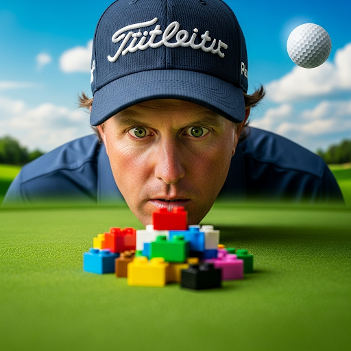

example output for research report, generated image and video creatives that intersect: 
1) marketing campaign, 
2) tending topic in Search, and 
3) trending video from YouTube 

---

# Marketing Campaign Brief: Google Pixel 9 - "Surreal Moments, Seamlessly Shared"

    

## 1. Campaign Guide Summary

*   **Campaign Name:** Marketing Campaign Guide for Google's Pixel 9
*   **Brand:** Google
*   **Target Product:** Pixel 9 smartphone
*   **Target Audience:** Gen Z individuals (18-24 years old), people who are frustrated with technology, developers or young adult technophiles, those who enjoy surreal memes.
*   **Target Regions:** Atlanta, US
*   **Campaign Objectives:** Increase brand awareness of Google Pixel 9 among Gen Z and drive consideration and desire for Pixel 9 features (camera, AI, etc.).
*   **Media Strategy:** Social Media (Instagram, TikTok, YouTube), Influencer Marketing (Hyper-Localized), and Digital Ads (Highly Targeted).
*   **Key Selling Points:** Best camera (AI-powered) and makes your life easier (Pixel Call Assist).

## 2. Key Insights from Research

### 2.1. Pixel 9: The AI-Powered Creative Companion for Gen Z

*   **Summary:** The Pixel 9's AI capabilities empower Gen Z to effortlessly create and share unique content, aligning with their desire for self-expression and creativity.
*   **Key Entities:** Google Pixel 9, Gen Z, AI, Creative Tools
*   **Key Relationships:** Pixel 9 provides AI-powered tools that enable Gen Z to express their creativity.
*   **Key Audiences:** Gen Z individuals, content creators, social media enthusiasts
*   **Key Product Insights:** AI-powered camera, Magic Editor, Pixel Studio app

### 2.2. Ditch Tech Frustration: Pixel 9 Simplifies Creativity

*   **Summary:** The Pixel 9 addresses Gen Z's frustration with complicated technology by offering a user-friendly experience that simplifies content creation and sharing.
*   **Key Entities:** Google Pixel 9, Gen Z, User Experience, Simplicity
*   **Key Relationships:** Pixel 9 simplifies the creative process, removing technical barriers for Gen Z users.
*   **Key Audiences:** Gen Z individuals, people frustrated with technology, social media users
*   **Key Product Insights:** User-friendly interface, seamless sharing, intuitive design

### 2.3. Seamless Sharing: Pixel 9 Connects Gen Z's World

*   **Summary:** The Pixel 9 facilitates instant and effortless sharing of content, catering to Gen Z's need for constant connectivity and social interaction.
*   **Key Entities:** Google Pixel 9, Gen Z, Social Sharing, Connectivity
*   **Key Relationships:** Pixel 9 enables Gen Z to seamlessly share their creations and experiences with their social networks.
*   **Key Audiences:** Gen Z individuals, social media users, influencers
*   **Key Product Insights:** Instant sharing capabilities, social media integration, cloud connectivity

## 3. Trend Analysis

### 3.1. Google Search Trend: Phil Mickelson - Golfing Legend in the Spotlight

*   **Context:** Phil Mickelson is trending due to his continued presence in major golf tournaments and public interest in his career.
*   **Key Entities:** Phil Mickelson, Golf, PGA Tour, LIV Golf
*   **Key Relationships:** Mickelson's participation in golf tournaments and his involvement with LIV Golf drive public interest.
*   **Key Audiences:** Golf fans, sports enthusiasts, Gen Z individuals interested in sports and celebrity culture
*   **Marketing Opportunity:** Leverage Mickelson's name recognition to create a playful connection with the Pixel 9, highlighting its ability to capture "winning moments" with crystal-clear quality.
*   **Product Integration:** Use Mickelson's image (or a look-alike) in ad creatives, showcasing the Pixel 9's camera capabilities.
*   **URLs:** (URLs related to Phil Mickelson's recent activities and trending status would be included here)

### 3.2. YouTube Trend: I Built a Giant LEGO Railway for my Pets!

*   **Context:** This video showcases creativity, DIY projects, and a love for animals, resonating with Gen Z's interests in unique content and self-expression.
*   **Key Themes:** Creativity, DIY, LEGO, Pets, Community
*   **Key Entities:** Aquarium Info (YouTube channel), LEGO, Pets
*   **Key Relationships:** The video creator builds a LEGO railway for their pets, showcasing creativity and craftsmanship.
*   **Key Audiences:** LEGO enthusiasts, pet lovers, DIY enthusiasts, Gen Z individuals interested in unique and creative content
*   **Marketing Opportunity:** Tap into the trend of DIY creativity and showcase the Pixel 9's ability to capture and share these creations with ease.
*   **Product Integration:** Feature Gen Z creators using the Pixel 9 to capture their LEGO creations, highlighting the phone's camera quality and seamless sharing capabilities.
*   **URLs:** [https://www.youtube.com/watch?v=p7q8NnVlbVY](https://www.youtube.com/watch?v=p7q8NnVlbVY)

## 4. Creative Campaign Ideas

### 4.1. Image Creative

*   **Description:** A surreal close-up photograph of a golfer who resembles Phil Mickelson. He is on a vibrant green golf course, but instead of focusing on the ball or the fairway, he is intensely staring at a small pile of LEGO blocks in front of him, with a look of extreme concentration. The LEGO blocks are brightly colored and slightly out of focus. The background should be dreamlike with an oversized golf ball floating in the sky.
*   **Reasoning:** This image combines the "Phil Mickelson" and "LEGO Railway" trends in a visually striking and attention-grabbing way, aligning with Gen Z's love for surreal memes.
*   **Filename:** 31d72ab9-0813-4f99-99b0-144c4bf20c86.png
*   **Ad Copy** "Is Phil Mickelson building a LEGO golf course? 🤔 Probably not, but with the Google Pixel 9, you can capture ANY amazing moment (even surreal ones) with crystal-clear quality and share it instantly with your friends! Seamless sharing for a connected generation! #Pixel9 #Golf #Lego #SeamlessSharing"

    

### 4.2. Video Creative

*   **Description:** A short, captivating video ad for Instagram/TikTok, building upon the still image. It opens with a close-up of the face of a golfer resembling Phil Mickelson intensely staring at a small pile of LEGO blocks on a vibrant green golf course. The camera slowly zooms out to reveal a Gen Z individual holding a Google Pixel 9. The individual uses the Pixel 9 to quickly capture a series of high-quality photos, demonstrating the camera’s excellent image stabilization. No golf ball in the sky. The video transitions into a montage of other Gen Z creators showcasing their unique LEGO creations captured with their Google Pixel 9s. The montage includes shots of different lighting environments. All phones shown should clearly be Google Pixel 9 models. Upbeat, trendy music plays throughout. The final shot displays the Google Pixel 9 with the tagline: 'Capture Your Amazing Moments. Seamless Sharing. Google Pixel 9.'
*   **Reasoning:** This video builds upon the surreal image, showcasing the Pixel 9's camera capabilities and seamless sharing features in a dynamic and engaging way.
*   **Filename:** 621845fe-b139-4650-9a47-c8320eece961.mp4

### 4.3. Ad Copy

*   **Ad Copy:** "Phil's secret hobby revealed?! 🤫🤯 Even golf legends need a LEGO break! 😂 But fr tho, the #Pixel9 camera snaps EVERYTHING in crystal clear quality. Build it, capture it, share it! #GolfMeetsLego #SeamlessSharing"
*   **Reasoning:** This caption is playful, attention-grabbing, and incorporates both the "Phil Mickelson" and "LEGO Railway" trends, while highlighting the Pixel 9's key features and benefits.

## 5. Opportunities to Enhance the Campaign Guide

The `search_trends`, `yt_trends`, and `insights` present several opportunities to enhance the original campaign guide:

*   **Expand on AI-Powered Creative Tools:** The campaign guide mentions the AI-powered camera, but it could be enhanced by showcasing specific AI features like Magic Editor and Pixel Studio, highlighting their ease of use and creative potential for Gen Z.
*   **Emphasize Seamless Sharing:** The campaign guide mentions social media as a core focus, but it could be strengthened by emphasizing the Pixel 9's seamless sharing capabilities and integration with popular social media platforms.
*   **Leverage User-Generated Content:** Encourage Gen Z users to share their Pixel 9-captured creations using a specific hashtag, fostering a sense of community and user engagement.
*   **Partner with Gen Z Influencers:** Collaborate with Gen Z influencers who are passionate about LEGO, DIY projects, and photography to create authentic and engaging content showcasing the Pixel 9's features and benefits.
*   **Create Interactive Experiences:** Develop interactive social media experiences, such as polls, quizzes, and AR filters, that allow Gen Z users to engage with the Pixel 9 brand in a fun and creative way.